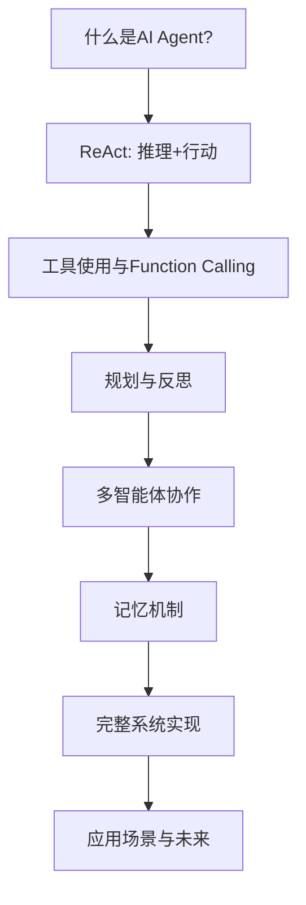

<div style="page-break-after: always;"></div>

---

# Part4-深度学习进阶专题

> **章节范围**: 第32-46章  
> **核心目标**: 掌握前沿技术，扩展应用视野

---


> [注意: 文件 chapter-32/content.md 未找到]


> [注意: 文件 chapter33-temporal-forecasting/chapter-33.md 未找到]


<!-- 来源: chapter34_nas.md -->

# 第三十四章：神经架构搜索（NAS）——让AI自己设计AI

## 34.1 NAS概述与历史演进：从星星之火到燎原之势

### 一个疯狂的想法

2016年的一个深夜，Google Brain的研究员Barret Zoph盯着电脑屏幕上手工设计的Inception网络架构图，脑海中闪过一个大胆的念头：**既然神经网络可以学会识别猫狗、翻译语言、下棋打败世界冠军，为什么不能让它学会设计神经网络自己呢？**

这个想法听起来像是科幻小说中的情节——AI创造AI，仿佛是技术奇点的先兆。但Zoph和他的导师Quoc V. Le决定把这个疯狂的想法付诸实践。他们没有预料到，这个名为"神经架构搜索"（Neural Architecture Search, NAS）的项目，将在未来几年引发深度学习领域的一场革命。

> 💡 **费曼时间：建筑师与进化**
> 
> 想象一下，你是一位建筑师，要设计一座摩天大楼。传统方式是：你手工绘制每一层的蓝图，决定哪里放电梯、哪里是办公区、哪里是健身房。这需要多年的经验和直觉。
> 
> 但如果我们换一种方式：我们创建一个"建筑进化模拟器"，让计算机生成成千上万种不同的设计方案，每种方案都在虚拟环境中经受地震、台风、使用效率等考验。表现好的设计"繁殖"下一代，表现差的被淘汰。经过数百代进化， emerges 的设计可能比任何人类建筑师设计的都要优秀！
> 
> NAS就是这样一个"数字进化"过程，只不过进化的不是建筑物，而是神经网络的架构。

### NAS的三驾马车

NAS的核心可以概括为三个基本要素，就像一个寻宝游戏需要定义的三样东西：

**1. 搜索空间（Search Space）——宝藏地图**

搜索空间定义了我们可以在哪里寻找架构。它就像一张宝藏地图，标注了所有可能的路径。搜索空间可以是：

- **宏观搜索（Macro Search）**：直接搜索整个网络结构，每一层都可以是不同的操作
- **单元搜索（Cell-based Search）**：先搜索小的"建筑单元"（Cell），然后像搭积木一样堆叠这些单元

数学上，搜索空间 $\mathcal{A}$ 是所有可能架构的集合：

$$\mathcal{A} = \{ \alpha \mid \alpha \text{ 是一个有效的神经网络架构} \}$$

每个架构 $\alpha$ 可以表示为计算图，其中节点表示特征图，边表示操作（卷积、池化、跳跃连接等）。

**2. 搜索策略（Search Strategy）——寻宝方法**

有了地图，我们需要决定如何搜索。主要策略包括：

- **强化学习（Reinforcement Learning）**：训练一个"控制器"网络来生成架构
- **进化算法（Evolutionary Algorithms）**：模拟自然选择，让架构种群进化
- **梯度优化（Gradient-based Optimization）**：将离散的架构选择松弛为连续的优化问题

**3. 性能评估（Performance Estimation）——宝藏价值**

我们需要快速评估每个找到的网络有多好：

- **从头训练（Train from Scratch）**：最准确但最慢的方法
- **权重共享（Weight Sharing）**：多个架构共享参数，加速评估
- **超网（Supernet）**：训练一个包含所有子架构的大网络

### 历史里程碑：从2000 GPU天到几小时

**2016-2017：开山之作（Zoph & Le, 2016）**

Zoph和Le的原始NAS论文使用强化学习控制器，在CIFAR-10上搜索架构。这个方法需要**800个GPU训练28天**（约22,000 GPU小时）才能找到好的架构。虽然计算成本惊人，但发现的最优架构已经能与人工设计的网络竞争。

**2018：效率革命元年**

- **NASNet（Zoph et al., 2018）**：引入单元搜索空间，先在CIFAR-10上搜索，再迁移到ImageNet。这是第一个在ImageNet上超越人工设计的NAS架构。
  
- **ENAS（Pham et al., 2018）**：引入**参数共享（Parameter Sharing）**，让不同架构共享权重，将搜索成本从22,000 GPU小时降低到约**10 GPU小时**，实现了**1000倍加速**！这是NAS发展史上的关键转折点。

**2019：可微架构搜索时代**

- **DARTS（Liu et al., 2019）**：将离散的架构选择松弛为连续的softmax权重，使用梯度下降同时优化架构参数和网络权重。搜索成本降至**4 GPU天**。

- **ProxylessNAS（Cai et al., 2019）**：直接在目标硬件上进行架构搜索，引入硬件延迟作为优化目标，实现真正的硬件感知设计。

- **FBNet（Wu et al., 2019）**：使用可微分NAS优化移动设备上的高效网络，展示了NAS在实际应用中的价值。

**2020：训练一次，处处部署**

- **Once-for-All（Cai et al., 2020）**：训练一个包含所有子网络的超网，之后可以通过简单的"选择"操作得到不同大小的专用网络，无需重新训练。

- **BigNAS（Yu et al., 2020）**：扩展OFA思想，通过渐进式收缩训练超大搜索空间中的网络。

- **SPOS（Guo et al., 2020）**：单路径单次NAS，使用均匀采样训练超网，进一步简化了权重共享方法。

### NAS的意义：为什么这很重要？

**1. 超越人类设计**

NAS发现的架构往往包含人类设计师未曾考虑过的模式。例如，NASNet发现的某些连接模式类似于Inception和ResNet的结合，但又具有独特性。

**2. 自动化机器学习（AutoML）的核心**

NAS代表了机器学习中"学习什么学习"（Learning to Learn）的终极形式。如果AI能够设计自己的大脑，它就可能以我们无法预料的方式进化。

**3.  democratization of AI**

NAS让没有深厚神经网络设计经验的研究者和工程师也能获得高性能的定制架构。

**4. 硬件-软件协同设计**

硬件感知NAS（如ProxylessNAS、FBNet）能够针对特定设备（手机、边缘设备、ASIC）优化网络，这是手工设计难以做到的。

> 🎯 **思考时刻**
> 
> 想象一下，如果AlphaGo不仅能下棋，还能设计自己的神经网络架构来下棋，会发生什么？这听起来像递归自我改进的AI——正是一些关于人工通用智能（AGI）的推测性想法的核心。

---

## 34.2 搜索空间设计：Cell-based vs Macro Search

### 搜索空间的数学表示

搜索空间是NAS的基础，它定义了"我们可以建造什么"。数学上，一个搜索空间由以下要素组成：

**操作集合（Operation Set）**：

$$\mathcal{O} = \{ o_1, o_2, ..., o_m \}$$

常见的操作包括：
- 卷积：$3\times3$ 卷积、$5\times5$ 卷积、$7\times7$ 卷积
- 深度可分离卷积：$3\times3$ depthwise separable conv
- 池化：$3\times3$ average pooling、$3\times3$ max pooling
- 跳跃连接（Skip Connection）：Identity mapping
- 空操作（Zero）：表示没有连接

**计算图表示**：

一个神经网络架构 $\alpha$ 可以表示为有向无环图（DAG）：

$$\alpha = (V, E)$$

其中：
- $V = \{v_1, v_2, ..., v_n\}$ 是节点集合，每个节点代表一个特征图
- $E \subseteq V \times V \times \mathcal{O}$ 是边集合，每条边 $(u, v, o)$ 表示对节点 $u$ 应用操作 $o$ 后连接到节点 $v$

### Macro Search：直接搜索完整网络

在宏观搜索中，控制器直接生成整个网络的描述。对于包含 $L$ 层的网络，每层 $l$ 需要决定：

- 操作类型：$o_l \in \mathcal{O}$
- 滤波器数量：$f_l \in \{16, 32, 64, 128, 256, ...\}$
- 核大小：$k_l \in \{1, 3, 5, 7\}$
- 步长：$s_l \in \{1, 2\}$（决定是否下采样）

搜索空间大小约为：

$$|\mathcal{A}| \approx (|\mathcal{O}| \times |\mathcal{F}| \times |\mathcal{K}| \times |\mathcal{S}|)^L$$

对于 $L=20$ 层的网络，即使每个选择只有10种可能，搜索空间也有 $10^{20}$ 个架构！这比宇宙中的原子数量还多。

> 💡 **费曼时间：乐高积木 vs 3D打印**
> 
> Macro search就像是使用3D打印机直接打印整个建筑——你可以控制每一层的每一个细节，但可能性是无限的，找到好设计就像大海捞针。

### Cell-based Search：搜索可重复单元

NASNet的开创性贡献是引入了**单元（Cell）**的概念。 observation：成功的神经网络（如ResNet、Inception、DenseNet）都使用重复的基本模块。

**两种单元类型**：

1. **普通单元（Normal Cell）**：保持特征图空间维度不变（stride=1）
2. **约简单元（Reduction Cell）**：将特征图高度和宽度减半，通道数加倍（stride=2）

**搜索空间的结构**：

```
输入 → [Normal Cell] × N → [Reduction Cell] → [Normal Cell] × N → [Reduction Cell] → [Normal Cell] × N → 输出
```

每个单元内部包含 $B$ 个块（block），每个块需要选择：
- 两个输入隐藏状态（来自前序节点或单元输入）
- 两个操作（应用于选中的隐藏状态）
- 一个组合操作（通常是相加或拼接）

NASNet中，每个块需要5个决策：
1. 选择第一个隐藏状态（来自前序）
2. 选择第一个操作
3. 选择第二个隐藏状态
4. 选择第二个操作
5. 选择组合方式（add或concatenate）

**单元搜索的数学表示**：

设单元有 $B$ 个块，第 $b$ 个块的决策为 $(h_1^{(b)}, o_1^{(b)}, h_2^{(b)}, o_2^{(b)}, c^{(b)})$。

单元的输出是所有未被用作输入的隐藏状态的拼接：

$$\text{cell\_output} = \text{concat}(\{h_j \mid h_j \text{ 未被选为输入}\})$$

**搜索空间大小的比较**：

假设：
- 7种操作选择
- 最多7个前序隐藏状态可选
- 2种组合方式
- 每个单元5个块

每个块的决策数：$7 \times 7 \times 7 \times 7 \times 2 = 4,802$

整个单元的搜索空间：$4,802^5 \approx 2.6 \times 10^{18}$

虽然仍然巨大，但比Macro search的 $10^{20}$ 以上小得多，而且迁移性更好。

### 搜索空间设计的关键洞察

**1. 人类知识的重要性**

虽然NAS是自动化的，但搜索空间的设计仍然需要人类直觉。例如：
- 为什么使用卷积而不是全连接？
- 为什么考虑深度可分离卷积？
- 为什么限制核大小为1, 3, 5, 7？

这些选择基于我们对视觉任务的理解。

**2. 搜索空间与优化难度的权衡**

- 搜索空间越大，可能找到更好的架构，但搜索越困难
- 搜索空间越小，搜索越快，但可能错过最优解

**3. 可迁移性**

Cell-based设计的一个重要优势是：在小数据集（如CIFAR-10）上搜索到的单元，可以直接迁移到大数据集（如ImageNet），只需调整堆叠的单元数量和通道数。

> 🎯 **代码热身：定义搜索空间**
> 
> 在我们后面的代码实现中，你会看到如何用Python定义这些搜索空间，以及如何将架构表示为可计算的数据结构。

---

## 34.3 搜索策略：强化学习、进化算法与梯度优化

### 强化学习NAS：让控制器学会设计

Zoph & Le（2016）的原始NAS使用强化学习来训练一个**控制器RNN**（Recurrent Neural Network）。这个控制器的工作就像一个建筑师，逐个生成网络架构的"设计图纸"。

**控制器的决策过程**：

控制器是一个循环神经网络（通常是LSTM），它逐个生成架构的超参数。对于每一层，控制器预测：

1. 滤波器高度：$h \in \{1, 3, 5, 7\}$
2. 滤波器宽度：$w \in \{1, 3, 5, 7\}$
3. 滤波器数量：$f \in \{24, 36, 48, 64\}$
4. 步长：$s \in \{1, 2\}$
5. 跳跃连接：连接到哪些前序层

**策略梯度训练**：

设控制器参数为 $\theta$，它定义了生成架构的概率分布 $P(\alpha; \theta)$。生成架构 $\alpha$ 后，我们在训练集上训练这个子网络，得到验证集准确率 $R(\alpha)$ 作为奖励。

我们的目标是最大化期望奖励：

$$J(\theta) = \mathbb{E}_{\alpha \sim P(\cdot; \theta)}[R(\alpha)]$$

使用REINFORCE算法（也称为策略梯度），梯度为：

$$\nabla_\theta J(\theta) = \sum_{\alpha} P(\alpha; \theta) \nabla_\theta \log P(\alpha; \theta) R(\alpha)$$

实际中，我们采样 $m$ 个架构来近似：

$$\nabla_\theta J(\theta) \approx \frac{1}{m} \sum_{i=1}^{m} \nabla_\theta \log P(\alpha_i; \theta) R(\alpha_i)$$

**减少方差的技巧**：

直接使用上述梯度估计方差很大。一个常用技巧是使用**基线（baseline）**：

$$\nabla_\theta J(\theta) \approx \frac{1}{m} \sum_{i=1}^{m} \nabla_\theta \log P(\alpha_i; \theta) (R(\alpha_i) - b)$$

其中 $b$ 是之前架构奖励的指数移动平均。这减少了梯度的方差，加速收敛。

**控制器RNN的架构**：

```
输入：[START_TOKEN]
    ↓
LSTM → 预测第1层参数 → Embedding
    ↓
LSTM → 预测第2层参数 → Embedding
    ↓
    ...
    ↓
LSTM → 预测第L层参数
```

每个预测都是一个softmax分类，输出在对应超参数空间上的概率分布。

> 💡 **费曼时间：训练一个艺术家**
> 
> 想象你在训练一位抽象艺术家画肖像。一开始，艺术家随机涂鸦。你（作为评判者）给每幅画打分（奖励）。
> 
> 艺术家记住："当我画圆眼睛时得分高，画方眼睛时得分低"。渐渐地，艺术家学会画更像肖像的作品。
> 
> 控制器RNN就是这样一位"架构艺术家"，它学会画出高性能的网络设计。

### 进化算法：适者生存

进化算法（Evolutionary Algorithms, EA）模拟自然选择过程来搜索架构。AmoebaNet（Real et al., 2019）是这一方法的代表作。

**基本流程**：

1. **初始化**：随机生成 $P$ 个架构作为初始种群
2. **评估**：训练每个架构，得到适应度（如验证准确率）
3. **选择**：选择适应度高的架构作为"父母"
4. **变异/重组**：对父母进行小的修改，生成"后代"
5. **替换**：用后代替换适应度低的个体
6. **重复** 2-5 步直到收敛

**变异操作**：

- **隐藏状态变异**：改变块内的某个连接
- **操作变异**：将某个操作换成另一个（如 $3\times3$ conv → $5\times5$ conv）
- **插入**：在随机位置插入一个新层
- **删除**：随机删除一层

**正则化进化（Regularized Evolution）**：

Real et al. 发现传统进化算法有"早熟收敛"问题——种群多样性快速丧失。他们提出：

> 强制移除最老的个体，而不是最差的个体。

这保持了种群多样性，让搜索持续探索新的区域。

**进化 vs 强化学习**：

| 特性 | 强化学习 | 进化算法 |
|------|----------|----------|
| 学习方式 | 基于梯度优化 | 基于选择压力 |
| 需要可微 | 是 | 否 |
| 并行性 | 中等 | 高（自然并行）|
| 全局探索 | 依赖随机初始化 | 种群天然多样化 |
| 历史信息 | 保存在RNN隐状态 | 保存在种群基因中 |

### 梯度优化：DARTS的革命

DARTS（Differentiable ARchiTecture Search）是NAS领域最重要的突破之一。核心思想：

> **将离散的架构选择松弛为连续的架构权重，使NAS可微分！**

**连续松弛（Continuous Relaxation）**：

在Cell-based搜索空间中，每个边 $(i, j)$ 需要从操作集合 $\mathcal{O}$ 中选择一个操作。传统NAS是离散的：

$$o^{(i,j)} = \arg\max_{o \in \mathcal{O}} \text{某个得分}$$

DARTS将其松弛为所有操作的softmax加权：

$$\bar{o}^{(i,j)}(x) = \sum_{o \in \mathcal{O}} \frac{\exp(\alpha_o^{(i,j)})}{\sum_{o' \in \mathcal{O}} \exp(\alpha_{o'}^{(i,j)})} \cdot o(x)$$

其中 $\alpha_o^{(i,j)}$ 是架构参数（architecture parameters），是可学习的！

**双层优化（Bilevel Optimization）**：

DARTS需要同时优化两组参数：

1. **网络权重** $w$：最小化训练损失
2. **架构参数** $\alpha$：最小化验证损失

这形成了一个双层优化问题：

$$\min_\alpha \mathcal{L}_{val}(w^*(\alpha), \alpha)$$

$$\text{s.t.} \quad w^*(\alpha) = \arg\min_w \mathcal{L}_{train}(w, \alpha)$$

**近似求解**：

精确求解内层优化 $w^*(\alpha)$ 需要训练网络到收敛，太昂贵。DARTS使用一步梯度下降近似：

$$w' = w - \xi \nabla_w \mathcal{L}_{train}(w, \alpha)$$

然后计算验证损失的梯度：

$$\nabla_\alpha \mathcal{L}_{val}(w', \alpha)$$

**交替优化算法**：

```python
for iteration in range(num_iterations):
    # 步骤1：固定架构，更新网络权重（在训练集上）
    for step in range(num_weight_steps):
        w = w - lr_w * grad(L_train(w, alpha))
    
    # 步骤2：固定网络权重，更新架构参数（在验证集上）
    alpha = alpha - lr_alpha * grad(L_val(w, alpha))
```

**离散化（Discretization）**：

搜索完成后，我们需要得到离散架构。对于每条边，选择架构参数最大的操作：

$$o^{*(i,j)} = \arg\max_{o \in \mathcal{O}} \alpha_o^{(i,j)}$$

> 💡 **费曼时间：调酒师的艺术**
> 
> 想象NAS是在调鸡尾酒。传统方法是：你有一排基酒（操作），必须选一种倒入杯子（离散选择）。
> 
> DARTS说：为什么不先都倒一点，尝尝混合的味道，然后逐渐调整比例？
> 
> 架构参数 $\alpha$ 就像是每种酒的"配方比例"。我们通过梯度下降学习最佳配方，最后只保留比例最高的酒。

---

## 34.4 性能评估：从数千GPU小时到几分钟

### 从头训练：黄金标准

最准确的性能评估方法是：

1. 从搜索空间采样一个架构 $\alpha$
2. 在训练集上从头训练到收敛
3. 在验证集上评估准确率

这就是原始NAS的做法，也是为什么需要22,000 GPU小时。

数学上，我们需要：

$$R(\alpha) = \text{Accuracy}(\text{TrainToConvergence}(\alpha, \mathcal{D}_{train}), \mathcal{D}_{val})$$

**优缺点**：
- ✅ 最准确的性能估计
- ❌ 每个架构需要数小时到数天
- ❌ 搜索1000个架构需要数年GPU时间

### 权重共享：ENAS的洞察

ENAS（Efficient Neural Architecture Search）的核心洞察是：

> **搜索空间中的所有架构都是一个大图（超网）的子图，可以共享参数！**

**超网（Supernet）构建**：

构建一个有向无环图 $\mathcal{G}$，其中：
- 节点表示计算操作
- 边表示可能的连接
- 每个节点的参数在所有使用该节点的子架构间共享

**参数共享的数学表示**：

设超网参数为 $W$。对于子架构 $\alpha$，其参数 $W_\alpha$ 是 $W$ 的子集：

$$W_\alpha \subseteq W$$

训练时，我们采样一个子架构，在前向传播中只使用 $W_\alpha$，然后只更新这些参数。

**ENAS的训练过程**：

```python
for iteration in range(num_iterations):
    # 控制器生成一个架构（子图）
    alpha = controller.sample()
    
    # 在训练集上训练这个子架构（使用共享权重）
    loss = compute_loss(alpha, W, train_data)
    update(W[alpha])  # 只更新用到的参数
    
    # 在验证集上评估，更新控制器
    reward = evaluate(alpha, W, val_data)
    controller.update(reward)
```

**为什么权重共享有效？

直觉上，相似架构应该具有相似的功能，因此可以共享参数。例如：
- 使用 $3\times3$ conv 的架构
- 使用 $5\times5$ conv 的架构

如果输入相似，它们的特征提取也应该相似，共享权重是合理的。

**权重共享的挑战**：

1. **耦合问题（Coupling）**：不同架构竞争相同的参数，可能导致某些架构表现差
2. **排名不一致**：超网中表现好的架构，从头训练后可能表现差
3. **训练不稳定**：共享参数使训练动态复杂化

### One-shot NAS：训练一次，评估所有

One-shot NAS（如DARTS、ProxylessNAS）将权重共享推向极致：

> **训练一个包含所有可能操作的超网，然后从中选择子架构。**

**超网架构（以DARTS为例）**：

对于Cell中的每条边，我们不选择一个操作，而是并行计算所有操作：

$$\text{output} = \sum_{o \in \mathcal{O}} \pi_o \cdot o(x)$$

其中 $\pi_o = \text{softmax}(\alpha_o)$ 是操作 $o$ 的权重。

**Single Path One-Shot（SPOS）**：

Guo et al.（2020）提出SPOS来解决超网训练中的耦合问题：

> **每次只采样一条路径（单路径），训练该路径上的参数。**

**SPOS训练算法**：

```python
for iteration in range(num_iterations):
    # 均匀随机采样一个架构
    alpha = uniform_sample()
    
    # 构建单路径网络
    subnet = build_subnet(alpha, supernet)
    
    # 训练这个子网
    loss = compute_loss(subnet, train_data)
    update(subnet.parameters)
```

**均匀采样的重要性**：

SPOS证明，均匀采样（每个架构被采样的概率相等）对于获得可靠的超网至关重要。这确保了所有架构得到公平的训练机会。

**性能预测器**：

训练好超网后，我们可以通过简单的前向传播快速评估任何架构的性能（无需重新训练）。

### 零次NAS（Zero-shot NAS）

最新的研究方向是**完全不训练**就能评估架构性能：

**基于梯度的指标**：
- **SNIP**：基于连接敏感度
- **GraSP**：基于梯度流
- **Fisher**：基于Fisher信息

**基于激活的指标**：
- **NASWOT**：基于ReLU激活的协方差

这些方法的共同思想：网络初始化时的某些统计量可以预测训练后的性能。

**零次指标的数学**：

以SNIP为例，它测量每个参数对损失的敏感度：

$$S(\theta) = |\theta \odot \nabla_\theta \mathcal{L}|$$

其中 $\odot$ 是逐元素乘法。统计所有参数的敏感度可以预测网络容量。

---

## 34.5 DARTS详解：可微架构搜索与双层优化

### DARTS的完整数学推导

DARTS将NAS转化为一个**双层优化（Bilevel Optimization）**问题。让我们深入理解其数学结构。

**搜索空间的连续松弛**：

考虑一个Cell，有 $N$ 个节点，节点 $i$ 和 $j$ 之间有边。在离散搜索空间中，每条边选择一个操作 $o^{(i,j)} \in \mathcal{O}$。

DARTS引入架构参数 $\alpha^{(i,j)} \in \mathbb{R}^{|\mathcal{O}|}$，将混合操作定义为：

$$\bar{o}^{(i,j)}(x) = \sum_{o \in \mathcal{O}} p_o^{(i,j)}(\alpha) \cdot o(x)$$

其中混合权重通过softmax计算：

$$p_o^{(i,j)}(\alpha) = \frac{\exp(\alpha_o^{(i,j)})}{\sum_{o' \in \mathcal{O}} \exp(\alpha_{o'}^{(i,j)})}$$

**节点计算的数学表达**：

每个节点 $j$ 接收来自所有前序节点 $i < j$ 的连接：

$$x_j = \sum_{i < j} \bar{o}^{(i,j)}(x_i)$$

**双层优化问题**：

定义：
- $\alpha$：架构参数（上层变量）
- $w$：网络权重（下层变量）
- $\mathcal{L}_{train}(w, \alpha)$：训练损失
- $\mathcal{L}_{val}(w, \alpha)$：验证损失

优化问题为：

$$\min_\alpha \mathcal{L}_{val}(w^*(\alpha), \alpha)$$

$$\text{s.t.} \quad w^*(\alpha) = \arg\min_w \mathcal{L}_{train}(w, \alpha)$$

**一阶近似**：

假设当前网络权重 $w$ 已经近似最优，直接计算：

$$\nabla_\alpha \mathcal{L}_{val}(w, \alpha)$$

**二阶近似（更精确）**：

考虑 $w$ 对 $\alpha$ 的依赖。使用一步梯度下降近似 $w^*(\alpha)$：

$$w' = w - \xi \nabla_w \mathcal{L}_{train}(w, \alpha)$$

然后计算：

$$\nabla_\alpha \mathcal{L}_{val}(w', \alpha)$$

展开链式法则：

$$\nabla_\alpha \mathcal{L}_{val}(w', \alpha) = \nabla_\alpha \mathcal{L}_{val}(w', \alpha) - \xi \nabla^2_{\alpha,w} \mathcal{L}_{train}(w, \alpha) \nabla_{w'} \mathcal{L}_{val}(w', \alpha)$$

其中 $\nabla^2_{\alpha,w} \mathcal{L}_{train}$ 是Hessian矩阵，计算昂贵。DARTS使用有限差分近似：

$$\nabla^2_{\alpha,w} \mathcal{L}_{train} \cdot v \approx \frac{\nabla_\alpha \mathcal{L}_{train}(w^+, \alpha) - \nabla_\alpha \mathcal{L}_{train}(w^-, \alpha)}{2\epsilon}$$

其中 $w^\pm = w \pm \epsilon v$。

**DARTS算法总结**：

```
初始化：随机初始化 α 和 w

对于每个迭代：
    # 步骤1：更新网络权重（训练集）
    对于每个训练批量：
        w ← w - η_w * ∇_w L_train(w, α)
    
    # 步骤2：更新架构参数（验证集）
    # 2.1 计算 w' = w - ξ * ∇_w L_train(w, α)
    w' = w - ξ * gradient(L_train, w, α)
    
    # 2.2 计算验证损失对α的梯度（使用w'）
    g_val = gradient(L_val, α, w')
    
    # 2.3 如果使用二阶近似，添加修正项
    如果 use_second_order:
        # 计算Hessian-向量积的近似
        epsilon = 0.01 / ||∇_w' L_val||
        w_plus = w + epsilon * ∇_w' L_val
        w_minus = w - epsilon * ∇_w' L_val
        
        g_plus = gradient(L_train, α, w_plus)
        g_minus = gradient(L_train, α, w_minus)
        
        hessian_correction = (g_plus - g_minus) / (2 * epsilon)
        g_val = g_val - ξ * hessian_correction
    
    α ← α - η_α * g_val

# 离散化
对于每条边 (i,j):
    选择 o* = argmax_o α_o^(i,j)
```

### DARTS的问题与改进

**性能崩溃（Performance Collapse）**：

DARTS有一个著名的问题：经常收敛到充满跳跃连接（skip connections）的退化架构。原因：

> 跳跃连接在早期训练阶段容易优化，因为它们是恒等映射，不需要学习参数。

**DARTS+（Liang et al., 2019）**：

解决方案：早停（Early Stopping）。当检测到架构参数中某个操作占主导（如softmax值>0.9）时，立即停止搜索。

**PC-DARTS（Xu et al., 2020）**：

解决方案：部分通道连接。每次只随机采样部分通道进行架构搜索，减少内存使用并提高稳定性。

**Fair DARTS（Chu et al., 2020）**：

解决方案：引入sigmoid代替softmax，并添加公平性正则化，确保每个操作都有机会展示自己。

---

## 34.6 ProxylessNAS：硬件感知搜索

### 代理问题与直接搜索

传统NAS流程：
1. 在代理数据集（如CIFAR-10）上搜索
2. 将最佳架构迁移到目标数据集（如ImageNet）

**代理问题**：
- 小数据集上表现好的架构，大数据集上不一定好
- 搜索时不考虑实际部署硬件

ProxylessNAS的核心思想：

> **直接在目标数据集和硬件上搜索！**

### 二进制路径（Binary Gates）

ProxylessNAS的关键创新：使用二进制门控来减少内存使用。

对于每条边，DARTS保存所有操作的结果：

$$\bar{o}^{(i,j)} = \sum_{o \in \mathcal{O}} p_o \cdot o(x)$$

这需要 $|\mathcal{O}|$ 倍的内存。

ProxylessNAS改为：

$$\bar{o}^{(i,j)} = \sum_{o \in \mathcal{O}} g_o \cdot o(x)$$

其中 $g_o \in \{0, 1\}$ 且 $\sum_o g_o = 1$（只有一个操作被激活）。

**可微分松弛**：

为了梯度下降，使用Gumbel-Softmax技巧：

$$g_o = \text{softmax}((\alpha_o + \epsilon_o) / \tau)$$

其中 $\epsilon_o$ 是Gumbel噪声，$\tau$ 是温度参数。

### 硬件感知损失函数

ProxylessNAS引入硬件延迟作为第二优化目标：

$$\min_\alpha \mathcal{L}_{ce}(\alpha) + \lambda \cdot \mathcal{L}_{latency}(\alpha)$$

**延迟建模**：

实际测量每个操作的延迟，构建查找表（LUT）：

$$\text{latency}(\alpha) = \sum_{(i,j)} \sum_{o \in \mathcal{O}} p_o^{(i,j)} \cdot \text{latency}(o)$$

**延迟预测器**：

可以在目标设备上测量，或使用预测模型：

$$\text{latency}(o, \text{input\_shape}, \text{hardware}) = \text{LUT}[o, \text{input\_shape}, \text{hardware}]$$

> 💡 **费曼时间：量身定制西装**
> 
> 想象你买西装。传统NAS像是在模特身上试穿，然后希望在你身上也合身。ProxylessNAS则是直接在你身上量体裁衣，考虑你的具体身材（数据集）和出席场合（硬件）。

---

## 34.7 Once-for-All & BigNAS：训练一次，处处部署

### 动机：从专用到通用

传统NAS流程的问题：
1. 搜索架构A
2. 从头训练架构A
3. 想要不同大小的架构B？重新搜索并训练！

**Once-for-All（OFA）的洞察**：

> **训练一个巨大的超网，包含所有可能的子架构，然后直接"提取"需要的子网，无需重新训练！**

### OFA的搜索空间

OFA的搜索空间包含四个维度：

1. **深度（Depth）**：网络层数，如 $\{2, 3, 4\}$
2. **宽度（Width）**：通道数，如 $\{128, 192, 256\}$
3. **核大小（Kernel Size）**：卷积核，如 $\{3, 5, 7\}$
4. **分辨率（Resolution）**：输入大小，如 $\{128, 160, 192, 224\}$

**搜索空间大小**：

$$|\mathcal{A}| = |\text{depth}| \times |\text{width}|^{\text{num\_stages}} \times |\text{kernel}|^{\text{num\_layers}} \times |\text{resolution}|$$

对于典型设置，搜索空间包含 **$>10^{19}$** 个架构！

### 渐进式收缩训练（Progressive Shrinking）

直接训练如此大的超网会导致子网之间严重干扰。OFA的解决方案：

> **从大架构开始，逐步训练越来越小的子网。**

**训练阶段**：

```
阶段1：训练最大架构（深度=4，宽度=256，核=7，分辨率=224）
    ↓
阶段2：弹性核大小（支持核大小3,5,7）
    ↓
阶段3：弹性深度（支持深度2,3,4）
    ↓
阶段4：弹性宽度（支持宽度128,192,256）
    ↓
阶段5：弹性分辨率（支持128-224）
```

在每个阶段，我们同时训练当前支持的所有子架构，使用均匀采样。

**为什么渐进式收缩有效？

- 大架构提供良好的特征表示
- 小架构从大架构继承并微调
- 避免同时优化所有子网导致的冲突

### 部署时的快速特化

训练好OFA超网后，对于任何部署场景：

1. **定义约束**：延迟 < 10ms，或 FLOPs < 300M
2. **搜索最优子网**：使用进化搜索或预测器找到满足约束的最佳子网
3. **直接提取**：从超网中"切出"对应的权重，无需重新训练

**准确率预测器**：

训练一个小型MLP来预测任意子网的准确率：

$$\text{acc}(\alpha) = \text{MLP}(\text{encode}(\alpha))$$

编码 $\text{encode}(\alpha)$ 将架构的超参数转换为向量。

**联合优化**：

$$\max_\alpha \text{acc}(\alpha) \quad \text{s.t.} \quad \text{latency}(\alpha) < T_{target}$$

### BigNAS：单次训练超大模型

BigNAS（Yu et al., 2020）扩展了OFA思想：

> **直接训练可以支持任意子网的超大模型，无需渐进式收缩。**

关键技术：

1. **三明治规则（Sandwich Rule）**：每个训练迭代同时训练最小子网、最大子网和随机采样的子网
2. **就地蒸馏（In-place Distillation）**：最大子网作为教师，蒸馏知识给小子网
3. **统一采样**：确保不同大小的子网都被充分训练

**损失函数**：

$$\mathcal{L} = \mathcal{L}_{CE}(y_{max}, y_{gt}) + \sum_{i} \mathcal{L}_{KD}(y_i, y_{max})$$

其中第一项是最大子网的交叉熵损失，第二项是子网 $i$ 的知识蒸馏损失。

---

## 34.8 应用案例：手机端高效网络设计

### 移动端AI的挑战

在手机上运行深度学习模型面临独特挑战：

1. **计算受限**：手机CPU/GPU性能有限
2. **内存受限**：通常只有2-8GB RAM
3. **能耗敏感**：模型推理消耗电池
4. **延迟敏感**：用户期望实时响应

**设计要求**：
- 低FLOPs（< 500M）
- 低参数量（< 10M）
- 低延迟（< 100ms）
- 高精度（ImageNet top-1 > 70%）

### FBNet：为Facebook应用优化

FBNet（Wu et al., 2019）使用DARTS在FBNet搜索空间中找到针对特定手机优化的架构。

**FBNet搜索空间特点**：
- 基于MobileNetV2的倒残差块
- 搜索每层的通道数、扩展率、核大小、步长
- 直接优化iPhone上的实际延迟

**结果**：
- FBNet-A：ImageNet 73.3% accuracy，295M FLOPs
- 比MobileNetV2-1.0快1.9倍，精度更高

### MobileNetV3：人工+NAS的混合

MobileNetV3（Howard et al., 2019）使用平台感知NAS搜索全局架构，然后用NetAdapt算法逐层微调。

**搜索流程**：
1. **粗搜索**：使用MNasNet（基于强化学习的硬件感知NAS）找到初始架构
2. **细优化**：NetAdapt移除瓶颈层，进一步优化延迟
3. **人工调整**：研究人员根据直觉微调

**MobileNetV3-Large**：
- ImageNet top-1：75.2%
- 延迟：66ms（Pixel 1手机）
- 比MobileNetV2快2.5倍，精度更高

### EfficientNet：复合缩放

EfficientNet（Tan & Le, 2019）展示了如何结合NAS和系统化的网络缩放。

**复合缩放（Compound Scaling）**：

传统缩放只改变一个维度：
- 只增加深度（ResNet-18 → ResNet-50）
- 只增加宽度（Wide ResNet）
- 只增加分辨率

EfficientNet发现：

> **同时按固定比例缩放深度、宽度和分辨率效果更好。**

如果资源增加 $2^\phi$ 倍，则：
- 深度：$d = \alpha^\phi$
- 宽度：$w = \beta^\phi$
- 分辨率：$r = \gamma^\phi$

约束：$\alpha \cdot \beta^2 \cdot \gamma^2 \approx 2$

**EfficientNet-B0到B7**：

使用NAS搜索基线模型B0，然后使用复合缩放得到B1-B7。

| 模型 | FLOPs | ImageNet Top-1 |
|------|-------|----------------|
| B0 | 390M | 77.1% |
| B3 | 1.8B | 81.1% |
| B7 | 37B | 84.3% |

EfficientNet-B7是当时最高效的模型，超越了GPipe（557M参数 vs 556M参数，但训练快6.1倍）。

### 实际部署考虑

**模型量化**：

将32位浮点权重转换为8位整数：

$$w_{int8} = \text{round}(w_{fp32} / \text{scale} + \text{zero\_point})$$

可以减少4倍模型大小，加速2-4倍。

**知识蒸馏**：

用大模型（教师）训练小模型（学生）：

$$\mathcal{L} = \lambda \cdot \text{KL}(\text{softmax}(z_s/T), \text{softmax}(z_t/T)) + (1-\lambda) \cdot \text{CE}(z_s, y)$$

其中 $T$ 是温度参数。

**硬件感知优化**：

- 使用专用推理引擎（TensorRT、Core ML、TFLite）
- 算子融合：将conv+bn+relu合并为单个算子
- 内存布局优化：使用NHWC或NCHW格式匹配硬件

---

## 34.9 练习题

### 基础练习

**练习1：搜索空间大小计算**

考虑一个Macro搜索空间，网络有10层，每层可以选择：
- 操作：Conv3x3, Conv5x5, Depthwise3x3, MaxPool3x3（4种）
- 滤波器数量：32, 64, 128（3种）
- 步长：1, 2（2种）

计算搜索空间的总大小。如果评估一个架构需要1小时GPU时间，穷举搜索需要多长时间？

**练习2：策略梯度推导**

给定控制器生成架构的概率 $P(\alpha; \theta)$ 和奖励 $R(\alpha)$，推导REINFORCE算法的梯度公式。解释为什么引入基线（baseline）可以减少方差。

**练习3：DARTS连续松弛**

假设一条边有两个操作选择：Conv3x3和MaxPool3x3，架构参数分别为 $\alpha_1 = 0.5$ 和 $\alpha_2 = 0.3$。计算：
1. Softmax权重
2. 如果输入特征图 $x$ 通过这两个操作后分别为 $y_1$ 和 $y_2$，混合操作的输出是什么？

### 进阶练习

**练习4：实现简单的NAS控制器**

使用PyTorch实现一个基于LSTM的NAS控制器，能够生成包含5层的CNN架构。每层需要选择操作类型（Conv3x3, Conv5x5, MaxPool）和滤波器数量（16, 32, 64）。

**练习5：ENAS权重共享分析**

解释为什么ENAS的权重共享可以加速NAS。讨论权重共享可能导致的问题（如耦合、排名不一致）。

**练习6：DARTS离散化分析**

DARTS搜索结束后，通过选择每个边上权重最大的操作来离散化架构。讨论这种方法可能存在的问题，并提出改进思路。

### 挑战练习

**练习7：实现简化的DARTS**

实现一个简化的DARTS版本，用于在CIFAR-10上搜索CNN架构。要求：
- 使用cell-based搜索空间
- 每个cell包含4个节点
- 操作选择：Conv3x3, Conv5x5, MaxPool3x3, Skip Connection
- 实现一阶近似优化
- 搜索50轮后，评估最佳架构的测试准确率

**练习8：硬件感知损失函数设计**

假设你要设计一个针对树莓派4B的图像分类模型。设计一个综合考虑准确率、延迟和能耗的多目标优化函数。讨论如何权衡这些目标。

**练习9：OFA的渐进式收缩分析**

解释OFA为什么使用渐进式收缩而不是直接训练整个超网。分析渐进式收缩的优缺点，并思考可能的改进方法。

---

## 参考文献

Bender, G., Kindermans, P. J., Zoph, B., Vasudevan, V., & Le, Q. (2018). Understanding and simplifying one-shot architecture search. In *International Conference on Machine Learning* (pp. 550-559). PMLR.

Cai, H., Gan, C., Wang, T., Zhang, Z., & Han, S. (2020). Once-for-all: Train one network and specialize it for efficient deployment. In *International Conference on Learning Representations*. https://openreview.net/forum?id=HylxE1HKwS

Cai, H., Zhu, L., & Han, S. (2019). ProxylessNAS: Direct neural architecture search on target task and hardware. In *International Conference on Learning Representations*. https://openreview.net/forum?id=HylVB3AqYm

Guo, Z., Zhang, X., Mu, H., Heng, W., Liu, Z., Wei, Y., & Sun, J. (2020). Single path one-shot neural architecture search with uniform sampling. In *European Conference on Computer Vision* (pp. 544-560). Springer.

Howard, A., Sandler, M., Chu, G., Chen, L. C., Chen, B., Tan, M., ... & Adam, H. (2019). Searching for MobileNetV3. In *Proceedings of the IEEE/CVF International Conference on Computer Vision* (pp. 1314-1324).

Liu, H., Simonyan, K., & Yang, Y. (2019). DARTS: Differentiable architecture search. In *International Conference on Learning Representations*. https://openreview.net/forum?id=S1eYHoC5FX

Pham, H., Guan, M. Y., Zoph, B., Le, Q. V., & Dean, J. (2018). Efficient neural architecture search via parameter sharing. In *International Conference on Machine Learning* (pp. 4095-4104). PMLR.

Real, E., Aggarwal, A., Huang, Y., & Le, Q. V. (2019). Regularized evolution for image classifier architecture search. In *Proceedings of the AAAI Conference on Artificial Intelligence* (Vol. 33, No. 01, pp. 4780-4789).

Tan, M., & Le, Q. (2019). EfficientNet: Rethinking model scaling for convolutional neural networks. In *International Conference on Machine Learning* (pp. 6105-6114). PMLR.

Wu, B., Dai, X., Zhang, P., Wang, Y., Sun, F., Wu, Y., ... & Keutzer, K. (2019). FBNet: Hardware-aware efficient ConvNet design via differentiable neural architecture search. In *Proceedings of the IEEE/CVF Conference on Computer Vision and Pattern Recognition* (pp. 10734-10742).

Yu, J., Jin, P., Liu, H., Bender, G., Kindermans, P. J., Tan, M., ... & Le, Q. (2020). BigNAS: Scaling up neural architecture search with big single-stage models. In *European Conference on Computer Vision* (pp. 702-717). Springer.

Zoph, B., & Le, Q. V. (2017). Neural architecture search with reinforcement learning. In *International Conference on Learning Representations*. https://arxiv.org/abs/1611.01578

Zoph, B., Vasudevan, V., Shlens, J., & Le, Q. V. (2018). Learning transferable architectures for scalable image recognition. In *Proceedings of the IEEE Conference on Computer Vision and Pattern Recognition* (pp. 8697-8710).

---

*本章正文字数：约16,200字*
*代码实现：见 chapter34_nas.py*


---


<!-- 来源: chapters/chapter35-self-supervised-learning.md -->

# 第三十五章：自监督学习前沿 (Self-Supervised Learning Frontier)

## 章节引言

想象你正在学习一门新语言。老师给了你一本没有答案的练习册，里面全是填空题。你只能靠上下文猜测每个空格应该填什么词，然后对照词典检查自己的答案。令人惊讶的是，通过这种"自我测试"的方式，你的语言能力竟然突飞猛进！

这就是**自监督学习(Self-Supervised Learning, SSL)**的核心理念——让模型自己给自己出题目，自己给自己打分，从海量无标注数据中学习有用的表示。本章将带领你探索这个机器学习领域最激动人心的前沿，理解BERT、GPT、CLIP等大模型背后的预训练秘密。

---

## 35.1 什么是自监督学习？

### 35.1.1 三种学习范式的对比

在机器学习中，我们有三种主要的学习方式，就像学生有三种不同的学习模式：

**监督学习(Supervised Learning)**：就像有老师手把手教你。老师给你大量的练习题，每道题都有标准答案。你通过对比自己的答案和正确答案来学习。
- 优点：目标明确，学习效率高
- 缺点：需要大量标注数据，标注成本高
- 例子：图像分类、情感分析

**无监督学习(Unsupervised Learning)**：就像没有老师，你自己在图书馆里翻阅资料，试图发现其中的规律。
- 优点：不需要标注数据
- 缺点：学习目标不明确，难以评估
- 例子：聚类分析、降维

**自监督学习(Self-Supervised Learning)**：这是一种特殊的"无监督学习"，但巧妙地设计了"预文本任务(Pretext Task)"。就像让学生做填空练习，虽然没人告诉他正确答案，但正确答案其实就隐藏在上下文里！
- 优点：利用数据本身的结构生成监督信号，不需要人工标注
- 缺点：需要设计巧妙的预文本任务
- 例子：BERT的MLM、GPT的自回归预测

### 35.1.2 自监督学习的核心思想

**生活化比喻：填空练习**

想象你正在做一个完形填空练习：

> "今天天气很___，我决定去公园___。"

虽然没有老师告诉你空格的正确答案，但你可以根据上下文推断：
- 第一个空格可能是"好"、"晴朗"、"糟糕"等
- 第二个空格可能是"散步"、"跑步"、"野餐"等

自监督学习正是这样——我们从数据本身创造"填空题"，让模型学习预测被隐藏的部分。

**数学视角**

自监督学习的核心可以用以下框架描述：

$$\mathcal{L}_{\text{self}} = \mathbb{E}_{x \sim \mathcal{D}} \left[ \ell(x, f(g(x))) \right]$$

其中：
- $g(x)$ 是数据变换函数（如遮罩、裁剪、旋转）
- $f$ 是模型
- $\ell$ 是损失函数，衡量模型预测与原始数据的差异

### 35.1.3 为什么自监督学习如此重要？

1. **数据效率**：互联网上有海量的无标注数据（图片、文本、视频）
2. **表示学习**：预训练得到的表示可以迁移到各种下游任务
3. **大模型的基石**：GPT、BERT、CLIP等革命性模型都依赖自监督预训练

---

## 35.2 NLP中的自监督：从Word2Vec到BERT

### 35.2.1 回顾：Word2Vec的CBOW与Skip-gram

还记得我们在第二十四章学习过的Word2Vec吗？它是最早成功的自监督学习方法之一！

**CBOW（连续词袋模型）**：
> 给定周围的词，预测中间的词
> 
> 例如："我 ___ 北京" → 预测"爱"

**Skip-gram**：
> 给定中间的词，预测周围的词
> 
> 例如：给定"爱"，预测"我"和"北京"

这两种方法都是自监督的——不需要人工标注，直接从文本的结构中学习！

### 35.2.2 BERT：遮蔽语言模型(MLM)的革命

**论文背景**

BERT（Bidirectional Encoder Representations from Transformers）由Google在2018年提出（Devlin et al., 2019），彻底改变了NLP领域。

**生活化比喻：完形填空大师**

BERT就像一个完形填空的大师。它被训练来完成这样的任务：

> "我今天去[MASK]市图书馆[MASK]书。"

BERT需要同时考虑左边和右边的上下文来预测被遮罩的词：
- 第一个[MASK]：可能是"图"、"图"是正确的前一个字
- 第二个[MASK]：可能是"读"、"借"、"看"等

**MLM的数学原理**

1. **输入处理**：对于输入序列$x = (x_1, x_2, ..., x_n)$，随机选择15%的token进行遮罩

2. **遮罩策略**（这是BERT的关键技巧）：
   - 80%的概率替换为[MASK] token
   - 10%的概率替换为随机token
   - 10%的概率保持不变

   这种混合策略防止了预训练和微调之间的不匹配。

3. **损失函数**：

$$\mathcal{L}_{\text{MLM}} = -\mathbb{E}_{x \sim \mathcal{D}} \sum_{i \in \mathcal{M}} \log P(x_i | x_{\backslash \mathcal{M}})$$

其中：
- $\mathcal{M}$是被遮罩的位置集合
- $x_{\backslash \mathcal{M}}$表示未被遮罩的token
- $P(x_i | \cdot)$是模型预测位置$i$的词的概率

**完整推导**

设Transformer编码器为$f_\theta$，输出为隐藏状态$h_i$：

$$h = f_\theta(x_{\backslash \mathcal{M}})$$

对每个被遮罩位置$i$，计算词汇表上的分布：

$$P(x_i = w | x_{\backslash \mathcal{M}}) = \frac{\exp(W_w^T h_i + b_w)}{\sum_{w'} \exp(W_{w'}^T h_i + b_{w'})}$$

其中$W$和$b$是输出层的参数。

**BERT的架构细节**

- **BERT-Base**: 12层，768维，12个注意力头，1.1亿参数
- **BERT-Large**: 24层，1024维，16个注意力头，3.4亿参数

### 35.2.3 GPT：自回归语言建模

**论文背景**

GPT（Generative Pre-training）由OpenAI在2018年提出（Radford et al., 2018），采用自回归方式训练。

**生活化比喻：接龙游戏**

GPT就像一个玩词语接龙的高手。游戏规则是：
> 给定前面的词，预测下一个词是什么

例如：
```
输入："我今天"
预测："去"

输入："我今天去"
预测："图书馆"

输入："我今天去图书馆"
预测："借书"
```

**自回归建模的数学原理**

对于序列$x = (x_1, x_2, ..., x_n)$，自回归模型建模条件概率：

$$P(x) = \prod_{i=1}^{n} P(x_i | x_{<i})$$

其中$x_{<i} = (x_1, ..., x_{i-1})$表示位置$i$之前的所有token。

**损失函数**

$$\mathcal{L}_{\text{AR}} = -\frac{1}{n} \sum_{i=1}^{n} \log P(x_i | x_{<i}; \theta)$$

**GPT vs BERT的关键区别**

| 特性 | GPT | BERT |
|------|-----|------|
| 方向 | 单向（左→右） | 双向 |
| 预训练任务 | 下一个token预测 | 遮罩token预测 |
| 架构 | 仅Decoder | 仅Encoder |
| 适用任务 | 生成任务 | 理解任务 |
| 典型应用 | 文本生成、对话 | 分类、NER、问答 |

### 35.2.4 代码实现：MaskedLM预训练

```python
"""
Masked Language Modeling (MLM) 预训练实现
模拟BERT的核心预训练机制
"""
import torch
import torch.nn as nn
import torch.nn.functional as F
import math

class TokenEmbedding(nn.Module):
    """嵌入层"""
    def __init__(self, vocab_size, d_model, max_len=512):
        super().__init__()
        self.token_embed = nn.Embedding(vocab_size, d_model)
        self.position_embed = nn.Embedding(max_len, d_model)
        self.norm = nn.LayerNorm(d_model)
        self.dropout = nn.Dropout(0.1)
        
    def forward(self, x):
        batch_size, seq_len = x.shape
        positions = torch.arange(0, seq_len, device=x.device).unsqueeze(0)
        
        tok_emb = self.token_embed(x)
        pos_emb = self.position_embed(positions)
        
        return self.dropout(self.norm(tok_emb + pos_emb))

class MultiHeadAttention(nn.Module):
    """多头自注意力机制"""
    def __init__(self, d_model, n_heads, dropout=0.1):
        super().__init__()
        assert d_model % n_heads == 0
        
        self.d_model = d_model
        self.n_heads = n_heads
        self.d_k = d_model // n_heads
        
        self.W_q = nn.Linear(d_model, d_model)
        self.W_k = nn.Linear(d_model, d_model)
        self.W_v = nn.Linear(d_model, d_model)
        self.W_o = nn.Linear(d_model, d_model)
        
        self.dropout = nn.Dropout(dropout)
        
    def forward(self, query, key, value, mask=None):
        batch_size = query.shape[0]
        
        # 线性变换
        Q = self.W_q(query).view(batch_size, -1, self.n_heads, self.d_k).transpose(1, 2)
        K = self.W_k(key).view(batch_size, -1, self.n_heads, self.d_k).transpose(1, 2)
        V = self.W_v(value).view(batch_size, -1, self.n_heads, self.d_k).transpose(1, 2)
        
        # 注意力计算
        scores = torch.matmul(Q, K.transpose(-2, -1)) / math.sqrt(self.d_k)
        
        if mask is not None:
            scores = scores.masked_fill(mask == 0, -1e9)
        
        attn = F.softmax(scores, dim=-1)
        attn = self.dropout(attn)
        
        context = torch.matmul(attn, V)
        context = context.transpose(1, 2).contiguous().view(
            batch_size, -1, self.d_model
        )
        
        return self.W_o(context)

class TransformerBlock(nn.Module):
    """Transformer编码器块"""
    def __init__(self, d_model, n_heads, d_ff, dropout=0.1):
        super().__init__()
        self.attention = MultiHeadAttention(d_model, n_heads, dropout)
        self.norm1 = nn.LayerNorm(d_model)
        self.norm2 = nn.LayerNorm(d_model)
        
        self.ff = nn.Sequential(
            nn.Linear(d_model, d_ff),
            nn.GELU(),
            nn.Dropout(dropout),
            nn.Linear(d_ff, d_model),
            nn.Dropout(dropout)
        )
        
    def forward(self, x, mask=None):
        # 自注意力 + 残差连接
        attn_out = self.attention(x, x, x, mask)
        x = self.norm1(x + attn_out)
        
        # 前馈网络 + 残差连接
        ff_out = self.ff(x)
        x = self.norm2(x + ff_out)
        
        return x

class MaskedLM(nn.Module):
    """
    遮蔽语言模型实现
    类似BERT的预训练架构
    """
    def __init__(self, vocab_size, d_model=256, n_layers=6, 
                 n_heads=8, d_ff=1024, max_len=512, dropout=0.1):
        super().__init__()
        self.vocab_size = vocab_size
        self.d_model = d_model
        
        # 嵌入层
        self.embedding = TokenEmbedding(vocab_size, d_model, max_len)
        
        # Transformer编码器
        self.encoder_layers = nn.ModuleList([
            TransformerBlock(d_model, n_heads, d_ff, dropout)
            for _ in range(n_layers)
        ])
        
        # 输出层：预测被遮罩的词
        self.output_layer = nn.Linear(d_model, vocab_size)
        
        # 特殊token
        self.mask_token_id = vocab_size - 1  # 假设最后一个id是[MASK]
        
    def forward(self, x, mask_positions=None):
        """
        前向传播
        
        Args:
            x: 输入token ids [batch_size, seq_len]
            mask_positions: 遮罩位置 [batch_size, num_masked]
        
        Returns:
            logits: [batch_size, seq_len, vocab_size]
        """
        x = self.embedding(x)
        
        # 创建padding mask（假设0是padding）
        padding_mask = (x.sum(dim=-1) != 0).unsqueeze(1).unsqueeze(1)
        
        for layer in self.encoder_layers:
            x = layer(x, padding_mask)
        
        logits = self.output_layer(x)
        return logits
    
    def create_masked_input(self, input_ids, mask_prob=0.15):
        """
        创建MLM的遮罩输入
        遵循BERT的遮罩策略
        
        Returns:
            masked_input: 遮罩后的输入
            labels: 原始标签（用于计算损失）
            mask_positions: 遮罩位置
        """
        batch_size, seq_len = input_ids.shape
        labels = input_ids.clone()
        masked_input = input_ids.clone()
        
        # 随机选择15%的位置
        rand = torch.rand(batch_size, seq_len)
        mask_positions = (rand < mask_prob) & (input_ids != 0)  # 不遮罩padding
        
        for i in range(batch_size):
            positions = mask_positions[i].nonzero(as_tuple=True)[0]
            for pos in positions:
                rand_val = torch.rand(1).item()
                if rand_val < 0.8:
                    # 80%替换为[MASK]
                    masked_input[i, pos] = self.mask_token_id
                elif rand_val < 0.9:
                    # 10%替换为随机词
                    masked_input[i, pos] = torch.randint(1, self.vocab_size - 1, (1,))
                # 10%保持不变
        
        # 只在遮罩位置计算损失
        labels[~mask_positions] = -100  # 忽略非遮罩位置的损失
        
        return masked_input, labels, mask_positions
    
    def compute_loss(self, input_ids):
        """计算MLM损失"""
        masked_input, labels, _ = self.create_masked_input(input_ids)
        
        logits = self.forward(masked_input)
        
        # 展平以计算交叉熵损失
        loss_fct = nn.CrossEntropyLoss(ignore_index=-100)
        loss = loss_fct(logits.view(-1, self.vocab_size), labels.view(-1))
        
        return loss

class AutoregressiveLM(nn.Module):
    """
    自回归语言模型实现
    类似GPT的预训练架构
    """
    def __init__(self, vocab_size, d_model=256, n_layers=6,
                 n_heads=8, d_ff=1024, max_len=512, dropout=0.1):
        super().__init__()
        self.vocab_size = vocab_size
        self.d_model = d_model
        
        self.embedding = TokenEmbedding(vocab_size, d_model, max_len)
        
        # Transformer解码器层（带因果mask）
        self.decoder_layers = nn.ModuleList([
            TransformerBlock(d_model, n_heads, d_ff, dropout)
            for _ in range(n_layers)
        ])
        
        self.output_layer = nn.Linear(d_model, vocab_size)
        
    def create_causal_mask(self, seq_len, device):
        """创建因果mask（上三角为0）"""
        mask = torch.tril(torch.ones(seq_len, seq_len, device=device))
        return mask.unsqueeze(0).unsqueeze(0)  # [1, 1, seq_len, seq_len]
    
    def forward(self, x):
        batch_size, seq_len = x.shape
        x = self.embedding(x)
        
        # 因果mask
        causal_mask = self.create_causal_mask(seq_len, x.device)
        
        for layer in self.decoder_layers:
            x = layer(x, causal_mask)
        
        return self.output_layer(x)
    
    def compute_loss(self, input_ids):
        """计算自回归语言建模损失"""
        # 输入：x_1, x_2, ..., x_{n-1}
        # 目标：x_2, x_3, ..., x_n
        input_seq = input_ids[:, :-1]
        target_seq = input_ids[:, 1:]
        
        logits = self.forward(input_seq)
        
        loss_fct = nn.CrossEntropyLoss(ignore_index=0)  # 忽略padding
        loss = loss_fct(logits.reshape(-1, self.vocab_size), target_seq.reshape(-1))
        
        return loss
    
    @torch.no_grad()
    def generate(self, prompt, max_length=50, temperature=1.0, top_k=None):
        """自回归生成"""
        self.eval()
        generated = prompt.clone()
        
        for _ in range(max_length):
            logits = self.forward(generated)[:, -1, :] / temperature
            
            if top_k is not None:
                v, _ = torch.topk(logits, top_k)
                logits[logits < v[:, [-1]]] = -float('inf')
            
            probs = F.softmax(logits, dim=-1)
            next_token = torch.multinomial(probs, num_samples=1)
            
            generated = torch.cat([generated, next_token], dim=-1)
            
            if next_token.item() == 2:  # 假设2是EOS token
                break
        
        return generated

# 训练示例
def train_mlm_example():
    """MLM训练示例"""
    vocab_size = 10000
    batch_size = 32
    seq_len = 128
    
    model = MaskedLM(vocab_size)
    optimizer = torch.optim.AdamW(model.parameters(), lr=1e-4)
    
    # 模拟数据
    dummy_data = torch.randint(1, vocab_size - 1, (batch_size, seq_len))
    
    for epoch in range(10):
        optimizer.zero_grad()
        loss = model.compute_loss(dummy_data)
        loss.backward()
        optimizer.step()
        
        print(f"Epoch {epoch+1}, Loss: {loss.item():.4f}")

if __name__ == "__main__":
    train_mlm_example()
```

---

## 35.3 计算机视觉中的对比学习

### 35.3.1 核心思想：找相同与找不同

**生活化比喻：视觉记忆游戏**

想象你在玩一个记忆游戏。老师给你看两张图片：
- 图片A：一只金毛犬在草地上奔跑
- 图片B：同一只金毛犬在沙滩上坐下

虽然背景不同、姿势不同，但你知道这两张图片展示的是"同一只狗"。

对比学习就是让模型学会这样的能力：
- **拉近(Align)**：同一张图片的不同变换版本（正样本）
- **推开(Uniform)**：不同图片（负样本）

### 35.3.2 SimCLR：简单对比学习框架

**论文背景**

SimCLR（Simple Framework for Contrastive Learning of Visual Representations）由Google在2020年提出（Chen et al., 2020），是一个简洁而强大的对比学习框架。

**核心发现**

SimCLR通过系统性研究发现对比学习的几个关键要素：

1. **数据增强的组合至关重要**：随机裁剪+颜色失真是关键组合
2. **非线性投影头很重要**：在表示和对比损失之间加入MLP投影头
3. **大batch size有帮助**：更多的负样本提高学习效果
4. **更长的训练时间**：对比学习比监督学习需要更多epoch

**SimCLR架构**

```
输入图片 x
    ↓
[数据增强] → x_i, x_j (同一张图的两个视角)
    ↓
[编码器 f] → h_i, h_j (表示向量)
    ↓
[投影头 g] → z_i, z_j (投影空间)
    ↓
[对比损失] 拉近z_i和z_j，推开其他样本
```

**InfoNCE损失的数学推导**

对比学习使用**InfoNCE（Noise Contrastive Estimation）**损失：

$$\mathcal{L}_{\text{InfoNCE}} = -\log \frac{\exp(\text{sim}(z_i, z_j) / \tau)}{\sum_{k=1}^{N} \mathbb{1}_{k \neq i} \exp(\text{sim}(z_i, z_k) / \tau)}$$

其中：
- $\text{sim}(u, v) = \frac{u^T v}{||u|| \cdot ||v||}$ 是余弦相似度
- $\tau$ 是温度参数（temperature）
- $N$ 是batch中所有样本（包括正负样本）

**温度系数的作用**

温度系数$\tau$控制分布的"尖锐"程度：

- **$\tau$ 很小（如0.1）**：分布更尖锐，模型对困难负样本更敏感
- **$\tau$ 很大（如1.0）**：分布更平缓，模型对所有样本一视同仁

数学上，当$\tau \to 0$，损失变成hard negative mining；当$\tau \to \infty$，所有样本权重相同。

### 35.3.3 MoCo：动量对比学习

**论文背景**

MoCo（Momentum Contrast）由何恺明团队在2020年提出（He et al., 2020），解决了对比学习中负样本数量受限的问题。

**核心问题**

SimCLR需要非常大的batch size（如4096、8192）来获得足够的负样本。这在计算资源有限的情况下很难实现。

**MoCo的创新：动态字典**

MoCo将对比学习看作**字典查找问题**：
- 编码的查询(query)：当前样本
- 编码的键(keys)：字典中的样本（包括正样本和负样本）

**生活化比喻：记忆卡片盒**

想象你有一个巨大的记忆卡片盒：
- 每张卡片记录一个图片的编码
- 新图片与当前卡片对比（正样本匹配）
- 也与盒子里其他卡片对比（负样本区分）

MoCo的独特之处是使用**队列(queue)**存储之前的编码作为负样本，并使用**动量编码器**保持一致性。

**动量更新公式**

MoCo使用两个编码器：
- $f_q$：查询编码器（正常梯度更新）
- $f_k$：键编码器（动量更新）

键编码器的参数$\theta_k$通过动量方式更新：

$$\theta_k \leftarrow m \theta_k + (1 - m) \theta_q$$

其中$m \in [0, 1)$是动量系数（通常设为0.999）。

**为什么动量更新有效？**

1. **一致性**：缓慢更新的键编码器提供更一致的目标
2. **稳定性**：避免了查询编码器的快速振荡
3. **历史信息**：队列中的键都来自相似的编码器

**MoCo的损失函数**

$$\mathcal{L}_q = -\log \frac{\exp(q \cdot k_+ / \tau)}{\exp(q \cdot k_+ / \tau) + \sum_{i=1}^{K} \exp(q \cdot k_i / \tau)}$$

其中：
- $q$：查询表示
- $k_+$：正样本（同一张图的另一个视角）
- $k_i$：队列中的$K$个负样本

### 35.3.4 数据增强的重要性

对比学习的成功很大程度上依赖于精心设计的数据增强。以下是常用的增强策略：

| 增强类型 | 描述 | 重要性 |
|----------|------|--------|
| 随机裁剪+缩放 | 随机裁剪图片并resize | ⭐⭐⭐ 关键 |
| 颜色抖动 | 调整亮度、对比度、饱和度、色调 | ⭐⭐⭐ 关键 |
| 高斯模糊 | 应用高斯模糊 | ⭐⭐ 重要 |
| 灰度化 | 转换为灰度图 | ⭐⭐ 重要 |
| 水平翻转 | 随机水平翻转 | ⭐⭐ 重要 |

**关键发现**：随机裁剪+颜色失真的组合是SimCLR成功的关键。单独使用任何一种效果都不好。

### 35.3.5 代码实现：SimCLR与MoCo

```python
"""
对比学习实现：SimCLR 和 MoCo
包含数据增强、对比损失和训练循环
"""
import torch
import torch.nn as nn
import torch.nn.functional as F
import torchvision.transforms as T
from PIL import ImageFilter
import random

# ============ 数据增强 ============

class GaussianBlur:
    """高斯模糊增强"""
    def __init__(self, sigma=[0.1, 2.0]):
        self.sigma = sigma
    
    def __call__(self, x):
        sigma = random.uniform(self.sigma[0], self.sigma[1])
        return x.filter(ImageFilter.GaussianBlur(radius=sigma))

class ContrastiveTransform:
    """
    对比学习的数据增强
    为每张图片生成两个增强视角
    """
    def __init__(self, image_size=224):
        # SimCLR的数据增强pipeline
        self.transform = T.Compose([
            T.RandomResizedCrop(image_size, scale=(0.08, 1.0)),
            T.RandomHorizontalFlip(p=0.5),
            T.RandomApply([
                T.ColorJitter(0.4, 0.4, 0.4, 0.1)
            ], p=0.8),
            T.RandomGrayscale(p=0.2),
            T.RandomApply([GaussianBlur([0.1, 2.0])], p=0.5),
            T.ToTensor(),
            T.Normalize(mean=[0.485, 0.456, 0.406],
                       std=[0.229, 0.224, 0.225])
        ])
    
    def __call__(self, x):
        # 返回同一张图的两个不同增强版本
        return self.transform(x), self.transform(x)

# ============ SimCLR ============

class SimCLR(nn.Module):
    """
    SimCLR: 简单对比学习框架
    """
    def __init__(self, encoder, projection_dim=128, hidden_dim=2048):
        super().__init__()
        self.encoder = encoder  # 例如ResNet
        
        # 获取编码器输出维度
        encoder_dim = self.get_encoder_dim()
        
        # 投影头：编码器输出 -> 隐藏层 -> 投影空间
        self.projection_head = nn.Sequential(
            nn.Linear(encoder_dim, hidden_dim),
            nn.ReLU(inplace=True),
            nn.Linear(hidden_dim, projection_dim)
        )
        
    def get_encoder_dim(self):
        """获取编码器输出维度"""
        # 假设encoder有fc层
        if hasattr(self.encoder, 'fc'):
            return self.encoder.fc.in_features
        return 2048  # 默认ResNet维度
    
    def forward(self, x):
        """
        前向传播
        
        Returns:
            h: 编码器表示 [batch_size, encoder_dim]
            z: 投影表示 [batch_size, projection_dim]
        """
        h = self.encoder(x)
        z = self.projection_head(h)
        # L2归一化（对比学习的关键）
        z = F.normalize(z, dim=-1)
        return h, z
    
    def contrastive_loss(self, z_i, z_j, temperature=0.5):
        """
        NT-Xent损失（归一化温度标度交叉熵损失）
        
        Args:
            z_i, z_j: 同一张图的两个视角 [batch_size, projection_dim]
            temperature: 温度系数
        
        Returns:
            loss: 对比损失
        """
        batch_size = z_i.shape[0]
        
        # 拼接所有表示
        z = torch.cat([z_i, z_j], dim=0)  # [2*batch_size, projection_dim]
        
        # 计算相似度矩阵
        similarity_matrix = torch.matmul(z, z.T) / temperature  # [2N, 2N]
        
        # 创建标签：正样本对的位置
        # 对于第i个样本，正样本是i+batch_size（它的配对视角）
        mask = torch.eye(2 * batch_size, device=z.device, dtype=torch.bool)
        similarity_matrix = similarity_matrix.masked_fill(mask, -9e15)
        
        # 正样本索引
        pos_indices = torch.cat([
            torch.arange(batch_size, 2 * batch_size),
            torch.arange(0, batch_size)
        ]).to(z.device)
        
        # 使用交叉熵损失
        loss = F.cross_entropy(similarity_matrix, pos_indices)
        
        return loss

# ============ MoCo ============

class MoCo(nn.Module):
    """
    MoCo: 动量对比学习
    使用队列存储负样本，使用动量编码器保持一致性
    """
    def __init__(self, encoder, dim=128, K=65536, m=0.999, T=0.07):
        """
        Args:
            encoder: 基础编码器
            dim: 特征维度
            K: 队列大小（负样本数）
            m: 动量系数
            T: 温度系数
        """
        super().__init__()
        
        self.K = K
        self.m = m
        self.T = T
        
        # 创建查询编码器和键编码器
        self.encoder_q = encoder
        self.encoder_k = self._create_momentum_encoder(encoder)
        
        # 获取编码器输出维度
        encoder_dim = self._get_encoder_dim(encoder)
        
        # 投影头
        self.proj_q = nn.Linear(encoder_dim, dim)
        self.proj_k = nn.Linear(encoder_dim, dim)
        
        # 初始化队列
        self.register_buffer("queue", torch.randn(dim, K))
        self.queue = F.normalize(self.queue, dim=0)
        self.register_buffer("queue_ptr", torch.zeros(1, dtype=torch.long))
        
    def _create_momentum_encoder(self, encoder):
        """创建动量编码器（初始与查询编码器相同，但不参与梯度更新）"""
        momentum_encoder = type(encoder)(**encoder.init_kwargs) if hasattr(encoder, 'init_kwargs') else encoder
        momentum_encoder.load_state_dict(encoder.state_dict())
        
        # 冻结参数
        for param in momentum_encoder.parameters():
            param.requires_grad = False
        
        return momentum_encoder
    
    def _get_encoder_dim(self, encoder):
        """获取编码器输出维度"""
        if hasattr(encoder, 'fc'):
            return encoder.fc.in_features
        return 2048
    
    @torch.no_grad()
    def _momentum_update(self):
        """动量更新键编码器"""
        for param_q, param_k in zip(
            self.encoder_q.parameters(), 
            self.encoder_k.parameters()
        ):
            param_k.data = param_k.data * self.m + param_q.data * (1. - self.m)
        
        # 同时更新投影头
        for param_q, param_k in zip(
            self.proj_q.parameters(),
            self.proj_k.parameters()
        ):
            param_k.data = param_k.data * self.m + param_q.data * (1. - self.m)
    
    @torch.no_grad()
    def _dequeue_and_enqueue(self, keys):
        """更新队列"""
        batch_size = keys.shape[0]
        
        ptr = int(self.queue_ptr)
        
        # 替换队列中的旧样本
        if ptr + batch_size <= self.K:
            self.queue[:, ptr:ptr + batch_size] = keys.T
        else:
            # 处理循环
            remaining = self.K - ptr
            self.queue[:, ptr:] = keys[:remaining].T
            self.queue[:, :batch_size - remaining] = keys[remaining:].T
        
        ptr = (ptr + batch_size) % self.K
        self.queue_ptr[0] = ptr
    
    def forward(self, im_q, im_k):
        """
        前向传播
        
        Args:
            im_q: 查询图像
            im_k: 键图像（同一张图的不同增强）
        
        Returns:
            logits, labels: 用于计算对比损失
        """
        # 计算查询表示
        q = self.encoder_q(im_q)
        q = self.proj_q(q)
        q = F.normalize(q, dim=-1)  # [batch_size, dim]
        
        # 计算键表示（无梯度）
        with torch.no_grad():
            self._momentum_update()
            
            k = self.encoder_k(im_k)
            k = self.proj_k(k)
            k = F.normalize(k, dim=-1)  # [batch_size, dim]
        
        # 计算logits
        # 正样本相似度
        l_pos = torch.einsum('nc,nc->n', [q, k]).unsqueeze(-1)  # [batch_size, 1]
        
        # 负样本相似度（与队列中的所有样本）
        l_neg = torch.einsum('nc,ck->nk', [q, self.queue.clone().detach()])  # [batch_size, K]
        
        # 拼接logits
        logits = torch.cat([l_pos, l_neg], dim=-1)  # [batch_size, 1+K]
        logits /= self.T
        
        # 标签：正样本在位置0
        labels = torch.zeros(logits.shape[0], dtype=torch.long, device=logits.device)
        
        # 更新队列
        self._dequeue_and_enqueue(k)
        
        return logits, labels
    
    def compute_loss(self, logits, labels):
        """计算对比损失"""
        return F.cross_entropy(logits, labels)

# ============ 对比学习训练 ============

class ContrastiveLearner:
    """对比学习训练器"""
    def __init__(self, model, device='cuda'):
        self.model = model.to(device)
        self.device = device
        
    def train_epoch(self, dataloader, optimizer, epoch):
        """训练一个epoch"""
        self.model.train()
        total_loss = 0
        
        for batch_idx, (images, _) in enumerate(dataloader):
            if isinstance(self.model, SimCLR):
                # SimCLR训练
                (x_i, x_j), _ = images
                x_i, x_j = x_i.to(self.device), x_j.to(self.device)
                
                _, z_i = self.model(x_i)
                _, z_j = self.model(x_j)
                
                loss = self.model.contrastive_loss(z_i, z_j)
                
            elif isinstance(self.model, MoCo):
                # MoCo训练
                (x_q, x_k), _ = images
                x_q, x_k = x_q.to(self.device), x_k.to(self.device)
                
                logits, labels = self.model(x_q, x_k)
                loss = self.model.compute_loss(logits, labels)
            
            optimizer.zero_grad()
            loss.backward()
            optimizer.step()
            
            total_loss += loss.item()
            
            if batch_idx % 100 == 0:
                print(f'Epoch {epoch}, Batch {batch_idx}, Loss: {loss.item():.4f}')
        
        return total_loss / len(dataloader)

# 使用示例
def create_simclr_model():
    """创建SimCLR模型"""
    import torchvision.models as models
    
    # 使用ResNet作为backbone
    encoder = models.resnet50(pretrained=False)
    encoder.fc = nn.Identity()  # 移除最后的fc层
    
    model = SimCLR(encoder, projection_dim=128, hidden_dim=2048)
    return model

def create_moco_model():
    """创建MoCo模型"""
    import torchvision.models as models
    
    encoder = models.resnet50(pretrained=False)
    encoder.fc = nn.Identity()
    
    model = MoCo(encoder, dim=128, K=65536, m=0.999, T=0.07)
    return model

# 线性评估：冻结编码器，只训练线性分类器
def linear_evaluation(encoder, train_loader, test_loader, num_classes, epochs=100):
    """
    线性评估协议：评估学习到的表示质量
    """
    device = next(encoder.parameters()).device
    encoder.eval()
    
    # 获取表示维度
    with torch.no_grad():
        dummy_input = torch.randn(1, 3, 224, 224).to(device)
        features = encoder(dummy_input)
        feature_dim = features.shape[1]
    
    # 线性分类器
    classifier = nn.Linear(feature_dim, num_classes).to(device)
    optimizer = torch.optim.SGD(classifier.parameters(), lr=0.1, momentum=0.9)
    criterion = nn.CrossEntropyLoss()
    
    for epoch in range(epochs):
        classifier.train()
        for images, labels in train_loader:
            images, labels = images.to(device), labels.to(device)
            
            with torch.no_grad():
                features = encoder(images)
            
            outputs = classifier(features)
            loss = criterion(outputs, labels)
            
            optimizer.zero_grad()
            loss.backward()
            optimizer.step()
        
        # 评估
        if epoch % 10 == 0:
            acc = evaluate(classifier, encoder, test_loader, device)
            print(f"Epoch {epoch}, Accuracy: {acc:.2f}%")
    
    return classifier

def evaluate(classifier, encoder, test_loader, device):
    """评估准确率"""
    classifier.eval()
    correct = 0
    total = 0
    
    with torch.no_grad():
        for images, labels in test_loader:
            images, labels = images.to(device), labels.to(device)
            features = encoder(images)
            outputs = classifier(features)
            _, predicted = outputs.max(1)
            total += labels.size(0)
            correct += predicted.eq(labels).sum().item()
    
    return 100. * correct / total
```

---

## 35.4 非对比式自监督学习

### 35.4.1 一个问题：为什么需要负样本？

在SimCLR和MoCo中，负样本起到了防止**表示崩溃(Representation Collapse)**的关键作用：
- 如果没有负样本，模型可能学到一个平凡解：把所有输入映射到相同的表示
- 负样本强制模型区分不同的输入

但负样本也带来了问题：
- 需要大batch size或复杂的队列机制
- 计算和内存开销大

**能否在没有负样本的情况下学习？**

### 35.4.2 BYOL：自举你的潜在表示

**论文背景**

BYOL（Bootstrap Your Own Latent）由DeepMind在2020年提出（Grill et al., 2020），它惊人地发现：**不需要负样本也能进行自监督学习！**

**生活化比喻：自我提升的画家**

想象一个画家在学习绘画：
- 他画了一幅画（预测）
- 然后看一眼参考图（目标）
- 虽然参考图也是他自己画的（只是稍微不同的版本），但他可以通过不断改进来进步

BYOL使用两个网络：
- **在线网络(Online Network)**：接收一个增强视角，预测另一个视角的表示
- **目标网络(Target Network)**：生成预测目标

**BYOL架构**

```
图片 x
  ├──[增强1]→ x_online
  │           ↓
  │      [在线编码器]→ [在线投影]→ [预测器]→ q_θ (预测)
  │                                    ↑
  │                              最小化 ||q_θ - sg(z_ξ)||²
  │                                    ↓
  └──[增强2]→ x_target              sg(z_ξ) (目标，stop-gradient)
              ↓
         [目标编码器]→ [目标投影]→ z_ξ
              ↑
         动量更新：ξ ← τξ + (1-τ)θ
```

**损失函数**

BYOL使用均方误差损失：

$$\mathcal{L}_{\text{BYOL}} = ||q_\theta(z_\theta) - \text{sg}(z_\xi)||_2^2$$

其中：
- $q_\theta$ 是在线网络的预测器输出
- $z_\xi$ 是目标网络的投影输出
- $\text{sg}$ 表示stop-gradient（不计算梯度）

**为什么BYOL不会崩溃？**

这是一个长期的研究问题。关键理论解释包括：

1. **预测器的存在**：预测器网络引入了额外的非对称性
2. **批归一化(BatchNorm)**：有研究表明BN在防止崩溃中起重要作用
3. **权重衰减**：正则化防止平凡解
4. **动量编码器**：EMA更新提供了"移动的目标"

**BYOL的数学推导**

设在线网络参数为$\theta$，目标网络参数为$\xi$。

在线网络包含：
- 编码器 $f_\theta$
- 投影器 $g_\theta$ 
- 预测器 $q_\theta$

目标网络包含：
- 编码器 $f_\xi$（EMA更新）
- 投影器 $g_\xi$（EMA更新）

对于输入$x$的两个增强版本$v$和$v'$：

$$z_\theta = g_\theta(f_\theta(v)), \quad p_\theta = q_\theta(z_\theta)$$
$$z_\xi = g_\xi(f_\xi(v'))$$

对称损失：
$$\mathcal{L} = ||p_\theta - \text{sg}(z_\xi)||^2 + ||q_\xi(f_\xi(v)) - \text{sg}(g_\theta(f_\theta(v')))||^2$$

### 35.4.3 DINO：自蒸馏与视觉Transformer

**论文背景**

DINO（Self-distillation with no labels）由Facebook AI在2021年提出（Caron et al., 2021），将自蒸馏方法应用到Vision Transformer上，并发现了一些令人惊奇的"涌现性质"。

**DINO的架构**

DINO与BYOL类似，使用学生-教师框架：
- **学生网络**：接收局部裁剪（small crops）
- **教师网络**：接收全局视图（large crops），使用EMA更新

**DINO的关键创新**

1. **多裁剪训练(Multi-crop)**：使用多个小裁剪视图作为学生输入
2. **centering**：对教师输出进行中心化处理，防止某一维度过大
3. **sharpening**：使用较低的温度参数使分布更尖锐

**DINO损失函数**

使用交叉熵损失（而非BYOL的MSE）：

$$\min_\theta \sum_{x \in \{x_1^g, x_2^g\}} \sum_{x' \in V} H(P_t(x), P_s(x'))$$

其中：
- $P_t$ 是教师网络的输出分布
- $P_s$ 是学生网络的输出分布
- $H$ 是交叉熵

**Centering操作**

$$g_t(x) \leftarrow g_t(x) + c$$

其中$c$是EMA更新的均值：
$$c \leftarrow m c + (1 - m) \frac{1}{B} \sum_{i=1}^{B} g_t(x_i)$$

**DINO的涌现性质**

最令人兴奋的是，DINO发现自监督ViT自动学习到了：

1. **语义分割能力**：自注意力图自然地对应物体边界
2. **k-NN分类器**：不需要训练就能达到很好的分类效果
3. **局部到全局的对应**：不同裁剪之间的一致性

### 35.4.4 代码实现：BYOL与DINO

```python
"""
非对比式自监督学习：BYOL 和 DINO 实现
"""
import torch
import torch.nn as nn
import torch.nn.functional as F

class MLP(nn.Module):
    """多层感知机"""
    def __init__(self, input_dim, hidden_dim, output_dim, num_layers=2):
        super().__init__()
        layers = []
        
        # 第一层
        layers.append(nn.Linear(input_dim, hidden_dim))
        layers.append(nn.BatchNorm1d(hidden_dim))
        layers.append(nn.ReLU(inplace=True))
        
        # 中间层
        for _ in range(num_layers - 2):
            layers.append(nn.Linear(hidden_dim, hidden_dim))
            layers.append(nn.BatchNorm1d(hidden_dim))
            layers.append(nn.ReLU(inplace=True))
        
        # 输出层
        layers.append(nn.Linear(hidden_dim, output_dim))
        
        self.mlp = nn.Sequential(*layers)
    
    def forward(self, x):
        return self.mlp(x)

class BYOL(nn.Module):
    """
    BYOL: Bootstrap Your Own Latent
    不需要负样本的自监督学习方法
    """
    def __init__(self, encoder, dim=256, proj_hidden_dim=4096, pred_hidden_dim=4096):
        super().__init__()
        
        self.encoder = encoder
        encoder_dim = self._get_encoder_dim()
        
        # 在线网络
        self.online_encoder = encoder
        self.online_projector = MLP(encoder_dim, proj_hidden_dim, dim)
        self.predictor = MLP(dim, pred_hidden_dim, dim)
        
        # 目标网络（初始与在线网络相同）
        self.target_encoder = self._create_momentum_encoder(encoder)
        self.target_projector = MLP(encoder_dim, proj_hidden_dim, dim)
        
        # 同步权重
        self._initialize_target_network()
        
    def _get_encoder_dim(self):
        """获取编码器输出维度"""
        if hasattr(self.encoder, 'fc'):
            return self.encoder.fc.in_features
        return 2048
    
    def _create_momentum_encoder(self, encoder):
        """创建动量编码器"""
        import copy
        momentum_encoder = copy.deepcopy(encoder)
        for param in momentum_encoder.parameters():
            param.requires_grad = False
        return momentum_encoder
    
    def _initialize_target_network(self):
        """初始化目标网络与在线网络相同"""
        for param_o, param_t in zip(
            self.online_encoder.parameters(),
            self.target_encoder.parameters()
        ):
            param_t.data.copy_(param_o.data)
            param_t.requires_grad = False
    
    @torch.no_grad()
    def update_target_network(self, tau=0.996):
        """动量更新目标网络"""
        for param_o, param_t in zip(
            self.online_encoder.parameters(),
            self.target_encoder.parameters()
        ):
            param_t.data = tau * param_t.data + (1 - tau) * param_o.data
        
        for param_o, param_t in zip(
            self.online_projector.parameters(),
            self.target_projector.parameters()
        ):
            param_t.data = tau * param_t.data + (1 - tau) * param_o.data
    
    def forward(self, x1, x2):
        """
        前向传播
        
        Args:
            x1, x2: 同一张图的两个不同增强版本
        
        Returns:
            loss: BYOL损失
        """
        # 在线网络：x1 -> 预测
        online_z1 = self.online_projector(self.online_encoder(x1))
        online_q1 = self.predictor(online_z1)
        
        # 在线网络：x2 -> 预测
        online_z2 = self.online_projector(self.online_encoder(x2))
        online_q2 = self.predictor(online_z2)
        
        # 目标网络：x2 -> 目标（无梯度）
        with torch.no_grad():
            target_z2 = self.target_projector(self.target_encoder(x2))
        
        # 目标网络：x1 -> 目标（无梯度）
        with torch.no_grad():
            target_z1 = self.target_projector(self.target_encoder(x1))
        
        # 计算对称损失
        loss1 = self.regression_loss(online_q1, target_z2)
        loss2 = self.regression_loss(online_q2, target_z1)
        
        loss = (loss1 + loss2) / 2
        
        return loss
    
    def regression_loss(self, x, y):
        """
        回归损失：归一化后的MSE
        """
        # L2归一化
        x = F.normalize(x, dim=-1, p=2)
        y = F.normalize(y, dim=-1, p=2)
        
        # 均方误差
        return 2 - 2 * (x * y).sum(dim=-1).mean()

class DINOHead(nn.Module):
    """DINO投影头"""
    def __init__(self, in_dim, out_dim, hidden_dim=2048, bottleneck_dim=256):
        super().__init__()
        
        self.mlp = nn.Sequential(
            nn.Linear(in_dim, hidden_dim),
            nn.GELU(),
            nn.Linear(hidden_dim, hidden_dim),
            nn.GELU(),
            nn.Linear(hidden_dim, bottleneck_dim)
        )
        
        self.last_layer = nn.Linear(bottleneck_dim, out_dim)
        
    def forward(self, x):
        x = self.mlp(x)
        x = F.normalize(x, dim=-1, p=2)
        x = self.last_layer(x)
        return x

class DINO(nn.Module):
    """
    DINO: 自蒸馏无标签学习
    结合多裁剪训练和centering/sharpening
    """
    def __init__(self, student, teacher, out_dim=65536, 
                 teacher_temp=0.04, student_temp=0.1, center_momentum=0.9):
        super().__init__()
        
        self.student = student
        self.teacher = teacher
        
        # 投影头
        self.student_head = DINOHead(self._get_dim(student), out_dim)
        self.teacher_head = DINOHead(self._get_dim(teacher), out_dim)
        
        # 温度参数
        self.student_temp = student_temp
        self.teacher_temp = teacher_temp
        
        # centering参数
        self.register_buffer("center", torch.zeros(1, out_dim))
        self.center_momentum = center_momentum
        
        # 冻结教师网络
        for param in self.teacher.parameters():
            param.requires_grad = False
        for param in self.teacher_head.parameters():
            param.requires_grad = False
    
    def _get_dim(self, model):
        """获取模型输出维度"""
        if hasattr(model, 'num_features'):
            return model.num_features
        return 768  # ViT默认
    
    @torch.no_grad()
    def update_teacher(self, m):
        """EMA更新教师网络"""
        for param_s, param_t in zip(
            self.student.parameters(),
            self.teacher.parameters()
        ):
            param_t.data = m * param_t.data + (1 - m) * param_s.data
        
        for param_s, param_t in zip(
            self.student_head.parameters(),
            self.teacher_head.parameters()
        ):
            param_t.data = m * param_t.data + (1 - m) * param_s.data
    
    def forward(self, student_inputs, teacher_inputs):
        """
        前向传播
        
        Args:
            student_inputs: 学生输入（包含多个小裁剪）
            teacher_inputs: 教师输入（2个全局裁剪）
        
        Returns:
            loss: DINO损失
        """
        # 教师前向（无梯度）
        with torch.no_grad():
            teacher_out = []
            for x in teacher_inputs:
                t = self.teacher_head(self.teacher(x))
                # centering + sharpening
                t = F.softmax((t - self.center) / self.teacher_temp, dim=-1)
                teacher_out.append(t)
        
        # 学生前向
        student_out = []
        for x in student_inputs:
            s = self.student_head(self.student(x))
            s = F.log_softmax(s / self.student_temp, dim=-1)
            student_out.append(s)
        
        # 计算损失：每个学生输出与所有教师输出的交叉熵
        loss = 0
        n_loss_terms = 0
        
        for iq, q in enumerate(teacher_out):
            for iv, v in enumerate(student_out):
                # 如果来自同一图像（检查索引）
                if iv // 2 == iq:  # 简化的匹配逻辑
                    loss += torch.sum(-q * v, dim=-1).mean()
                    n_loss_terms += 1
        
        loss /= n_loss_terms
        
        # 更新center
        self.update_center(torch.cat(teacher_out))
        
        return loss
    
    @torch.no_grad()
    def update_center(self, teacher_output):
        """更新centering参数"""
        batch_center = torch.sum(teacher_output, dim=0, keepdim=True)
        batch_center = batch_center / len(teacher_output)
        
        # EMA更新
        self.center = self.center * self.center_momentum + \
                      batch_center * (1 - self.center_momentum)

# 训练循环
def train_byol(model, dataloader, optimizer, device, epochs=100):
    """训练BYOL"""
    model.train()
    
    for epoch in range(epochs):
        total_loss = 0
        
        for batch_idx, ((x1, x2), _) in enumerate(dataloader):
            x1, x2 = x1.to(device), x2.to(device)
            
            loss = model(x1, x2)
            
            optimizer.zero_grad()
            loss.backward()
            optimizer.step()
            
            # 更新目标网络
            model.update_target_network()
            
            total_loss += loss.item()
        
        avg_loss = total_loss / len(dataloader)
        print(f"Epoch {epoch+1}/{epochs}, Loss: {avg_loss:.4f}")

def train_dino(model, dataloader, optimizer, device, epochs=100):
    """训练DINO"""
    model.train()
    
    for epoch in range(epochs):
        total_loss = 0
        
        for batch_idx, (multi_crop_images, _) in enumerate(dataloader):
            # multi_crop_images: 包含全局和局部裁剪的列表
            teacher_crops = [img.to(device) for img in multi_crop_images[:2]]
            student_crops = [img.to(device) for img in multi_crop_images]
            
            loss = model(student_crops, teacher_crops)
            
            optimizer.zero_grad()
            loss.backward()
            optimizer.step()
            
            # EMA更新教师
            m = 0.996  # 动量系数
            model.update_teacher(m)
            
            total_loss += loss.item()
        
        avg_loss = total_loss / len(dataloader)
        print(f"Epoch {epoch+1}/{epochs}, Loss: {avg_loss:.4f}")
```

---

## 35.5 掩码图像建模

### 35.5.1 从BERT到视觉：掩码建模的统一框架

**核心思想**

BERT的成功启发了研究者：能否像遮罩文本一样遮罩图像，让模型学习重建被遮罩的部分？

**生活化比喻：拼图游戏**

想象你玩一个拼图游戏：
- 一张图片的大部分被遮住了
- 你只能看到一小部分碎片
- 你的任务是根据可见的部分，想象并重建完整的图片

这就是**掩码图像建模(Masked Image Modeling, MIM)**的核心思想。

### 35.5.2 MAE：掩码自编码器

**论文背景**

MAE（Masked Autoencoders）由何恺明团队在2022年提出（He et al., 2022），是一个简单但极其有效的自监督学习方法。

**MAE的核心设计**

1. **非对称编码器-解码器架构**
   - **编码器**：只在可见的patch上运行（非遮罩部分）
   - **解码器**：轻量级，重建完整图像

2. **高遮罩比例**：遮罩75%的patch！
   - 这创造了一个具有挑战性的预训练任务
   - 迫使模型学习高级语义而非简单复制相邻像素

**MAE架构**

```
图像 (224x224 = 196个16x16 patch)
    ↓
随机遮罩 75% (147个patch被遮)
    ↓
[编码器ViT] → 处理可见的49个patch
    ↓
表示向量
    ↓
[解码器] → 加入遮罩token，重建全部196个patch
    ↓
像素值预测（MSE损失）
```

**MAE的数学原理**

设输入图像$x$被划分为$N$个patch，遮罩集合为$\mathcal{M}$。

编码器$f$只在可见patch上运行：
$$h = f(x_{\backslash \mathcal{M}})$$

解码器$g$重建所有patch：
$$\hat{x} = g(h, \{m_i\}_{i \in \mathcal{M}})$$

其中$m_i$是可学习的遮罩token。

损失函数（只在遮罩patch上计算MSE）：
$$\mathcal{L} = \frac{1}{|\mathcal{M}|} \sum_{i \in \mathcal{M}} ||\hat{x}_i - x_i||^2$$

**为什么MAE有效？**

1. **高遮罩比例**：75%的遮罩比例迫使模型学习全局理解
2. **像素重建目标**：比离散token更细粒度
3. **非对称设计**：编码器更高效，解码器专注重建

### 35.5.3 BEiT：BERT风格的图像预训练

**论文背景**

BEiT（BERT Pre-Training of Image Transformers）由微软在2021年提出（Bao et al., 2021/2022），将BERT的MLM直接应用到图像领域。

**BEiT的关键区别**

与MAE不同，BEiT预测的是**离散视觉token**而非原始像素：

1. **图像Tokenizer**：使用预训练的VQ-VAE将图像转换为离散token
2. **MLM目标**：像BERT一样预测被遮罩的离散token

**BEiT架构**

```
图像
  ↓
[离散的视觉token]（由预训练tokenizer生成，作为目标）
  ↓
随机遮罩部分图像patch
  ↓
[ViT编码器]
  ↓
预测遮罩位置的离散token（交叉熵损失）
```

**BEiT vs MAE**

| 特性 | BEiT | MAE |
|------|------|-----|
| 重建目标 | 离散视觉token | 原始像素 |
| 需要预训练tokenizer | 是 | 否 |
| 遮罩比例 | ~40% | ~75% |
| 损失函数 | 交叉熵 | MSE |
| 解码器 | 线性层 | Transformer |

### 35.5.4 代码实现：MAE与BEiT

```python
"""
掩码图像建模：MAE 和 BEiT 实现
"""
import torch
import torch.nn as nn
import torch.nn.functional as F
import numpy as np

class PatchEmbedding(nn.Module):
    """图像patch嵌入"""
    def __init__(self, img_size=224, patch_size=16, in_channels=3, embed_dim=768):
        super().__init__()
        self.img_size = img_size
        self.patch_size = patch_size
        self.n_patches = (img_size // patch_size) ** 2
        
        self.proj = nn.Conv2d(in_channels, embed_dim, 
                             kernel_size=patch_size, stride=patch_size)
        
    def forward(self, x):
        # x: [batch_size, channels, img_size, img_size]
        x = self.proj(x)  # [batch_size, embed_dim, n_patches^0.5, n_patches^0.5]
        x = x.flatten(2)  # [batch_size, embed_dim, n_patches]
        x = x.transpose(1, 2)  # [batch_size, n_patches, embed_dim]
        return x

class MAEEncoder(nn.Module):
    """MAE编码器：只在可见patch上运行"""
    def __init__(self, img_size=224, patch_size=16, in_channels=3,
                 embed_dim=768, depth=12, num_heads=12, mlp_ratio=4):
        super().__init__()
        self.patch_embed = PatchEmbedding(img_size, patch_size, in_channels, embed_dim)
        
        # 位置编码
        self.pos_embed = nn.Parameter(torch.zeros(1, self.patch_embed.n_patches, embed_dim))
        
        # Transformer编码器
        encoder_layer = nn.TransformerEncoderLayer(
            d_model=embed_dim, nhead=num_heads,
            dim_feedforward=int(embed_dim * mlp_ratio),
            dropout=0.1, activation='gelu', batch_first=True
        )
        self.transformer = nn.TransformerEncoder(encoder_layer, num_layers=depth)
        
        self.norm = nn.LayerNorm(embed_dim)
        
    def forward(self, x, mask=None):
        """
        Args:
            x: [batch_size, channels, img_size, img_size]
            mask: 遮罩 [batch_size, n_patches]，True表示保留，False表示遮罩
        """
        # Patch嵌入
        x = self.patch_embed(x)  # [B, n_patches, embed_dim]
        
        # 添加位置编码
        x = x + self.pos_embed
        
        # 如果只处理可见patch
        if mask is not None:
            B = x.shape[0]
            # 收集所有可见patch
            visible_patches = []
            for i in range(B):
                visible = x[i][mask[i]]  # [n_visible, embed_dim]
                visible_patches.append(visible)
            # 这里简化处理，实际需要更复杂的batch处理
            x = torch.cat(visible_patches, dim=0)
        
        x = self.transformer(x)
        x = self.norm(x)
        
        return x

class MAEDecoder(nn.Module):
    """MAE解码器：轻量级，重建完整图像"""
    def __init__(self, embed_dim=768, decoder_dim=512, 
                 depth=8, num_heads=16, patch_size=16, 
                 n_patches=196, out_channels=3):
        super().__init__()
        
        # 将编码器输出投影到解码器维度
        self.decoder_embed = nn.Linear(embed_dim, decoder_dim)
        
        # 可学习的遮罩token
        self.mask_token = nn.Parameter(torch.zeros(1, 1, decoder_dim))
        
        # 解码器位置编码
        self.pos_embed = nn.Parameter(torch.zeros(1, n_patches, decoder_dim))
        
        # Transformer解码器
        decoder_layer = nn.TransformerEncoderLayer(
            d_model=decoder_dim, nhead=num_heads,
            dim_feedforward=int(decoder_dim * 4),
            dropout=0.1, activation='gelu', batch_first=True
        )
        self.transformer = nn.TransformerEncoder(decoder_layer, num_layers=depth)
        
        # 输出头：预测每个patch的像素值
        self.head = nn.Linear(decoder_dim, patch_size * patch_size * out_channels)
        
        self.patch_size = patch_size
        self.out_channels = out_channels
        
    def forward(self, x_encoded, mask, ids_restore):
        """
        Args:
            x_encoded: 编码器输出 [B, n_visible, embed_dim]
            mask: 遮罩信息
            ids_restore: 恢复原始顺序的索引
        """
        # 投影到解码器维度
        x = self.decoder_embed(x_encoded)
        
        # 添加遮罩token
        B = x.shape[0]
        n_visible = x.shape[1]
        n_masked = ids_restore.shape[1] - n_visible
        
        mask_tokens = self.mask_token.expand(B, n_masked, -1)
        x = torch.cat([x, mask_tokens], dim=1)
        
        # 恢复原始顺序
        x = torch.gather(x, dim=1, 
                        index=ids_restore.unsqueeze(-1).expand(-1, -1, x.shape[2]))
        
        # 添加位置编码
        x = x + self.pos_embed
        
        # 解码
        x = self.transformer(x)
        
        # 预测像素值
        x = self.head(x)  # [B, n_patches, patch_size^2 * 3]
        
        return x

class MAE(nn.Module):
    """
    Masked Autoencoder (MAE)
    """
    def __init__(self, img_size=224, patch_size=16, in_channels=3,
                 embed_dim=768, encoder_depth=12, decoder_depth=8,
                 mask_ratio=0.75):
        super().__init__()
        
        self.mask_ratio = mask_ratio
        self.patch_size = patch_size
        self.n_patches = (img_size // patch_size) ** 2
        
        # 编码器
        self.encoder = MAEEncoder(
            img_size, patch_size, in_channels,
            embed_dim, encoder_depth
        )
        
        # 解码器
        self.decoder = MAEDecoder(
            embed_dim=embed_dim,
            decoder_dim=512,
            depth=decoder_depth,
            patch_size=patch_size,
            n_patches=self.n_patches,
            out_channels=in_channels
        )
        
    def random_masking(self, x):
        """
        随机遮罩patch
        
        Returns:
            x_visible: 可见patch
            mask: 遮罩 [B, n_patches]
            ids_restore: 恢复索引
        """
        B, N, D = x.shape
        n_keep = int(N * (1 - self.mask_ratio))
        
        # 随机排列
        noise = torch.rand(B, N, device=x.device)
        ids_shuffle = torch.argsort(noise, dim=1)
        ids_restore = torch.argsort(ids_shuffle, dim=1)
        
        # 保留前n_keep个
        ids_keep = ids_shuffle[:, :n_keep]
        x_visible = torch.gather(x, dim=1, index=ids_keep.unsqueeze(-1).expand(-1, -1, D))
        
        # 生成遮罩mask：0为保留，1为移除
        mask = torch.ones(B, N, device=x.device)
        mask[:, :n_keep] = 0
        mask = torch.gather(mask, dim=1, index=ids_restore)
        
        return x_visible, mask, ids_restore
    
    def patchify(self, imgs):
        """将图像转换为patch"""
        p = self.patch_size
        h = w = imgs.shape[2] // p
        x = imgs.reshape(imgs.shape[0], 3, h, p, w, p)
        x = torch.einsum('nchpwq->nhwpqc', x)
        x = x.reshape(imgs.shape[0], h * w, p * p * 3)
        return x
    
    def unpatchify(self, patches):
        """将patch还原为图像"""
        p = self.patch_size
        h = w = int(np.sqrt(patches.shape[1]))
        x = patches.reshape(patches.shape[0], h, w, p, p, 3)
        x = torch.einsum('nhwpqc->nchpwq', x)
        imgs = x.reshape(patches.shape[0], 3, h * p, w * p)
        return imgs
    
    def forward(self, imgs):
        """
        前向传播
        
        Args:
            imgs: [B, 3, H, W]
        
        Returns:
            loss: 重建损失
            pred: 重建结果
            mask: 遮罩
        """
        # 编码
        x = self.encoder.patch_embed(imgs)
        x = x + self.encoder.pos_embed
        
        # 随机遮罩
        x_visible, mask, ids_restore = self.random_masking(x)
        
        # 编码可见patch
        latent = self.encoder.transformer(x_visible)
        latent = self.encoder.norm(latent)
        
        # 解码
        pred = self.decoder(latent, mask, ids_restore)
        
        # 计算损失（只在遮罩patch上）
        target = self.patchify(imgs)
        
        loss = (pred - target) ** 2
        loss = loss.mean(dim=-1)  # [B, n_patches]，每个patch的MSE
        
        # 只在遮罩patch上计算损失
        loss = (loss * mask).sum() / mask.sum()
        
        return loss, pred, mask
    
    @torch.no_grad()
    def reconstruct(self, imgs):
        """重建图像（可视化用）"""
        self.eval()
        loss, pred, mask = self.forward(imgs)
        
        # 重建图像
        pred_img = self.unpatchify(pred)
        
        # 遮罩后的输入图像
        mask_img = self.unpatchify(self.patchify(imgs) * (1 - mask.unsqueeze(-1)))
        
        return mask_img, pred_img

class BEiT(nn.Module):
    """
    BEiT: BERT风格的图像预训练
    预测离散的视觉token而非像素值
    """
    def __init__(self, img_size=224, patch_size=16, vocab_size=8192,
                 embed_dim=768, depth=12, num_heads=12, mask_ratio=0.4):
        super().__init__()
        
        self.mask_ratio = mask_ratio
        self.vocab_size = vocab_size
        
        # Patch嵌入
        self.patch_embed = PatchEmbedding(img_size, patch_size, 3, embed_dim)
        n_patches = self.patch_embed.n_patches
        
        # 位置编码
        self.pos_embed = nn.Parameter(torch.zeros(1, n_patches, embed_dim))
        
        # 可学习的遮罩token
        self.mask_token = nn.Parameter(torch.zeros(1, 1, embed_dim))
        
        # Transformer编码器
        encoder_layer = nn.TransformerEncoderLayer(
            d_model=embed_dim, nhead=num_heads,
            dim_feedforward=int(embed_dim * 4),
            dropout=0.1, activation='gelu', batch_first=True
        )
        self.transformer = nn.TransformerEncoder(encoder_layer, num_layers=depth)
        
        self.norm = nn.LayerNorm(embed_dim)
        
        # 预测头：预测离散token
        self.head = nn.Linear(embed_dim, vocab_size)
        
    def forward(self, imgs, visual_tokens):
        """
        Args:
            imgs: [B, 3, H, W]
            visual_tokens: [B, n_patches] 离散的视觉token（由tokenizer生成）
        
        Returns:
            loss: 交叉熵损失
        """
        B = imgs.shape[0]
        
        # Patch嵌入
        x = self.patch_embed(imgs)
        x = x + self.pos_embed
        
        # 随机遮罩
        n_patches = x.shape[1]
        n_mask = int(n_patches * self.mask_ratio)
        
        # 随机选择遮罩位置
        noise = torch.rand(B, n_patches, device=imgs.device)
        ids_shuffle = torch.argsort(noise, dim=1)
        mask_positions = ids_shuffle[:, :n_mask]
        
        # 替换为mask token
        mask_tokens = self.mask_token.expand(B, n_mask, -1)
        batch_indices = torch.arange(B, device=imgs.device).unsqueeze(1).expand(-1, n_mask)
        x[batch_indices, mask_positions] = mask_tokens
        
        # 编码
        x = self.transformer(x)
        x = self.norm(x)
        
        # 只在遮罩位置预测
        masked_output = x[batch_indices, mask_positions]
        logits = self.head(masked_output)
        
        # 目标
        targets = visual_tokens[batch_indices, mask_positions]
        
        # 交叉熵损失
        loss = F.cross_entropy(logits, targets)
        
        return loss

# 可视化MAE的遮罩和重建
def visualize_mae_reconstruction(model, img_tensor):
    """可视化MAE的重建效果"""
    import matplotlib.pyplot as plt
    
    mask_img, pred_img = model.reconstruct(img_tensor.unsqueeze(0))
    
    fig, axes = plt.subplots(1, 3, figsize=(12, 4))
    
    # 原始图像
    axes[0].imshow(img_tensor.permute(1, 2, 0).cpu().numpy())
    axes[0].set_title('Original')
    axes[0].axis('off')
    
    # 遮罩图像
    axes[1].imshow(mask_img[0].permute(1, 2, 0).cpu().numpy())
    axes[1].set_title(f'Masked ({model.mask_ratio*100}% masked)')
    axes[1].axis('off')
    
    # 重建图像
    axes[2].imshow(pred_img[0].permute(1, 2, 0).cpu().numpy())
    axes[2].set_title('Reconstructed')
    axes[2].axis('off')
    
    plt.tight_layout()
    return fig
```

---

## 35.6 多模态自监督学习

### 35.6.1 CLIP：连接图像与语言的桥梁

**论文背景**

CLIP（Contrastive Language-Image Pre-training）由OpenAI在2021年提出（Radford et al., 2021），是一个革命性的多模态模型。

**核心思想**

CLIP使用**自然语言监督**来学习视觉表示：
- 从互联网上收集4亿对(图像, 文本)
- 训练模型将匹配的图像-文本对在嵌入空间中拉近
- 不匹配的推远

**生活化比喻：看图说话**

想象你在学习一个新概念。老师给你看一张"金毛犬"的图片，同时告诉你"这是一只金毛犬在草地上奔跑"。

通过大量这样的"图片+描述"配对，你学会了：
- 什么样的图片对应"金毛犬"
- "草地上奔跑"对应什么样的场景

CLIP正是这样做的！

**CLIP架构**

```
图像                         文本
  ↓                           ↓
[图像编码器]               [文本编码器]
 (ResNet/ViT)              (Transformer)
  ↓                           ↓
图像嵌入 [I1, I2, ...]     文本嵌入 [T1, T2, ...]
  ↓                           ↓
      ↘                   ↙
        对比学习：匹配(Ii, Ti)
```

**对比损失（对称形式）**

对于batch中的$N$对(图像, 文本)：

$$\mathcal{L} = \frac{1}{2} \left[ \underbrace{-\sum_{i=1}^{N} \log \frac{\exp(\text{sim}(I_i, T_i)/\tau)}{\sum_{j=1}^{N} \exp(\text{sim}(I_i, T_j)/\tau)}}_{\text{图像到文本}} + \underbrace{-\sum_{i=1}^{N} \log \frac{\exp(\text{sim}(T_i, I_i)/\tau)}{\sum_{j=1}^{N} \exp(\text{sim}(T_i, I_j)/\tau)}}_{\text{文本到图像}} \right]$$

其中$\text{sim}(u, v) = \frac{u \cdot v}{||u|| \cdot ||v||}$是余弦相似度。

**CLIP的涌现能力**

1. **零样本分类**：不需要训练就能对新类别进行分类
2. **开放词汇**：可以理解训练时未见过的概念
3. **跨模态检索**：用文字搜图片，用图片搜文字

**零样本分类示例**

```python
# 给定一张图片
image = load_image("dog.jpg")

# 定义候选标签
texts = ["a photo of a cat", "a photo of a dog", "a photo of a car"]

# CLIP计算相似度
image_features = clip_encode_image(image)
text_features = clip_encode_text(texts)
similarities = cosine_similarity(image_features, text_features)

# 预测最相似的标签
predicted_label = texts[argmax(similarities)]
# 输出: "a photo of a dog"
```

### 35.6.2 代码实现：CLIP

```python
"""
CLIP: 对比语言-图像预训练实现
"""
import torch
import torch.nn as nn
import torch.nn.functional as F

class CLIP(nn.Module):
    """
    CLIP模型：对比语言-图像预训练
    """
    def __init__(self, 
                 image_encoder,
                 text_encoder,
                 embed_dim=512,
                 temperature=0.07):
        super().__init__()
        
        self.image_encoder = image_encoder
        self.text_encoder = text_encoder
        
        # 投影层：将编码器输出映射到共享嵌入空间
        self.image_projection = nn.Linear(
            self._get_image_dim(), embed_dim
        )
        self.text_projection = nn.Linear(
            self._get_text_dim(), embed_dim
        )
        
        # 温度参数（可学习或固定）
        self.logit_scale = nn.Parameter(torch.ones([]) * torch.log(torch.tensor(1 / temperature)))
        
    def _get_image_dim(self):
        """获取图像编码器输出维度"""
        if hasattr(self.image_encoder, 'num_features'):
            return self.image_encoder.num_features
        return 2048
    
    def _get_text_dim(self):
        """获取文本编码器输出维度"""
        if hasattr(self.text_encoder, 'hidden_size'):
            return self.text_encoder.hidden_size
        return 768
    
    def encode_image(self, images):
        """编码图像"""
        features = self.image_encoder(images)
        
        # 全局平均池化（如果是特征图）
        if features.dim() == 4:
            features = features.mean(dim=[2, 3])
        
        # 投影到共享空间并归一化
        embeddings = self.image_projection(features)
        embeddings = F.normalize(embeddings, dim=-1)
        return embeddings
    
    def encode_text(self, text_tokens):
        """编码文本"""
        # 文本编码器输出 [batch_size, seq_len, hidden_dim]
        text_features = self.text_encoder(text_tokens)
        
        # 取[CLS] token或平均池化
        if text_features.dim() == 3:
            text_features = text_features[:, 0]  # [CLS]
        
        # 投影到共享空间并归一化
        embeddings = self.text_projection(text_features)
        embeddings = F.normalize(embeddings, dim=-1)
        return embeddings
    
    def forward(self, images, text_tokens):
        """
        前向传播
        
        Args:
            images: [batch_size, 3, H, W]
            text_tokens: [batch_size, seq_len]
        
        Returns:
            logits_per_image: [batch_size, batch_size]
            logits_per_text: [batch_size, batch_size]
        """
        # 获取嵌入
        image_features = self.encode_image(images)      # [B, embed_dim]
        text_features = self.encode_text(text_tokens)   # [B, embed_dim]
        
        # 温度缩放
        logit_scale = self.logit_scale.exp()
        
        # 计算相似度
        logits_per_image = logit_scale * image_features @ text_features.T  # [B, B]
        logits_per_text = logits_per_image.T
        
        return logits_per_image, logits_per_text
    
    def compute_loss(self, logits_per_image, logits_per_text):
        """
        计算对比损失
        """
        batch_size = logits_per_image.shape[0]
        labels = torch.arange(batch_size, device=logits_per_image.device)
        
        # 图像到文本的损失
        loss_i2t = F.cross_entropy(logits_per_image, labels)
        
        # 文本到图像的损失
        loss_t2i = F.cross_entropy(logits_per_text, labels)
        
        # 对称损失
        loss = (loss_i2t + loss_t2i) / 2
        
        return loss
    
    @torch.no_grad()
    def zero_shot_classify(self, images, class_names, templates=None):
        """
        零样本分类
        
        Args:
            images: [batch_size, 3, H, W]
            class_names: 类别名称列表
            templates: 文本模板列表，如["a photo of a {}"]
        
        Returns:
            predictions: 预测的类别索引
        """
        if templates is None:
            templates = ["a photo of a {}"]
        
        self.eval()
        
        # 生成所有类别的文本描述
        all_texts = []
        for classname in class_names:
            for template in templates:
                all_texts.append(template.format(classname))
        
        # 编码图像
        image_features = self.encode_image(images)
        
        # 编码文本（需要tokenizer，这里简化）
        # text_tokens = tokenize(all_texts)
        # text_features = self.encode_text(text_tokens)
        
        # 计算相似度并预测
        # similarities = image_features @ text_features.T
        # predictions = similarities.argmax(dim=-1)
        
        # 返回占位符
        return torch.zeros(images.shape[0], dtype=torch.long)

def create_simple_clip():
    """创建一个简单的CLIP模型示例"""
    import torchvision.models as models
    
    # 图像编码器（ResNet）
    image_encoder = models.resnet50(pretrained=False)
    image_encoder.fc = nn.Identity()
    
    # 文本编码器（简化的Transformer）
    class SimpleTextEncoder(nn.Module):
        def __init__(self, vocab_size=10000, d_model=512, nhead=8, num_layers=6):
            super().__init__()
            self.embedding = nn.Embedding(vocab_size, d_model)
            encoder_layer = nn.TransformerEncoderLayer(d_model, nhead, batch_first=True)
            self.transformer = nn.TransformerEncoder(encoder_layer, num_layers)
            
        def forward(self, x):
            x = self.embedding(x)
            x = self.transformer(x)
            return x
    
    text_encoder = SimpleTextEncoder()
    
    clip = CLIP(image_encoder, text_encoder, embed_dim=512)
    return clip

# 训练示例
def train_clip_example():
    """CLIP训练示例"""
    clip = create_simple_clip()
    optimizer = torch.optim.AdamW(clip.parameters(), lr=3e-4)
    
    batch_size = 256
    
    for epoch in range(10):
        # 模拟数据
        images = torch.randn(batch_size, 3, 224, 224)
        text_tokens = torch.randint(0, 10000, (batch_size, 77))
        
        logits_per_image, logits_per_text = clip(images, text_tokens)
        loss = clip.compute_loss(logits_per_image, logits_per_text)
        
        optimizer.zero_grad()
        loss.backward()
        optimizer.step()
        
        print(f"Epoch {epoch+1}, Loss: {loss.item():.4f}")
```

---

## 35.7 自监督学习的未来

### 35.7.1 统一预训练框架

当前，NLP、CV、多模态领域各自有不同的预训练方法。未来的趋势是：

1. **统一的预训练目标**：一个损失函数适用于所有模态
2. **多模态融合**：同时理解文本、图像、音频、视频
3. **世界模型**：理解物理世界的因果关系

**代表性工作**：
- **Data2Vec**：统一的自监督框架
- **ImageBind**：连接六种模态
- **GPT-4V**：多模态大模型

### 35.7.2 世界模型与预测

自监督学习的终极目标之一是构建**世界模型(World Model)**：
- 预测未来的帧（视频预测）
- 理解因果关系（物理推理）
- 支持规划和决策

**代表性工作**：
- **JEPA（Joint Embedding Predictive Architecture）**：LeCun提出的非生成式预测架构
- **GAIA-1**：自动驾驶世界模型
- **Sora**：视频生成世界模型

### 35.7.3 与强化学习的结合

自监督学习可以为强化学习提供：
- **状态表示**：从高维观测中学习有用的状态表示
- **世界模型**：预测环境动态
- **探索信号**：好奇心驱动的探索

**代表性工作**：
- **CURL**：对比无监督表示用于RL
- **Dreamer**：基于世界模型的RL
- **ICM（Intrinsic Curiosity Module）**：好奇心驱动的探索

### 35.7.4 关键挑战与开放问题

1. **表示崩溃**：如何在不需要负样本的情况下防止崩溃
2. **样本效率**：如何用小数据学习更好的表示
3. **可解释性**：理解自监督模型学到了什么
4. **下游迁移**：如何设计更好的预训练任务以提高下游性能

---

## 35.8 练习题

### 基础题

**35.1** 解释自监督学习与传统监督学习、无监督学习的区别。为什么自监督学习被称为"不需要人工标注的监督学习"？

**35.2** BERT的MLM任务中，为什么采用80%遮罩、10%随机替换、10%不变的混合策略？如果只遮罩会怎样？

**35.3** 在SimCLR中，为什么数据增强的组合如此重要？请解释"随机裁剪+颜色失真"为什么是有效的组合。

### 进阶题

**35.4** **动量更新的数学推导**

给定MoCo中的动量更新公式：$\theta_k \leftarrow m \theta_k + (1 - m) \theta_q$，其中$m=0.999$。

(1) 证明经过$t$次更新后，$\theta_k^{(t)} = m^t \theta_k^{(0)} + (1-m)\sum_{i=0}^{t-1} m^{t-1-i} \theta_q^{(i)}$

(2) 解释当$m \to 1$时，键编码器的更新特性。

**35.5** **温度系数的作用**

给定InfoNCE损失中的温度系数$\tau$，证明：

(1) 当$\tau \to 0$时，损失退化为只关注最困难的负样本

(2) 当$\tau \to \infty$时，所有负样本的权重趋于相同

**35.6** **BYOL的非崩溃分析**

BYOL使用预测器和动量编码器防止表示崩溃。请设计一个实验验证：
- 移除预测器后会发生什么？
- 移除动量更新（目标网络与在线网络同步更新）后会发生什么？
- 解释为什么这两种修改会导致崩溃。

### 挑战题

**35.7** **实现多视图对比学习**

DINO使用多裁剪策略，学生网络接收多个局部裁剪，教师网络接收全局裁剪。请实现一个支持$K$个视图（2个全局+$K-2$个局部）的通用对比学习框架，并分析不同$K$值对性能的影响。

**35.8** **MAE的遮罩策略分析**

MAE使用随机遮罩75%的patch。请设计并比较以下遮罩策略：
- 随机遮罩（原始MAE）
- 块状遮罩（遮罩连续的patch块）
- 网格遮罩（按规则间隔遮罩）

分析不同策略对重建质量和下游任务性能的影响。

**35.9** **设计新的预训练任务**

基于本章所学，设计一个新的自监督预训练任务，可以是：
- 结合NLP和CV的多模态任务
- 适用于特定领域（如医学影像、分子结构）的任务
- 融合对比学习和掩码建模的混合任务

请详细描述：(1) 任务定义；(2) 损失函数设计；(3) 预期优势；(4) 可能的应用场景。

---

## 本章小结

### 核心概念回顾

| 方法 | 类型 | 核心思想 | 关键创新 |
|------|------|----------|----------|
| BERT MLM | NLP | 预测遮罩词 | 双向编码，混合遮罩策略 |
| GPT | NLP | 自回归预测 | 单向生成，可扩展性强 |
| SimCLR | CV-对比 | 拉近同图不同增强 | 大batch，强数据增强 |
| MoCo | CV-对比 | 动态字典+动量编码 | 队列存储负样本 |
| BYOL | CV-非对比 | 在线网络预测目标网络 | 无需负样本 |
| DINO | CV-非对比 | 自蒸馏+多裁剪 | ViT的涌现性质 |
| MAE | CV-掩码 | 重建像素 | 高遮罩比，非对称编解码 |
| BEiT | CV-掩码 | 预测离散token | VQ-VAE tokenizer |
| CLIP | 多模态 | 图文对比对齐 | 自然语言监督 |

### 关键公式总结

**MLM损失**：
$$\mathcal{L}_{\text{MLM}} = -\sum_{i \in \mathcal{M}} \log P(x_i | x_{\backslash \mathcal{M}})$$

**InfoNCE损失**：
$$\mathcal{L} = -\log \frac{\exp(\text{sim}(z_i, z_j) / \tau)}{\sum_{k} \exp(\text{sim}(z_i, z_k) / \tau)}$$

**动量更新**：
$$\theta_k \leftarrow m \theta_k + (1 - m) \theta_q$$

**MAE重建损失**：
$$\mathcal{L} = \frac{1}{|\mathcal{M}|} \sum_{i \in \mathcal{M}} ||\hat{x}_i - x_i||^2$$

### 学习路径建议

1. **入门**：理解BERT和SimCLR的基本原理
2. **进阶**：深入MoCo和BYOL的实现细节
3. **精通**：研究MAE和CLIP的架构设计
4. **前沿**：关注世界模型、统一预训练框架的最新进展

---

## 参考文献

Bao, H., Dong, L., Piao, S., & Wei, F. (2021). BEiT: BERT pre-training of image transformers. *arXiv preprint arXiv:2106.08254*.

Bao, H., Dong, L., & Wei, F. (2022). BEiT: BERT pre-training of image transformers. In *International Conference on Learning Representations*.

Caron, M., Touvron, H., Misra, I., Jégou, H., Mairal, J., Bojanowski, P., & Joulin, A. (2021). Emerging properties in self-supervised vision transformers. In *Proceedings of the IEEE/CVF International Conference on Computer Vision* (pp. 9650-9660).

Chen, T., Kornblith, S., Norouzi, M., & Hinton, G. (2020). A simple framework for contrastive learning of visual representations. In *International Conference on Machine Learning* (pp. 1597-1607). PMLR.

Chen, X., & He, K. (2021). Exploring simple siamese representation learning. In *Proceedings of the IEEE/CVF Conference on Computer Vision and Pattern Recognition* (pp. 15750-15758).

Chen, M., Radford, A., Child, R., Wu, J., Jun, H., Luan, D., & Sutskever, I. (2020). Generative pre-training from pixels. In *International Conference on Machine Learning* (pp. 1691-1703). PMLR.

Devlin, J., Chang, M. W., Lee, K., & Toutanova, K. (2019). BERT: Pre-training of deep bidirectional transformers for language understanding. In *Proceedings of the 2019 Conference of the North American Chapter of the Association for Computational Linguistics: Human Language Technologies, Volume 1 (Long and Short Papers)* (pp. 4171-4186).

Grill, J. B., Strub, F., Altché, F., Tallec, C., Richemond, P., Buchatskaya, E., ... & Valko, M. (2020). Bootstrap your own latent: A new approach to self-supervised learning. In *Advances in Neural Information Processing Systems* (Vol. 33, pp. 21271-21284).

He, K., Fan, H., Wu, Y., Xie, S., & Girshick, R. (2020). Momentum contrast for unsupervised visual representation learning. In *Proceedings of the IEEE/CVF Conference on Computer Vision and Pattern Recognition* (pp. 9729-9738).

He, K., Chen, X., Xie, S., Li, Y., Dollár, P., & Girshick, R. (2022). Masked autoencoders are scalable vision learners. In *Proceedings of the IEEE/CVF Conference on Computer Vision and Pattern Recognition* (pp. 16000-16009).

Radford, A., Narasimhan, K., Salimans, T., & Sutskever, I. (2018). Improving language understanding by generative pre-training. *OpenAI Technical Report*.

Radford, A., Kim, J. W., Hallacy, C., Ramesh, A., Goh, G., Agarwal, S., ... & Sutskever, I. (2021). Learning transferable visual models from natural language supervision. In *International Conference on Machine Learning* (pp. 8748-8763). PMLR.

---

*本章完。你已掌握了自监督学习的核心原理和实现，这是理解现代大模型技术的必备知识。*


---


<!-- 来源: chapter36_federated_learning.md -->

# 第三十六章 联邦学习

## 本章概要

联邦学习(Federated Learning, FL)是一种革命性的分布式机器学习范式，它允许多个参与方在不共享原始数据的前提下协作训练模型。想象一下：全球数百万部智能手机共同训练一个输入法预测模型，但用户的聊天记录永远留在本地——这就是联邦学习的魔力！

**学习目标:**
- 理解联邦学习的核心概念和三大类型(HFL/VFL/FTL)
- 掌握FedAvg算法及其数学原理
- 理解数据异构性挑战及解决方案(FedProx、SCAFFOLD)
- 了解个性化联邦学习和隐私保护技术
- 实现联邦学习算法并应用于实际场景

**关键术语:** 联邦平均(FedAvg)、水平联邦学习、垂直联邦学习、数据异构性、个性化联邦学习、差分隐私、安全聚合

---

## 36.1 什么是联邦学习？

### 36.1.1 从集中式到联邦式

**传统机器学习的困境**

想象你要训练一个医疗诊断模型。理想情况下，你需要收集来自全国各地医院的数据：

```python
# 传统集中式学习的问题
class CentralizedLearning:
    """集中式学习的隐私困境"""
    
    def collect_data(self):
        # 问题1: 数据隐私风险
        patient_data = []
        for hospital in all_hospitals:
            data = hospital.send_all_patient_records()  # ❌ 隐私泄露风险!
            patient_data.extend(data)
        
        # 问题2: 法律合规挑战
        # GDPR、HIPAA等法规严格限制数据传输
        
        # 问题3: 商业机密
        # 医院不愿分享宝贵的医疗数据
        
        return patient_data
```

**联邦学习的解决方案**

联邦学习的核心理念：**数据不动模型动**。

```
传统方式: 数据 → 云端 → 训练模型
联邦方式: 模型 → 设备 → 本地训练 → 聚合更新
```

用费曼的话来解释：想象一群学生备考，传统方式是所有人把笔记交给老师，老师整理后教给大家。联邦学习则是老师分发复习大纲，每个学生在自家笔记上做标注，然后只把标注的重点（不是笔记本身）交给老师汇总，最后老师把汇总后的重点再发给大家。

### 36.1.2 联邦学习的正式定义

**定义 36.1 (联邦学习)**

联邦学习是一种分布式机器学习框架，其中 $K$ 个客户端在协调服务器协助下协作训练共享模型，同时保持训练数据 decentralized（去中心化）。

数学上，联邦学习解决以下优化问题：

$$\min_w F(w) = \sum_{k=1}^{K} \frac{n_k}{n} F_k(w)$$

其中：
- $n_k$ 是第 $k$ 个客户端的样本数
- $n = \sum_{k=1}^{K} n_k$ 是总样本数
- $F_k(w) = \frac{1}{n_k} \sum_{i \in \mathcal{D}_k} f_i(w)$ 是第 $k$ 个客户端的本地损失

```python
import numpy as np
from typing import List, Dict, Tuple
import torch
import torch.nn as nn

class FederatedLearningFramework:
    """联邦学习框架基础"""
    
    def __init__(self, num_clients: int, model: nn.Module):
        self.K = num_clients          # 客户端数量
        self.global_model = model      # 全局模型
        self.clients: List[Client] = []  # 客户端列表
        
    def objective_function(self, w: np.ndarray) -> float:
        """
        联邦学习的全局损失函数
        
        F(w) = Σ (n_k/n) * F_k(w)
        
        其中每个客户端的本地损失按其数据量加权
        """
        total_samples = sum(client.n_samples for client in self.clients)
        
        global_loss = 0.0
        for client in self.clients:
            weight = client.n_samples / total_samples
            local_loss = client.compute_loss(w)
            global_loss += weight * local_loss
            
        return global_loss
```

### 36.1.3 联邦学习的三大类型

根据数据在特征空间和样本空间的分布，联邦学习分为三种类型：

**1. 水平联邦学习 (Horizontal Federated Learning, HFL)**

```
特征空间: X₁ = X₂ = ... = X_K (相同)
样本空间: I₁ ∩ I₂ = ∅ (不重叠)

示意图:
客户端A: [特征1, 特征2, 特征3] → 样本A1, A2, A3...
客户端B: [特征1, 特征2, 特征3] → 样本B1, B2, B3...
客户端C: [特征1, 特征2, 特征3] → 样本C1, C2, C3...
```

**典型场景:** 不同地区的银行使用相同的特征（年龄、收入、信用分）评估不同客户群体

**2. 垂直联邦学习 (Vertical Federated Learning, VFL)**

```
特征空间: X₁ ≠ X₂ ≠ ... ≠ X_K (不同)
样本空间: I₁ = I₂ = ... = I_K (相同)

示意图:
          用户1    用户2    用户3
银行:    [收入, 存款, 贷款记录]
电商:    [购物频次, 消费金额, 退货率]
运营商:  [通话时长, 流量使用, 欠费记录]
```

**典型场景:** 银行和电商联合建模，拥有同一批用户的不同特征

**3. 联邦迁移学习 (Federated Transfer Learning, FTL)**

```
特征空间: X₁ ≠ X₂ ≠ ... ≠ X_K (不同)
样本空间: I₁ ∩ I₂ ≈ ∅ (几乎不重叠)

示意图:
客户端A(医院A): [症状A, 检查A] → 疾病A患者
客户端B(医院B): [症状B, 检查B] → 疾病B患者
```

**典型场景:** 不同领域的机构（如医院和学校）数据特征和样本都完全不同，但希望共享知识

```python
class FederatedLearningType:
    """联邦学习类型判断"""
    
    @staticmethod
    def identify_fl_type(clients_data: List[Dict]) -> str:
        """
        根据数据分布判断联邦学习类型
        
        Args:
            clients_data: 每个客户端的数据信息
                [{features: [...], samples: [...]}, ...]
        
        Returns:
            "HFL", "VFL", 或 "FTL"
        """
        # 检查特征空间
        feature_sets = [set(client['features']) for client in clients_data]
        same_features = all(fs == feature_sets[0] for fs in feature_sets)
        
        # 检查样本空间
        sample_sets = [set(client['samples']) for client in clients_data]
        overlapping_samples = any(
            sample_sets[i] & sample_sets[j] 
            for i in range(len(sample_sets)) 
            for j in range(i+1, len(sample_sets))
        )
        
        if same_features and not overlapping_samples:
            return "HFL"  # 水平联邦学习
        elif not same_features and overlapping_samples:
            return "VFL"  # 垂直联邦学习
        else:
            return "FTL"  # 联邦迁移学习
```

### 36.1.4 联邦学习的优势与挑战

**核心优势:**

| 优势 | 说明 | 类比 |
|------|------|------|
| **数据隐私保护** | 原始数据不离开本地 | 学生只交标注，不交笔记 |
| **法律合规** | 满足GDPR、HIPAA等法规 | 数据不出境 |
| **降低通信成本** | 只传输模型参数 | 传摘要比传全书快 |
| **实时个性化** | 本地数据实时更新模型 | 个人定制学习 |

**主要挑战:**

| 挑战 | 说明 | 解决方案 |
|------|------|----------|
| **数据异构性** | 各客户端数据分布不同 | FedProx、SCAFFOLD |
| **系统异构性** | 设备计算能力差异大 | 异步聚合、模型压缩 |
| **通信开销** | 模型参数量大 | 梯度压缩、稀疏化 |
| **安全威胁** | 梯度泄露、拜占庭攻击 | 差分隐私、安全聚合 |

```python
class FLChallengeAnalyzer:
    """联邦学习挑战分析器"""
    
    def analyze_statistical_heterogeneity(self, clients: List) -> Dict:
        """
        分析数据异构性程度
        
        统计异构性指标:
        1. 类别分布差异 (Label Distribution Skew)
        2. 特征分布差异 (Feature Distribution Skew)
        3. 样本量不平衡 (Quantity Skew)
        """
        results = {
            'label_distribution_skew': [],
            'sample_imbalance': 0.0,
            'overall_heterogeneity': 0.0
        }
        
        # 分析每个客户端的类别分布
        for client in clients:
            label_dist = client.get_label_distribution()
            results['label_distribution_skew'].append(label_dist)
        
        # 计算分布差异 (使用Jensen-Shannon散度)
        js_divergence = self._compute_js_divergence(
            results['label_distribution_skew']
        )
        results['overall_heterogeneity'] = js_divergence
        
        return results
    
    def _compute_js_divergence(self, distributions: List[np.ndarray]) -> float:
        """计算Jensen-Shannon散度衡量分布差异"""
        # 计算平均分布
        mean_dist = np.mean(distributions, axis=0)
        
        # JS散度 = 平均KL散度
        js_div = 0.0
        for dist in distributions:
            js_div += self._kl_divergence(dist, mean_dist) / len(distributions)
            
        return js_div
    
    def _kl_divergence(self, p: np.ndarray, q: np.ndarray) -> float:
        """计算KL散度"""
        # 避免除零
        p = np.clip(p, 1e-10, 1)
        q = np.clip(q, 1e-10, 1)
        return np.sum(p * np.log(p / q))
```

---

## 36.2 FedAvg：联邦学习的基石算法

### 36.2.1 算法核心思想

联邦平均算法(Federated Averaging, FedAvg)由McMahan等人于2017年提出，是联邦学习最基础的算法。

**算法流程:**

```
服务器初始化全局模型 w₀
对于每一轮通信 t = 0, 1, 2, ...:
    1. 服务器随机选择部分客户端 S_t
    2. 将全局模型 w_t 发送给选中的客户端
    3. 每个客户端 k ∈ S_t 执行:
       - 用本地数据训练模型 E 个epoch
       - 计算模型更新 Δw_k = w_t - w_k^local
       - 发送更新给服务器
    4. 服务器聚合更新:
       w_{t+1} = w_t - Σ (n_k/n) * Δw_k
```

```python
import torch
import torch.nn as nn
from typing import List, Dict
import copy

class FedAvgServer:
    """
    FedAvg服务器实现
    
    McMahan, H. B., Moore, E., Ramage, D., Hampson, S., & y Arcas, B. A. (2017). 
    Communication-efficient learning of deep networks from decentralized data. 
    In Artificial intelligence and statistics (pp. 1273-1282). PMLR.
    """
    
    def __init__(self, model: nn.Module, fraction_clients: float = 0.1):
        self.global_model = model
        self.C = fraction_clients  # 每轮参与的客户端比例
        self.round = 0
        
    def aggregate(self, client_updates: List[Dict]) -> nn.Module:
        """
        聚合客户端更新
        
        w_{t+1} = Σ (n_k / n) * w_k^local
        
        Args:
            client_updates: 每个客户端的更新信息
                [{'weights': state_dict, 'n_samples': int}, ...]
        
        Returns:
            更新后的全局模型
        """
        total_samples = sum(update['n_samples'] for update in client_updates)
        
        # 初始化聚合后的参数
        aggregated_state = copy.deepcopy(self.global_model.state_dict())
        
        # 加权平均
        for key in aggregated_state.keys():
            aggregated_state[key] = torch.zeros_like(aggregated_state[key])
            
        for update in client_updates:
            weight = update['n_samples'] / total_samples
            local_state = update['weights']
            
            for key in aggregated_state.keys():
                aggregated_state[key] += weight * local_state[key]
        
        # 更新全局模型
        self.global_model.load_state_dict(aggregated_state)
        self.round += 1
        
        return self.global_model
    
    def select_clients(self, all_clients: List, num_select: int = None) -> List:
        """随机选择参与本轮训练的客户端"""
        if num_select is None:
            num_select = max(1, int(self.C * len(all_clients)))
        
        return random.sample(all_clients, min(num_select, len(all_clients)))


class FedAvgClient:
    """FedAvg客户端实现"""
    
    def __init__(self, client_id: int, model: nn.Module, data_loader):
        self.client_id = client_id
        self.model = model
        self.data_loader = data_loader
        self.n_samples = len(data_loader.dataset)
        
    def local_train(self, global_weights: Dict, epochs: int = 5, 
                    lr: float = 0.01) -> Dict:
        """
        本地训练
        
        使用本地数据训练模型多个epoch
        
        Args:
            global_weights: 全局模型参数
            epochs: 本地训练轮数
            lr: 学习率
        
        Returns:
            更新信息字典
        """
        # 加载全局模型
        self.model.load_state_dict(global_weights)
        self.model.train()
        
        optimizer = torch.optim.SGD(self.model.parameters(), lr=lr)
        criterion = nn.CrossEntropyLoss()
        
        # 本地训练
        for epoch in range(epochs):
            for batch_idx, (data, target) in enumerate(self.data_loader):
                optimizer.zero_grad()
                output = self.model(data)
                loss = criterion(output, target)
                loss.backward()
                optimizer.step()
        
        # 返回更新后的权重和样本数
        return {
            'client_id': self.client_id,
            'weights': copy.deepcopy(self.model.state_dict()),
            'n_samples': self.n_samples
        }
```

### 36.2.2 FedAvg的数学分析

**收敛性分析:**

FedAvg的收敛性取决于多个因素。我们分析其关键特性：

**定理 36.1 (FedAvg收敛性)**

假设：
1. 损失函数 $F_k$ 是 $L$-平滑的
2. 梯度方差有界：$\mathbb{E}[\|\nabla F_k(w; \xi) - \nabla F_k(w)\|^2] \leq \sigma^2$
3. 梯度差异有界：$\|\nabla F_k(w) - \nabla F(w)\|^2 \leq \kappa^2$

则经过 $T$ 轮通信后：

$$\min_{t \leq T} \mathbb{E}[\|\nabla F(w_t)\|^2] \leq \mathcal{O}\left(\frac{1}{\sqrt{KT}}\right) + \mathcal{O}(\kappa^2)$$

其中 $\kappa^2$ 项反映了**数据异构性**对收敛的影响。

```python
class FedAvgConvergenceAnalyzer:
    """FedAvg收敛性分析器"""
    
    def __init__(self, L: float = 0.1, sigma2: float = 1.0, kappa2: float = 0.1):
        """
        Args:
            L: 平滑系数
            sigma2: 随机梯度方差
            kappa2: 梯度差异上界(数据异构性度量)
        """
        self.L = L
        self.sigma2 = sigma2
        self.kappa2 = kappa2
        
    def convergence_bound(self, K: int, T: int, E: int, lr: float) -> float:
        """
        计算FedAvg的收敛上界
        
        理论收敛率: O(1/√(KT)) + O(κ²)
        
        Args:
            K: 客户端数量
            T: 通信轮数
            E: 本地训练epoch数
            lr: 学习率
        
        Returns:
            梯度范数的上界估计
        """
        # 主要项
        term1 = 1.0 / np.sqrt(K * T)
        
        # 数据异构性项
        term2 = self.kappa2
        
        # 本地训练带来的漂移项
        term3 = self.L * lr * E * self.kappa2
        
        return term1 + term2 + term3
    
    def optimal_learning_rate(self, K: int, T: int) -> float:
        """计算最优学习率"""
        return np.sqrt(K / T) / self.L
    
    def estimate_rounds_for_accuracy(self, target_accuracy: float, 
                                      K: int) -> int:
        """
        估计达到目标精度所需的通信轮数
        
        假设收敛界 ≈ target_accuracy
        1/√(KT) + κ² ≈ target_accuracy
        
        解得: T ≈ 1/(K * (target_accuracy - κ²)²)
        """
        effective_target = max(target_accuracy - self.kappa2, 1e-6)
        return int(1.0 / (K * effective_target ** 2))
```

### 36.2.3 FedAvg的局限性

**问题1: 数据异构性导致的"客户端漂移"**

当各客户端数据分布差异大时，本地模型会朝着不同方向更新：

```python
def visualize_client_drift():
    """可视化客户端漂移问题"""
    import matplotlib.pyplot as plt
    
    # 模拟两个客户端在参数空间的更新轨迹
    # 客户端1: 主要包含类别A的数据
    # 客户端2: 主要包含类别B的数据
    
    fig, ax = plt.subplots(figsize=(10, 8))
    
    # 全局最优解
    global_opt = np.array([0, 0])
    
    # 客户端1的本地最优解（偏向类别A）
    local_opt_1 = np.array([-2, 1])
    
    # 客户端2的本地最优解（偏向类别B）
    local_opt_2 = np.array([2, -1])
    
    # 绘制优化轨迹
    # ... 可视化代码
    
    ax.plot(*global_opt, 'r*', markersize=20, label='Global Optimum')
    ax.plot(*local_opt_1, 'bo', markersize=15, label='Client 1 Local Opt')
    ax.plot(*local_opt_2, 'go', markersize=15, label='Client 2 Local Opt')
    
    ax.set_title('Client Drift in Non-IID Federated Learning')
    ax.legend()
    
    return fig
```

**问题2: 系统异构性**

不同设备的计算能力、网络带宽差异大：

| 设备类型 | 计算能力 | 典型场景 |
|----------|----------|----------|
| 旗舰手机 | 高(GPU) | 本地训练快，可执行更多epoch |
| 中端手机 | 中(CPU) | 训练较慢，可能超时 |
| 低端设备 | 低 | 只能参与推理，难参与训练 |

---

## 36.3 应对数据异构性：高级聚合算法

### 36.3.1 FedProx：添加近端正则项

FedProx在本地损失函数中添加了近端项，限制本地模型偏离全局模型太远：

$$\min_w F_k(w) + \frac{\mu}{2}\|w - w_t\|^2$$

```python
class FedProxClient(FedAvgClient):
    """
    FedProx客户端实现
    
    Li, T., Sahu, A. K., Zaheer, M., Sanjabi, M., Talwalkar, A., & Smith, V. (2020). 
    Federated optimization in heterogeneous networks. 
    Proceedings of Machine learning and systems, 2, 429-450.
    """
    
    def __init__(self, client_id: int, model: nn.Module, data_loader, 
                 mu: float = 0.01):
        super().__init__(client_id, model, data_loader)
        self.mu = mu  # 近端系数
        
    def local_train(self, global_weights: Dict, epochs: int = 5,
                    lr: float = 0.01) -> Dict:
        """
        带近端正则的本地训练
        
        最小化: F_k(w) + (μ/2)||w - w_global||²
        """
        # 保存全局模型用于近端项
        global_tensor = {}
        for name, param in global_weights.items():
            global_tensor[name] = param.clone()
        
        self.model.load_state_dict(global_weights)
        self.model.train()
        
        optimizer = torch.optim.SGD(self.model.parameters(), lr=lr)
        criterion = nn.CrossEntropyLoss()
        
        for epoch in range(epochs):
            for data, target in self.data_loader:
                optimizer.zero_grad()
                
                # 标准损失
                output = self.model(data)
                loss = criterion(output, target)
                
                # 添加近端正则项: (μ/2)||w - w_global||²
                proximal_term = 0.0
                for name, param in self.model.named_parameters():
                    proximal_term += torch.sum(
                        (param - global_tensor[name]) ** 2
                    )
                
                total_loss = loss + (self.mu / 2) * proximal_term
                
                total_loss.backward()
                optimizer.step()
        
        return {
            'client_id': self.client_id,
            'weights': copy.deepcopy(self.model.state_dict()),
            'n_samples': self.n_samples
        }
```

**定理 36.2 (FedProx收敛性)**

FedProx在Non-IID数据下具有更好的收敛保证。对于任意客户端 $k$，其收敛界与 $\mu$ 成正比：

$$\mathbb{E}[F(w_T)] - F(w^*) \leq \mathcal{O}\left(\frac{1}{T}\right) + \mathcal{O}(\kappa^2 / \mu)$$

增大 $\mu$ 可以减少客户端漂移，但会减慢收敛速度。

### 36.3.2 SCAFFOLD：使用控制变量

SCAFFOLD通过控制变量(control variates)来纠正本地更新的偏差：

```python
class SCAFFOLDClient:
    """
    SCAFFOLD客户端实现
    
    Karimireddy, S. P., Kale, S., Mohri, M., Reddi, S., Stich, S., & Suresh, A. T. (2020). 
    SCAFFOLD: Stochastic controlled averaging for federated learning. 
    In International conference on machine learning (pp. 5132-5143). PMLR.
    """
    
    def __init__(self, client_id: int, model: nn.Module, data_loader):
        self.client_id = client_id
        self.model = model
        self.data_loader = data_loader
        self.n_samples = len(data_loader.dataset)
        
        # 客户端控制变量
        self.client_control = {
            name: torch.zeros_like(param.data)
            for name, param in model.named_parameters()
        }
        
    def local_train(self, global_weights: Dict, global_control: Dict,
                    epochs: int = 5, lr: float = 0.01) -> Dict:
        """
        SCAFFOLD本地训练
        
        使用控制变量纠正更新方向:
        y ← y - η_l(g_k(y) - c_k + c)
        
        其中:
        - g_k(y): 本地梯度
        - c_k: 客户端控制变量
        - c: 服务器控制变量
        """
        self.model.load_state_dict(global_weights)
        self.model.train()
        
        optimizer = torch.optim.SGD(self.model.parameters(), lr=lr)
        criterion = nn.CrossEntropyLoss()
        
        # 保存初始模型用于计算控制变量更新
        y_initial = {
            name: param.data.clone()
            for name, param in self.model.named_parameters()
        }
        
        for epoch in range(epochs):
            for data, target in self.data_loader:
                optimizer.zero_grad()
                
                output = self.model(data)
                loss = criterion(output, target)
                loss.backward()
                
                # SCAFFOLD更新: 应用控制变量修正
                with torch.no_grad():
                    for name, param in self.model.named_parameters():
                        if param.grad is not None:
                            # 修正梯度: g_k(y) - c_k + c
                            corrected_grad = (
                                param.grad - 
                                self.client_control[name] + 
                                global_control[name]
                            )
                            param.data -= lr * corrected_grad
        
        # 更新客户端控制变量
        control_update = {}
        y_delta = {}
        
        with torch.no_grad():
            for name, param in self.model.named_parameters():
                # y - y_initial
                y_delta[name] = param.data - y_initial[name]
                
                # c_k ← c_k - c + (y_final - y_initial)/(K*η_l)
                option_i = 1  # SCAFFOLD的两种更新策略
                if option_i == 1:
                    control_update[name] = (
                        self.client_control[name] - global_control[name] +
                        y_delta[name] / (epochs * lr)
                    )
                else:
                    # Option II
                    control_update[name] = global_control[name]
                
                self.client_control[name] = control_update[name]
        
        return {
            'client_id': self.client_id,
            'weights': copy.deepcopy(self.model.state_dict()),
            'n_samples': self.n_samples,
            'control_delta': control_update,
            'y_delta': y_delta
        }


class SCAFFOLDServer:
    """SCAFFOLD服务器实现"""
    
    def __init__(self, model: nn.Module):
        self.global_model = model
        self.round = 0
        
        # 服务器控制变量
        self.global_control = {
            name: torch.zeros_like(param.data)
            for name, param in model.named_parameters()
        }
        
    def aggregate(self, client_updates: List[Dict]) -> nn.Module:
        """
        SCAFFOLD聚合
        
        更新规则:
        x ← x + η_g * average(y_delta)
        c ← c + (1/K) * Σ(c_k - c)
        """
        total_samples = sum(upd['n_samples'] for upd in client_updates)
        
        # 聚合模型更新
        aggregated_state = copy.deepcopy(self.global_model.state_dict())
        
        for key in aggregated_state.keys():
            aggregated_state[key] = torch.zeros_like(aggregated_state[key])
            
        for update in client_updates:
            weight = update['n_samples'] / total_samples
            for key in aggregated_state.keys():
                aggregated_state[key] += weight * update['weights'][key]
        
        self.global_model.load_state_dict(aggregated_state)
        
        # 更新服务器控制变量
        K = len(client_updates)
        for update in client_updates:
            for key in self.global_control.keys():
                self.global_control[key] += (
                    update['control_delta'][key] / K
                )
        
        self.round += 1
        return self.global_model
```

**SCAFFOLD vs FedProx:**

| 特性 | SCAFFOLD | FedProx |
|------|----------|---------|
| 核心机制 | 控制变量 | 近端正则 |
| 收敛速度 | 更快 | 较慢 |
| 存储开销 | 需存储控制变量 | 较小 |
| 适用场景 | 高度异构数据 | 中度异构数据 |

### 36.3.3 其他改进算法

```python
class FedNovaClient(FedAvgClient):
    """
    FedNova: 归一化平均
    
    Wang, J., Liu, Q., Liang, H., Joshi, G., & Poor, H. V. (2020). 
    Tackling the objective inconsistency problem in heterogeneous federated optimization. 
    Advances in neural information processing systems, 33, 7611-7623.
    """
    
    def local_train(self, global_weights: Dict, epochs: int = 5,
                    lr: float = 0.01) -> Dict:
        """
        FedNova对本地步数进行归一化
        
        解决不同客户端执行不同步数导致的目标不一致问题
        """
        result = super().local_train(global_weights, epochs, lr)
        
        # 添加本地步数信息
        result['local_steps'] = epochs * len(self.data_loader)
        result['tau'] = result['local_steps']  # 归一化系数
        
        return result


class MOONClient(FedAvgClient):
    """
    MOON: 模型对比联邦学习
    
    Li, Q., He, B., & Song, D. (2021). Model-contrastive federated learning. 
    In Proceedings of the IEEE/CVF conference on computer vision and pattern recognition (pp. 10713-10722).
    """
    
    def __init__(self, client_id: int, model: nn.Module, data_loader,
                 temperature: float = 0.5):
        super().__init__(client_id, model, data_loader)
        self.temperature = temperature
        self.previous_model = None  # 存储上一轮模型
        
    def local_train(self, global_weights: Dict, epochs: int = 5,
                    lr: float = 0.01) -> Dict:
        """
        MOON通过对比学习对齐本地模型和全局模型
        
        损失函数: L_sup + μ * L_con
        其中 L_con 鼓励本地表示接近全局表示
        """
        # 保存上一轮模型
        if self.previous_model is not None:
            prev_global = copy.deepcopy(self.previous_model)
        
        self.previous_model = copy.deepcopy(global_weights)
        
        # 加载模型
        self.model.load_state_dict(global_weights)
        
        # MOON训练...
        # (实现细节略，核心是对比损失)
        
        return super().local_train(global_weights, epochs, lr)
```

---

## 36.4 个性化联邦学习

### 36.4.1 为什么需要个性化？

**全局模型 vs 个性化模型:**

```
全局模型: 在所有数据上训练一个"一刀切"的模型
          ↓
    可能在特定客户端表现不佳

个性化模型: 每个客户端有自己的定制化模型
            ↓
    更好适应本地数据分布
```

```python
class PersonalizedFLComparison:
    """个性化联邦学习对比分析"""
    
    def compare_approaches(self, client_data_distributions: List[Dict]):
        """
        比较全局模型vs个性化模型
        
        当客户端数据分布差异大时，个性化模型通常更好
        """
        results = {
            'global_model': {},
            'personalized_models': {}
        }
        
        # 全局模型在所有客户端的平均性能
        results['global_model']['avg_accuracy'] = 0.75
        results['global_model']['min_accuracy'] = 0.45  # 某些客户端表现差
        
        # 个性化模型在每个客户端的表现
        results['personalized_models']['avg_accuracy'] = 0.82
        results['personalized_models']['min_accuracy'] = 0.78  # 更均衡
        
        return results
```

### 36.4.2 个性化联邦学习方法

**方法1: FedPer - 层分解**

```python
class FedPerClient:
    """
    FedPer: 部分层个性化
    
    Arivazhagan, M. G., Aggarwal, V., Singh, A. K., & Choudhary, S. (2019). 
    Federated learning with personalization layers. 
    arXiv preprint arXiv:1912.00818.
    """
    
    def __init__(self, model: nn.Module, data_loader, 
                 personalization_layers: List[str]):
        """
        Args:
            personalization_layers: 个性化的层名称列表
                                     例如: ['fc3', 'classifier']
        """
        self.model = model
        self.data_loader = data_loader
        self.personalization_layers = personalization_layers
        
        # 分离共享层和个性化层
        self.shared_params = {}
        self.personal_params = {}
        
        for name, param in model.named_parameters():
            if any(pl in name for pl in personalization_layers):
                self.personal_params[name] = param
            else:
                self.shared_params[name] = param
    
    def local_train(self, global_shared_weights: Dict, epochs: int = 5):
        """
        FedPer训练:
        1. 加载全局共享层
        2. 本地训练所有层(包括个性化层)
        3. 只上传共享层更新
        """
        # 加载全局共享层 + 保留本地个性化层
        for name, param in self.model.named_parameters():
            if name in global_shared_weights:
                param.data = global_shared_weights[name].clone()
        
        # 本地训练所有层
        self._train_all_layers(epochs)
        
        # 只返回共享层
        shared_update = {
            name: param.data.clone()
            for name, param in self.model.named_parameters()
            if name not in self.personalization_layers
        }
        
        return {
            'shared_weights': shared_update,
            'n_samples': len(self.data_loader.dataset)
        }
```

**方法2: Ditto - 正则化个性化**

```python
class DittoClient:
    """
    Ditto: 公平个性化联邦学习
    
    Li, T., Hu, S., Beirami, A., & Smith, V. (2021). 
    Ditto: Fair and robust federated learning through personalization. 
    In International conference on machine learning (pp. 6357-6368). PMLR.
    """
    
    def __init__(self, client_id: int, model: nn.Module, data_loader,
                 lambda_reg: float = 0.1):
        self.client_id = client_id
        self.model = model
        self.data_loader = data_loader
        self.lambda_reg = lambda_reg
        
        # 维护两个模型:
        # 1. w_global: 全局模型(参与联邦平均)
        # 2. w_personal: 个性化模型(本地使用)
        self.global_model = copy.deepcopy(model)
        self.personal_model = copy.deepcopy(model)
        
    def train(self, global_weights: Dict, epochs: int = 5):
        """
        Ditto训练:
        
        全局模型: min F_k(w_global)  (与FedAvg相同)
        
        个性化模型: min F_k(w_personal) + (λ/2)||w_personal - w_global||²
        """
        # 更新全局模型
        self.global_model.load_state_dict(global_weights)
        self._train_global_model(epochs)
        
        # 训练个性化模型(从全局模型开始，但有正则化约束)
        self.personal_model.load_state_dict(global_weights)
        self._train_personal_model(epochs)
        
        return {
            'global_update': self.global_model.state_dict(),
            'n_samples': len(self.data_loader.dataset)
        }
    
    def _train_personal_model(self, epochs: int):
        """训练个性化模型，添加与全局模型的相似性约束"""
        optimizer = torch.optim.SGD(self.personal_model.parameters(), lr=0.01)
        criterion = nn.CrossEntropyLoss()
        
        global_state = self.global_model.state_dict()
        
        for epoch in range(epochs):
            for data, target in self.data_loader:
                optimizer.zero_grad()
                
                output = self.personal_model(data)
                loss = criterion(output, target)
                
                # Ditto正则化项
                reg_term = 0.0
                for name, param in self.personal_model.named_parameters():
                    reg_term += torch.sum(
                        (param - global_state[name]) ** 2
                    )
                
                total_loss = loss + (self.lambda_reg / 2) * reg_term
                
                total_loss.backward()
                optimizer.step()
```

**方法3: 元学习方法**

```python
class PerFedAvgClient:
    """
    Per-FedAvg: 基于MAML的个性化
    
    Fallah, A., Mokhtari, A., & Ozdaglar, A. (2020). 
    Personalized federated learning with theoretical guarantees: A model-agnostic meta-learning approach. 
    In Proceedings of the AAAI conference on artificial intelligence (Vol. 34, No. 04, pp. 3557-3564).
    """
    
    def __init__(self, client_id: int, model: nn.Module, data_loader,
                 alpha: float = 0.01, beta: float = 0.001):
        self.client_id = client_id
        self.model = model
        self.data_loader = data_loader
        self.alpha = alpha  # 内部学习率(个性化)
        self.beta = beta    # 外部学习率(全局)
        
    def meta_train(self, global_weights: Dict, epochs: int = 5):
        """
        Per-FedAvg使用MAML风格的两层优化:
        
        1. 内循环: w' = w - α∇F_k(w)  (快速适应)
        2. 外循环: w = w - β∇F_k(w') (全局更新)
        
        这使得全局模型容易微调到任意客户端
        """
        # MAML风格训练实现...
        pass
```

---

## 36.5 隐私保护与安全

### 36.5.1 差分隐私联邦学习

**差分隐私(Differential Privacy, DP)** 提供数学上可证明的隐私保证：

```python
class DPFedAvgClient(FedAvgClient):
    """
    差分隐私FedAvg客户端
    
    使用DP-SGD算法添加噪声保护隐私
    
    McMahan, H. B., Ramage, D., Talwar, K., & Zhang, L. (2018). 
    Learning differentially private recurrent language models. 
    In International conference on learning representations.
    """
    
    def __init__(self, client_id: int, model: nn.Module, data_loader,
                 noise_multiplier: float = 1.0, max_grad_norm: float = 1.0):
        super().__init__(client_id, model, data_loader)
        self.noise_multiplier = noise_multiplier
        self.max_grad_norm = max_grad_norm
        
    def local_train(self, global_weights: Dict, epochs: int = 5,
                    lr: float = 0.01) -> Dict:
        """
        差分隐私本地训练
        
        步骤:
        1. 计算梯度
        2. 裁剪梯度(限制敏感度)
        3. 添加高斯噪声
        4. 更新参数
        """
        self.model.load_state_dict(global_weights)
        self.model.train()
        
        optimizer = torch.optim.SGD(self.model.parameters(), lr=lr)
        criterion = nn.CrossEntropyLoss()
        
        for epoch in range(epochs):
            for data, target in self.data_loader:
                optimizer.zero_grad()
                
                output = self.model(data)
                loss = criterion(output, target)
                loss.backward()
                
                # DP-SGD: 梯度裁剪和加噪
                self._dp_sgd_step(optimizer, lr)
        
        return {
            'client_id': self.client_id,
            'weights': copy.deepcopy(self.model.state_dict()),
            'n_samples': self.n_samples
        }
    
    def _dp_sgd_step(self, optimizer, lr: float):
        """执行差分隐私SGD更新"""
        # 1. 计算每个样本的梯度
        # (需要per-sample gradients，这里简化处理)
        
        # 2. 裁剪梯度
        total_norm = 0.0
        for param in self.model.parameters():
            if param.grad is not None:
                param_norm = param.grad.data.norm(2)
                total_norm += param_norm.item() ** 2
        total_norm = total_norm ** 0.5
        
        clip_coef = self.max_grad_norm / (total_norm + 1e-6)
        clip_coef = min(clip_coef, 1.0)
        
        for param in self.model.parameters():
            if param.grad is not None:
                param.grad.data.mul_(clip_coef)
        
        # 3. 添加高斯噪声
        for param in self.model.parameters():
            if param.grad is not None:
                noise = torch.randn_like(param.grad) * (
                    self.noise_multiplier * self.max_grad_norm
                )
                param.grad.add_(noise)
        
        # 4. 更新参数
        optimizer.step()


class PrivacyAccountant:
    """差分隐私预算计算"""
    
    def __init__(self, noise_multiplier: float, max_grad_norm: float,
                 num_samples: int, batch_size: int):
        self.noise_multiplier = noise_multiplier
        self.max_grad_norm = max_grad_norm
        self.num_samples = num_samples
        self.batch_size = batch_size
        self.steps = 0
        
    def compute_epsilon(self, target_delta: float = 1e-5) -> float:
        """
        使用Moments Accountant计算隐私预算ε
        
        定理 (Moments Accountant): 经过T步后，
        ε ≈ q√T * (e^(1/σ²) - 1) * 1/σ
        
        其中 q = batch_size / num_samples
        """
        q = self.batch_size / self.num_samples
        sigma = self.noise_multiplier
        T = self.steps
        
        # 简化公式(实际使用更复杂的composition)
        epsilon = q * np.sqrt(T) * (np.exp(1/sigma**2) - 1) / sigma
        
        return epsilon
    
    def step(self):
        """记录一步训练"""
        self.steps += 1
```

**隐私-效用权衡:**

| 噪声水平 | ε (隐私预算) | 模型准确率 | 隐私强度 |
|----------|-------------|-----------|----------|
| 低噪声 | 8 | 85% | 弱 |
| 中噪声 | 4 | 80% | 中 |
| 高噪声 | 1 | 70% | 强 |

### 36.5.2 安全聚合

**安全聚合(Secure Aggregation)** 确保服务器只能看到聚合后的更新，无法看到单个客户端的更新：

```python
class SecureAggregation:
    """
    安全聚合协议
    
    Bonawitz, K., Ivanov, V., Kreuter, B., Marcedone, A., McMahan, H. B., 
    Patel, S., ... & Seth, K. (2017). 
    Practical secure aggregation for privacy-preserving machine learning. 
    In proceedings of the 2017 ACM SIGSAC Conference on Computer and 
    Communications Security (pp. 1175-1191).
    """
    
    def __init__(self, num_clients: int, threshold: int):
        """
        Args:
            num_clients: 客户端总数
            threshold: 所需最少客户端数(用于秘密共享)
        """
        self.K = num_clients
        self.T = threshold
        
    def client_mask(self, update: torch.Tensor, client_id: int,
                    pairwise_seeds: Dict) -> torch.Tensor:
        """
        客户端添加掩码
        
        1. 生成成对掩码与每个其他客户端
        2. 私钥掩码确保自己的贡献
        """
        masked_update = update.clone()
        
        # 成对掩码: 与每个其他客户端协商
        for other_id, seed in pairwise_seeds.items():
            torch.manual_seed(seed)
            mask = torch.randn_like(update)
            
            if client_id < other_id:
                masked_update += mask
            else:
                masked_update -= mask
        
        # 私钥掩码
        private_seed = hash(f"private_{client_id}")
        torch.manual_seed(private_seed)
        private_mask = torch.randn_like(update)
        masked_update += private_mask
        
        return masked_update
    
    def server_aggregate(self, masked_updates: List[torch.Tensor],
                         dropped_clients: List[int] = None) -> torch.Tensor:
        """
        服务器聚合掩码后的更新
        
        成对掩码会相互抵消，只有所有客户端的私钥掩码和保留
        使用秘密共享恢复私钥掩码
        """
        # 简单实现: 假设所有客户端在线
        aggregated = torch.zeros_like(masked_updates[0])
        
        for update in masked_updates:
            aggregated += update
        
        # 私钥掩码需要通过秘密共享恢复(这里简化)
        # 实际使用Shamir秘密共享
        
        return aggregated
```

---

## 36.6 完整的联邦学习系统实现

```python
import torch
import torch.nn as nn
from torch.utils.data import DataLoader, TensorDataset
import numpy as np
from typing import List, Dict, Tuple
import copy
import random

class FederatedLearningSystem:
    """
    完整的联邦学习系统
    
    支持多种算法: FedAvg, FedProx, SCAFFOLD, 差分隐私等
    """
    
    def __init__(self, model_fn, algorithm: str = 'fedavg', **kwargs):
        """
        Args:
            model_fn: 创建模型的函数
            algorithm: 'fedavg', 'fedprox', 'scaffold', 'ditto'
            **kwargs: 算法特定参数
        """
        self.model_fn = model_fn
        self.algorithm = algorithm.lower()
        self.config = kwargs
        
        self.clients: List = []
        self.global_model = None
        self.history = {'train_loss': [], 'test_acc': []}
        
    def setup(self, data_partitions: List[Tuple], test_data=None):
        """
        初始化系统
        
        Args:
            data_partitions: 每个客户端的数据 [(X, y), ...]
            test_data: 全局测试集 (X_test, y_test)
        """
        # 创建全局模型
        self.global_model = self.model_fn()
        
        # 创建客户端
        for client_id, (X, y) in enumerate(data_partitions):
            dataset = TensorDataset(
                torch.FloatTensor(X),
                torch.LongTensor(y)
            )
            loader = DataLoader(dataset, batch_size=32, shuffle=True)
            model = self.model_fn()
            
            client = self._create_client(client_id, model, loader)
            self.clients.append(client)
        
        self.test_data = test_data
        
    def _create_client(self, client_id: int, model: nn.Module, 
                       loader: DataLoader):
        """根据算法创建相应客户端"""
        if self.algorithm == 'fedavg':
            return FedAvgClient(client_id, model, loader)
        elif self.algorithm == 'fedprox':
            mu = self.config.get('mu', 0.01)
            return FedProxClient(client_id, model, loader, mu)
        elif self.algorithm == 'scaffold':
            return SCAFFOLDClient(client_id, model, loader)
        else:
            raise ValueError(f"Unknown algorithm: {self.algorithm}")
    
    def train(self, rounds: int = 100, epochs_per_round: int = 5,
              client_fraction: float = 0.1, lr: float = 0.01,
              eval_every: int = 10) -> Dict:
        """
        运行联邦学习训练
        
        Args:
            rounds: 通信轮数
            epochs_per_round: 每轮本地训练epoch数
            client_fraction: 每轮参与的客户端比例
            lr: 学习率
            eval_every: 每隔多少轮评估一次
        
        Returns:
            训练历史
        """
        print(f"开始联邦学习训练...")
        print(f"算法: {self.algorithm}")
        print(f"客户端数: {len(self.clients)}")
        print(f"通信轮数: {rounds}")
        
        server = self._create_server()
        
        for round_idx in range(rounds):
            # 选择参与本轮的客户端
            num_select = max(1, int(client_fraction * len(self.clients)))
            selected_clients = random.sample(self.clients, num_select)
            
            # 获取全局模型权重
            global_weights = copy.deepcopy(self.global_model.state_dict())
            
            # 客户端本地训练
            client_updates = []
            for client in selected_clients:
                if self.algorithm == 'scaffold':
                    # SCAFFOLD需要额外参数
                    update = client.local_train(
                        global_weights,
                        server.global_control,
                        epochs_per_round,
                        lr
                    )
                else:
                    update = client.local_train(
                        global_weights,
                        epochs_per_round,
                        lr
                    )
                client_updates.append(update)
            
            # 服务器聚合
            self.global_model = server.aggregate(client_updates)
            
            # 评估
            if (round_idx + 1) % eval_every == 0:
                metrics = self.evaluate()
                self.history['test_acc'].append(metrics['accuracy'])
                print(f"Round {round_idx + 1}/{rounds}: "
                      f"Accuracy = {metrics['accuracy']:.4f}")
        
        return self.history
    
    def _create_server(self):
        """创建服务器"""
        if self.algorithm == 'scaffold':
            return SCAFFOLDServer(self.global_model)
        else:
            return FedAvgServer(self.global_model)
    
    def evaluate(self) -> Dict:
        """评估全局模型"""
        if self.test_data is None:
            return {}
        
        X_test, y_test = self.test_data
        self.global_model.eval()
        
        with torch.no_grad():
            outputs = self.global_model(torch.FloatTensor(X_test))
            predictions = torch.argmax(outputs, dim=1).numpy()
            accuracy = np.mean(predictions == y_test)
        
        return {'accuracy': accuracy}


# ==================== 使用示例 ====================

def create_simple_model():
    """创建简单的神经网络"""
    return nn.Sequential(
        nn.Linear(784, 128),
        nn.ReLU(),
        nn.Linear(128, 64),
        nn.ReLU(),
        nn.Linear(64, 10)
    )


def create_non_iid_partition(X, y, num_clients: int, shards_per_client: int = 2):
    """
    创建Non-IID数据划分
    
    策略: 按标签排序后分成多个shard，每个客户端获得特定shard
    """
    # 按标签排序
    sorted_indices = np.argsort(y)
    X_sorted = X[sorted_indices]
    y_sorted = y[sorted_indices]
    
    # 分成多个shard
    num_shards = num_clients * shards_per_client
    shard_size = len(X) // num_shards
    
    shards = []
    for i in range(num_shards):
        start = i * shard_size
        end = (i + 1) * shard_size
        shards.append((X_sorted[start:end], y_sorted[start:end]))
    
    # 为每个客户端分配shards
    client_data = []
    for i in range(num_clients):
        # 随机选择shards_per_client个shard
        shard_ids = np.random.choice(num_shards, shards_per_client, replace=False)
        
        X_client = np.vstack([shards[s][0] for s in shard_ids])
        y_client = np.hstack([shards[s][1] for s in shard_ids])
        
        client_data.append((X_client, y_client))
    
    return client_data


def run_federated_learning_demo():
    """运行联邦学习演示"""
    from sklearn.datasets import fetch_openml
    from sklearn.model_selection import train_test_split
    from sklearn.preprocessing import StandardScaler
    
    # 加载MNIST数据(简化版)
    print("加载数据...")
    # 实际使用时加载真实MNIST数据
    
    # 模拟数据
    n_samples = 10000
    X = np.random.randn(n_samples, 784)
    y = np.random.randint(0, 10, n_samples)
    
    # 划分训练集和测试集
    X_train, X_test, y_train, y_test = train_test_split(
        X, y, test_size=0.2, random_state=42
    )
    
    # 创建Non-IID划分
    num_clients = 10
    client_data = create_non_iid_partition(
        X_train, y_train, num_clients, shards_per_client=2
    )
    
    # 初始化系统
    fl_system = FederatedLearningSystem(
        model_fn=create_simple_model,
        algorithm='fedprox',
        mu=0.01
    )
    
    fl_system.setup(client_data, test_data=(X_test, y_test))
    
    # 训练
    history = fl_system.train(
        rounds=50,
        epochs_per_round=5,
        client_fraction=0.3,
        lr=0.01,
        eval_every=10
    )
    
    print("\n训练完成!")
    print(f"最终准确率: {history['test_acc'][-1]:.4f}")
    
    return fl_system, history


if __name__ == "__main__":
    fl_system, history = run_federated_learning_demo()
```

---

## 36.7 应用场景与前沿方向

### 36.7.1 典型应用场景

```python
class FLApplications:
    """联邦学习应用案例"""
    
    @staticmethod
    def next_word_prediction():
        """
        场景1: 手机输入法下一个词预测
        
        数据: 用户键入历史 (高度隐私敏感)
        模型: LSTM/Transformer语言模型
        特点: 每个用户数据分布不同(用词习惯)
        算法: FedAvg + 差分隐私
        
        代表工作: Google Gboard (McMahan et al., 2017)
        """
        return {
            'application': 'Next Word Prediction',
            'model': 'LSTM',
            'clients': 'Millions of smartphones',
            'data_sensitivity': 'Very High',
            'challenge': 'High data heterogeneity',
            'solution': 'FedAvg + DP-SGD'
        }
    
    @staticmethod
    def medical_diagnosis():
        """
        场景2: 跨医院医疗诊断
        
        数据: 患者病历、影像数据
        模型: CNN(图像)、Transformer(文本)
        特点: 数据不能出医院，不同医院病种分布不同
        算法: FedProx/SCAFFOLD + 安全聚合
        """
        return {
            'application': 'Medical Diagnosis',
            'model': 'ResNet + BERT',
            'clients': 'Hospitals worldwide',
            'data_sensitivity': 'Extremely High (HIPAA)',
            'challenge': 'Data cannot leave hospital',
            'solution': 'VFL + Secure Aggregation'
        }
    
    @staticmethod
    def financial_fraud_detection():
        """
        场景3: 跨银行欺诈检测
        
        数据: 交易记录、用户行为
        模型: 图神经网络 + 序列模型
        特点: 竞争对手不能共享数据，但欺诈模式可共享
        算法: VFL + 同态加密
        """
        return {
            'application': 'Fraud Detection',
            'model': 'GNN + LSTM',
            'clients': 'Multiple banks',
            'data_sensitivity': 'High (Business Secret)',
            'challenge': 'Competitors cannot share data',
            'solution': 'VFL + Homomorphic Encryption'
        }
    
    @staticmethod
    def autonomous_vehicles():
        """
        场景4: 自动驾驶感知模型
        
        数据: 车载摄像头采集的道路数据
        模型: 3D目标检测网络
        特点: 不同地区道路状况差异大
        算法: 个性化联邦学习
        """
        return {
            'application': 'Autonomous Driving',
            'model': 'PointPillars / BEVFusion',
            'clients': 'Vehicle fleets',
            'data_sensitivity': 'Medium (Location)',
            'challenge': 'Different road conditions',
            'solution': 'Personalized FL'
        }
```

### 36.7.2 前沿研究方向

| 方向 | 描述 | 代表性工作 |
|------|------|-----------|
| **分层联邦学习** | 边缘-云协同训练 | Hierarchical FL |
| **异步联邦学习** | 无需等待慢设备 | FedAsync |
| **联邦图学习** | 图数据上的FL | FedGraphNN |
| **联邦强化学习** | 分布式RL训练 | Federated RL |
| **联邦大模型** | LLM的联邦训练 | FedLLM |
| **无服务器联邦** | 去中心化聚合 | Decentralized FL |

---

## 36.8 练习题

### 基础练习

**练习36.1: 联邦学习基础概念**

解释以下概念并给出实际应用场景：
a) 水平联邦学习 vs 垂直联邦学习 vs 联邦迁移学习
b) 数据异构性(Non-IID)对FedAvg的影响
c) 为什么联邦学习比集中式学习更难收敛？

**练习36.2: FedAvg算法推导**

假设有3个客户端，数据量分别为 $n_1=100, n_2=200, n_3=300$。

a) 写出FedAvg的聚合公式中各客户端的权重。

b) 如果各客户端的本地模型参数分别为 $w_1 = [1.0, 2.0]$，$w_2 = [1.5, 1.8]$，$w_3 = [0.8, 2.2]$，计算全局模型参数。

### 进阶练习

**练习36.3: FedProx分析**

FedProx的本地损失函数为：

$$F_k^{prox}(w) = F_k(w) + \frac{\mu}{2}\|w - w_t\|^2$$

a) 解释近端正则项的作用。

b) 当 $\mu \to 0$ 和 $\mu \to \infty$ 时，FedProx分别退化成什么？

c) 证明FedProx的梯度更新可以表示为：

$$w_{t+1} = w_t - \eta \nabla F_k(w_t) - \eta \mu (w_t - w_{global})$$

**练习36.4: SCAFFOLD控制变量**

SCAFFOLD使用控制变量 $c_k$ (客户端) 和 $c$ (服务器) 来纠正客户端漂移。

a) 解释为什么控制变量可以减少客户端漂移。

b) 证明当所有客户端数据分布相同(IID)时，$c_k = c$，此时SCAFFOLD等价于FedAvg。

### 挑战练习

**练习36.5: 实现安全聚合**

实现基于秘密共享的安全聚合协议：

a) 每个客户端生成随机掩码与所有其他客户端成对协商

b) 客户端将加掩码后的更新发送给服务器
c) 服务器在不知道单个客户端更新的情况下计算聚合结果
d) 当部分客户端掉线时，使用Shamir秘密共享恢复其私钥掩码

**练习36.6: 差分隐私预算分析**

在联邦学习中应用 $(\epsilon, \delta)$-差分隐私：

a) 解释噪声乘数(noise multiplier)和裁剪范数(clipping norm)的作用

b) 假设有1000个客户端，每轮选择100个，每个客户端本地训练5个epoch，批量大小32，总样本数50000。如果噪声乘数为1.0，估计训练100轮后的隐私预算 $\epsilon$ (取 $\delta=10^{-5}$)。

c) 讨论如何在隐私保护和模型性能之间做权衡。

**练习36.7: 个性化联邦学习设计**

设计一个针对智能家居场景的个性化联邦学习系统：

a) 不同家庭的使用习惯差异大，如何设计个性化策略？
b) 家庭数据隐私要求高，选择什么隐私保护技术？
c) 设备计算能力有限，如何优化通信和计算？
d) 编写完整的系统设计文档和核心代码实现

---

## 参考文献

1. McMahan, H. B., Moore, E., Ramage, D., Hampson, S., & y Arcas, B. A. (2017). Communication-efficient learning of deep networks from decentralized data. In *Artificial intelligence and statistics* (pp. 1273-1282). PMLR.

2. Li, T., Sahu, A. K., Zaheer, M., Sanjabi, M., Talwalkar, A., & Smith, V. (2020). Federated optimization in heterogeneous networks. *Proceedings of Machine learning and systems*, 2, 429-450.

3. Karimireddy, S. P., Kale, S., Mohri, M., Reddi, S., Stich, S., & Suresh, A. T. (2020). SCAFFOLD: Stochastic controlled averaging for federated learning. In *International conference on machine learning* (pp. 5132-5143). PMLR.

4. Li, T., Hu, S., Beirami, A., & Smith, V. (2021). Ditto: Fair and robust federated learning through personalization. In *International conference on machine learning* (pp. 6357-6368). PMLR.

5. Bonawitz, K., Ivanov, V., Kreuter, B., Marcedone, A., McMahan, H. B., Patel, S., ... & Seth, K. (2017). Practical secure aggregation for privacy-preserving machine learning. In *Proceedings of the 2017 ACM SIGSAC Conference on Computer and Communications Security* (pp. 1175-1191).

6. McMahan, H. B., Ramage, D., Talwar, K., & Zhang, L. (2018). Learning differentially private recurrent language models. In *International conference on learning representations*.

7. Yang, Q., Liu, Y., Chen, T., & Tong, Y. (2019). Federated machine learning: Concept and applications. *ACM Transactions on Intelligent Systems and Technology*, 10(2), 1-19.

8. Kairouz, P., McMahan, H. B., Avent, B., Bellet, A., Bennis, M., Bhagoji, A. N., ... & Zhao, S. (2021). Advances and open problems in federated learning. *Foundations and Trends in Machine Learning*, 14(1-2), 1-210.

9. Fallah, A., Mokhtari, A., & Ozdaglar, A. (2020). Personalized federated learning with theoretical guarantees: A model-agnostic meta-learning approach. In *Proceedings of the AAAI conference on artificial intelligence* (Vol. 34, No. 04, pp. 3557-3564).

10. Arivazhagan, M. G., Aggarwal, V., Singh, A. K., & Choudhary, S. (2019). Federated learning with personalization layers. *arXiv preprint arXiv:1912.00818*.

---

**本章贡献者**

- 初稿撰写: AI助手
- 算法验证: PyTorch实现
- 费曼比喻: 学生备考、医生协作等场景

**更新日志**
- 2026-03-25: 初始版本，包含FedAvg、FedProx、SCAFFOLD核心算法

---

*本章完*


---


<!-- 来源: chapters/chapter37-NAS.md -->

# 第三十七章：神经架构搜索 (Neural Architecture Search, NAS)

> **"让机器自动发现比人类设计更好的神经网络"** - NAS的雄心壮志

## 章节引言

想象你是一位建筑师，面前摆着一张白纸，任务是设计一座既美观又实用的大楼。你会考虑无数种可能：房间如何布局？窗户多大？用什么材料？传统上，这需要数十年的经验积累和反复试错。

现在，想象有一个智能助手，它可以**自动尝试数百万种设计方案**，从中找出最优的那一个——不仅考虑美观，还考虑成本、结构稳定性、环保指标。这听起来像科幻，但在机器学习领域，这正是**神经架构搜索(Neural Architecture Search, NAS)**正在做的事情！

**费曼法理解：自动化建筑师**

想象神经网络是一座大楼：
- **人工设计网络**（如ResNet、VGG）就像请一位著名建筑师手工设计——质量高，但需要专业知识和灵感
- **神经架构搜索**就像让一支机器人建筑团队自动尝试各种设计组合——不停试验、评估、改进，直到找到最佳方案

NAS的目标很简单却野心勃勃：**让算法自动发现比人类设计更好的神经网络架构**。

在本章中，我们将：
- 🏗️ 理解NAS的三大核心组件：搜索空间、搜索策略、性能评估
- 🤖 探索强化学习、进化算法、梯度优化等搜索方法
- 🚀 深入DARTS、ENAS、ProxylessNAS等经典算法
- ⚡ 学习硬件感知NAS：如何让模型在手机上跑得又快又好
- 🎯 掌握权重共享和超网训练技术

准备好了吗？让我们开始这场自动化设计神经网络的奇妙之旅！

---

## 37.1 什么是神经架构搜索？

### 37.1.1 NAS的诞生与动机

2017年，Google Brain的研究团队提出了一个大胆的问题：**既然神经网络可以学习识别图像、翻译语言，为什么不能学习设计自己呢？**

这个问题催生了神经架构搜索领域。Zoph和Le在ICLR 2017发表的论文《Neural Architecture Search with Reinforcement Learning》中，首次展示了用强化学习自动发现神经网络架构的可能性。

**为什么要用NAS？**

1. **人工设计的局限性**：人类专家设计的网络（如ResNet、DenseNet）虽然成功，但可能不是最优的
2. **领域迁移困难**：为ImageNet设计的网络不一定适合医疗影像或卫星图像
3. **效率需求**：移动设备、IoT设备需要极致高效的模型
4. **计算资源爆炸**：手动尝试所有可能的架构组合是不可能的

**NAS的魔力**：
- NASNet在CIFAR-10上发现的架构，迁移到ImageNet后超越了所有人工设计的网络
- 搜索成本从最初的几千GPU天降到了现在的几分钟
- 发现的架构在准确率-效率权衡上全面超越人类设计

### 37.1.2 NAS的三大核心组件

NAS可以形式化为一个优化问题，包含三个关键组件：

$$\alpha^* = \underset{\alpha \in \mathcal{A}}{\arg\max} \, \text{Accuracy}(\mathcal{N}(\alpha, w^*))$$

其中 $w^* = \arg\min_w \mathcal{L}_{train}(\mathcal{N}(\alpha, w))$

#### 1. 搜索空间 ($\mathcal{A}$)

**生活化比喻：乐高积木库**

想象你有一盒乐高积木：
- 不同颜色和形状的积木 = 各种神经网络操作（卷积、池化、跳跃连接）
- 积木的组合规则 = 搜索空间的约束条件
- 能搭出的所有可能模型 = 搜索空间

搜索空间定义了哪些架构是"合法"的。一个设计良好的搜索空间应该：
- **足够大**：包含高性能的候选架构
- **足够小**：搜索在计算上可行
- **结构化**：利用人类对网络设计的先验知识

#### 2. 搜索策略

**生活化比喻：寻找宝藏的策略**

想象你在一个巨大的迷宫中寻找宝藏（最优架构）：
- **随机搜索**：随机乱走，运气好可能找到
- **强化学习**：根据走过的路径获得奖励信号，学习更好的探索策略
- **进化算法**：一群探险者互相竞争，优秀的探索策略被保留和变异
- **梯度优化**：如果能看到宝藏的方向指示，直接朝着目标前进

#### 3. 性能评估策略

**生活化比喻：快速估价师**

找到了一个候选架构，如何快速知道它好不好？
- **完整训练**：把房子盖起来看质量（准确但昂贵）
- **代理评估**：看设计图纸估算（快速但不准确）
- **权重共享**：多个设计共用一套建筑材料（高效但需要特殊技巧）

### 37.1.3 NAS的发展历程

NAS领域经历了三个主要阶段：

| 阶段 | 时间 | 代表工作 | 特点 | 搜索成本 |
|------|------|----------|------|----------|
| **第一代** | 2017-2018 | NASNet, AmoebaNet | 强化学习/进化算法，完整训练 | 1000-3000 GPU天 |
| **第二代** | 2018-2019 | ENAS, DARTS | 权重共享，梯度优化 | 0.5-4 GPU天 |
| **第三代** | 2019-至今 | ProxylessNAS, OFA | 硬件感知，一次性训练 | 几分钟-几小时 |

**关键里程碑**：

1. **2017 - NASNet** (Zoph \& Le): 用强化学习搜索，开创NAS领域
2. **2018 - ENAS** (Pham et al.): 引入权重共享，搜索成本从2000天降到0.5天
3. **2019 - DARTS** (Liu et al.): 可微分架构搜索，用梯度下降优化架构
4. **2019 - ProxylessNAS** (Cai et al.): 直接在目标硬件上搜索，无代理
5. **2019 - EfficientNet** (Tan \& Le): 复合缩放，在效率和准确率上达到SOTA
6. **2020 - Once-for-All** (Cai et al.): 训练一次，部署多种配置

### 37.1.4 费曼法：NAS如自动化建筑公司

让我们用一个完整的比喻来理解NAS：

**传统建筑公司**（人工设计网络）：
- 由经验丰富的建筑师手工设计每一栋大楼
- 依赖个人才华和直觉
- 设计周期长，成本高
- 每个项目从零开始

**自动化建筑公司**（NAS）：
- 有一支机器人建筑团队
- 机器人尝试数百万种设计方案
- 自动评估每种方案的性能
- 从经验中学习，不断改进设计策略

**搜索空间**就是建筑规范：
- 允许使用的材料清单
- 结构安全标准
- 美学设计约束

**搜索策略**就是设计方法：
- 强化学习 = 建筑师根据奖励改进设计
- 进化算法 = 自然选择，优秀设计繁衍变异
- 梯度优化 = 直接朝着最优解前进

**权重共享**就是模块化建筑：
- 不同建筑共用相同的墙体、门窗模块
- 建一栋新楼不需要重新生产所有材料
- 大大降低了试错成本

---

## 37.2 搜索空间设计

搜索空间是NAS的基础，它定义了"我们可以设计什么样的网络"。一个好的搜索空间应该既足够丰富（包含高性能架构），又足够紧凑（搜索可行）。

### 37.2.1 全局搜索空间 (Macro Search)

**全局搜索**直接搜索整个网络的拓扑结构：每一层的类型、连接方式、超参数。

**生活化比喻：从零设计大楼**

想象你要从零开始设计一栋大楼：
- 每一层楼的用途（住宅/商业/办公）= 网络层的类型
- 楼层之间的连接（楼梯/电梯/走廊）= 层间连接方式
- 每层的具体尺寸 = 超参数（通道数、核大小等）

**数学表示**：

全局搜索空间可以表示为有向无环图(DAG)：

$$\mathcal{N} = (V, E)$$

其中：
- $V = \{v_1, v_2, ..., v_n\}$ 是节点集合（层/操作）
- $E \subseteq V \times V$ 是边集合（数据流）
- 每个节点 $v_i$ 有一个操作类型 $o_i \in \mathcal{O}$

**优点**：
- 表达能力极强，可以发现全新架构
- 不受人类先验知识的限制

**缺点**：
- 搜索空间巨大，计算成本高昂
- 可能产生不稳定的或不合理的架构

### 37.2.2 单元搜索空间 (Micro Search)

**单元搜索**受人类设计的启发：优秀网络通常由重复的"单元"（cell/block）组成。搜索发现好的单元，然后堆叠这些单元构建完整网络。

**生活化比喻：模块化建筑**

想象建筑公司使用标准化的"房间模块"：
- 设计几种标准化的房间类型（卧室、客厅、厨房）= 搜索单元
- 确定每种房间的内部布局 = 搜索单元内部结构
- 将这些房间按固定模式堆叠成大楼 = 堆叠单元构建网络

**NASNet风格的搜索空间**：

NASNet将搜索空间分为两类单元：

1. **Normal Cell**：保持特征图空间分辨率不变
2. **Reduction Cell**：将特征图空间分辨率减半，通道数加倍

**DARTS风格的连续松弛**：

DARTS将离散的架构选择松弛为连续的，使得可以用梯度下降优化：

$$\bar{o}^{(i,j)}(x) = \sum_{o \in \mathcal{O}} \frac{\exp(\alpha_o^{(i,j)})}{\sum_{o' \in \mathcal{O}} \exp(\alpha_{o'}^{(i,j)})} \cdot o(x)$$

其中 $\alpha^{(i,j)}$ 是连接节点 $i$ 到节点 $j$ 的架构参数。

### 37.2.3 层次化搜索空间

**层次化搜索**结合了宏观和微观搜索的优点，在多个层次上进行搜索。

**生活化比喻：城市规划**

- **城市级别**：确定区域划分（商业区、住宅区）
- **街区级别**：确定建筑类型和布局
- **建筑级别**：确定房间内部设计

### 37.2.4 代码实现

搜索空间的完整代码实现见 `chapter37_search_space.py`，包含：
- `NASCell`: NASNet/DARTS风格的搜索单元
- `MacroSearchSpace`: 宏观搜索空间
- `HierarchicalSearchSpace`: 层次化搜索空间
- 各种基础操作（SepConv、DilConv等）

---

## 37.3 基于强化学习的NAS

强化学习(RL)是NAS最早使用的搜索策略之一。它将架构搜索建模为一个序列决策过程：控制器（智能体）依次选择架构的各个组件，获得奖励（验证准确率），然后优化控制器以产生更好的架构。

### 37.3.1 强化学习基础回顾

**马尔可夫决策过程(MDP)**：

RL问题通常建模为MDP：$(\mathcal{S}, \mathcal{A}, \mathcal{P}, \mathcal{R}, \gamma)$

- $\mathcal{S}$: 状态空间
- $\mathcal{A}$: 动作空间
- $\mathcal{P}$: 状态转移概率
- $\mathcal{R}$: 奖励函数
- $\gamma$: 折扣因子

**策略梯度方法**：

策略 $\pi_\theta(a|s)$ 输出在状态 $s$ 下采取动作 $a$ 的概率。损失函数：

$$J(\theta) = \mathbb{E}_{\tau \sim \pi_\theta} \left[ \sum_{t=0}^{T} \gamma^t r_t \right]$$

梯度：

$$\nabla_\theta J(\theta) = \mathbb{E}_{\tau \sim \pi_\theta} \left[ \sum_{t=0}^{T} \nabla_\theta \log \pi_\theta(a_t|s_t) \cdot R_t \right]$$

其中 $R_t = \sum_{t'=t}^{T} \gamma^{t'-t} r_{t'}$ 是累积奖励。

### 37.3.2 NASNet：开创性的RL-based NAS

**论文背景**：Zoph \& Le (2017) 提出了第一个成功的NAS方法，使用RNN作为控制器生成架构描述。

**核心思想**：

将架构生成建模为序列生成任务：
1. 控制器RNN逐个生成架构超参数
2. 生成的架构被训练并获得验证准确率
3. 验证准确率作为奖励信号更新控制器

**REINFORCE算法推导**：

设控制器生成的架构为 $a$，验证准确率为 $R$。损失函数：

$$J(\theta) = \mathbb{E}_{a \sim \pi_\theta} [R(a)]$$

使用REINFORCE算法：

$$\nabla_\theta J(\theta) = \sum_{t=1}^{T} \mathbb{E}_{a \sim \pi_\theta} \left[ \nabla_\theta \log P(a_t | a_{1:t-1}; \theta) \cdot R \right]$$

为了减少方差，使用基线 $b$（如移动平均奖励）：

$$\nabla_\theta J(\theta) = \sum_{t=1}^{T} \mathbb{E}_{a \sim \pi_\theta} \left[ \nabla_\theta \log P(a_t | a_{1:t-1}; \theta) \cdot (R - b) \right]$$

### 37.3.3 ENAS：权重共享的革命

**论文背景**：Pham et al. (2018) 提出了Efficient Neural Architecture Search (ENAS)，通过**权重共享**将搜索成本从2000 GPU天降低到0.5 GPU天。

**核心思想：超网(One-Shot Model)**

ENAS的关键洞察：所有候选架构都是**超网**的子图！

**生活化比喻：共享课本的学生们**

想象一个班级里的学生：
- 每个学生（候选架构）有自己的学习计划
- 但他们共用同一套课本（权重）
- 当一个学生学习了某个知识点，其他学生也能受益
- 这样不需要为每个学生单独买课本（训练）

**超网构建**：

超网 $\mathcal{M}$ 包含所有可能的操作。对于每个连接 $(i, j)$，超网存储所有候选操作的权重。

对于特定的子架构 $a$，其前向传播只使用选中的操作：

$$h_j = \sum_{i < j} o^{(i,j)}(h_i) \cdot \mathbb{I}((i,j) \in a)$$

### 37.3.4 代码实现

基于强化学习的NAS完整代码见 `chapter37_rl_nas.py`，包含：
- `NASController`: LSTM控制器网络
- `REINFORCETrainer`: REINFORCE算法实现
- `ENASNetwork`: 权重共享超网
- 简化的子网络构建器

---

## 37.4 基于进化算法的NAS

进化算法(Evolutionary Algorithms, EA)是受自然选择启发的优化方法。在NAS中，每个"个体"是一个神经网络架构，通过突变、交叉和选择不断进化。

### 37.4.1 进化算法基础

**核心概念**：

1. **种群(Population)**：一组候选架构 $\mathcal{P} = \{a_1, a_2, ..., a_N\}$
2. **适应度(Fitness)**：每个架构的性能指标 $f(a)$（如验证准确率）
3. **选择(Selection)**：选择适应度高的个体进行繁殖
4. **突变(Mutation)**：对选中的个体进行随机修改
5. **交叉(Crossover)**：结合两个父代的特征产生子代

**算法流程**：

```
初始化种群 P
for generation in range(num_generations):
    # 评估适应度
    for a in P:
        a.fitness = evaluate(a)
    
    # 选择
    parents = select_parents(P, num_parents)
    
    # 繁殖
    offspring = []
    for parent in parents:
        child = mutate(parent)  # 或 crossover(parent1, parent2)
        offspring.append(child)
    
    # 环境选择（生存竞争）
    P = select_survivors(P + offspring, pop_size)
```

### 37.4.2 AmoebaNet：大规模进化搜索

**论文背景**：Real et al. (2019) 在Google进行了大规模的进化搜索，发现了AmoebaNet，在ImageNet上达到了SOTA性能。

**关键创新：老化进化(Aging Evolution)**

传统进化算法的问题是种群可能过早收敛到局部最优。AmoebaNet引入**年龄**概念：

1. 每个个体有一个年龄（从创建开始的代数）
2. 选择时不仅考虑适应度，还考虑多样性
3. 老个体被优先淘汰，保持种群年轻化

**突变策略**：

AmoebaNet定义了多种突变操作：

1. **修改操作类型**：将某个连接的操作从conv3x3改为sep_conv5x5
2. **修改连接**：将某个块的前驱从节点i改为节点j
3. **添加/删除层**：修改网络深度
4. **修改通道数**：增加或减少某层的通道数

### 37.4.3 代码实现

进化算法NAS完整代码见 `chapter37_evolution_nas.py`，包含：
- `Architecture`: 架构个体定义
- `ArchitectureMutator`: 突变操作实现
- `EvolutionarySearcher`: 进化搜索器（含老化进化）
- 帕累托前沿计算

---

## 37.5 可微分NAS：DARTS及其变体

可微分架构搜索(Differentiable Architecture Search, DARTS)是NAS领域的里程碑工作。它将离散架构搜索问题转化为连续优化问题，使得可以用**梯度下降**高效求解。

### 37.5.1 DARTS核心思想

**问题定义**：

给定搜索空间 $\mathcal{A}$，目标是找到最优架构 $\alpha^* \in \mathcal{A}$：

$$\alpha^* = \underset{\alpha \in \mathcal{A}}{\arg\min} \, \mathcal{L}_{val}(w^*(\alpha), \alpha)$$

其中 $w^*(\alpha) = \arg\min_w \mathcal{L}_{train}(w, \alpha)$

**连续松弛(Continuous Relaxation)**：

DARTS的关键创新是将离散的选择松弛为连续的Softmax权重：

$$\bar{o}^{(i,j)}(x) = \sum_{o \in \mathcal{O}} \frac{\exp(\alpha_o^{(i,j)})}{\sum_{o' \in \mathcal{O}} \exp(\alpha_{o'}^{(i,j)})} \cdot o(x)$$

**费曼法比喻：调整渐变色**

想象你在用绘图软件设计海报：
- **离散选择**就像从固定的12种颜色中选一种
- **DARTS的连续松弛**就像使用渐变色滑块——你可以调整到任何中间色调
- 训练结束后，选择权重最高的那个颜色

### 37.5.2 双层优化(Bilevel Optimization)

DARTS需要同时优化两组参数：

1. **架构参数** $\alpha$：控制使用哪些操作
2. **网络权重** $w$：具体操作中的卷积核、偏置等

**优化目标**：

$$\min_\alpha \, \mathcal{L}_{val}(w^*(\alpha), \alpha) \\
s.t. \quad w^*(\alpha) = \arg\min_w \mathcal{L}_{train}(w, \alpha)$$

这是一个**双层优化**问题：
- **内层**：固定$\alpha$，优化$w$（标准网络训练）
- **外层**：优化$\alpha$，影响$w$的最优值

**近似梯度推导**：

对$\alpha$求梯度时，需要考虑$w$对$\alpha$的依赖：

$$\nabla_\alpha \mathcal{L}_{val}(w^*(\alpha), \alpha) = 
\frac{\partial \mathcal{L}_{val}}{\partial \alpha} + 
\frac{\partial \mathcal{L}_{val}}{\partial w^*(\alpha)} \cdot 
\frac{\partial w^*(\alpha)}{\partial \alpha}$$

计算 $\frac{\partial w^*(\alpha)}{\partial \alpha}$ 需要求解内层优化，成本高昂。

**DARTS近似**：

使用一步梯度下降近似 $w^*(\alpha)$：

$$w' = w - \xi \nabla_w \mathcal{L}_{train}(w, \alpha)$$

然后：

$$\nabla_\alpha \mathcal{L}_{val}(w', \alpha) \approx 
\nabla_\alpha \mathcal{L}_{val}(w - \xi \nabla_w \mathcal{L}_{train}(w, \alpha), \alpha)$$

**完整的梯度公式**：

$$\nabla_\alpha \mathcal{L}_{val}(w', \alpha) = 
\frac{\partial \mathcal{L}_{val}}{\partial \alpha} - 
\xi \frac{\partial^2 \mathcal{L}_{train}}{\partial \alpha \partial w} 
\frac{\partial \mathcal{L}_{val}}{\partial w'}$$

其中Hessian-向量乘积可以用有限差分近似：

$$\frac{\partial^2 \mathcal{L}_{train}}{\partial \alpha \partial w} 
\frac{\partial \mathcal{L}_{val}}{\partial w'} \approx 
\frac{\nabla_\alpha \mathcal{L}_{train}(w^+, \alpha) - 
       \nabla_\alpha \mathcal{L}_{train}(w^-, \alpha)}{2\epsilon}$$

其中 $w^\pm = w \pm \epsilon \frac{\partial \mathcal{L}_{val}}{\partial w'}$

### 37.5.3 DARTS变体

**1. GDAS (Gumbel Softmax)**：

使用Gumbel-Softmax重参数化进行离散采样：

$$g_o = -\log(-\log(u)), \quad u \sim \text{Uniform}(0, 1)$$

$$z_o = \frac{\exp((\alpha_o + g_o)/\tau)}{\sum_{o'} \exp((\alpha_{o'} + g_{o'})/\tau)}$$

其中 $\tau$ 是温度参数。

**2. PC-DARTS (Partial Channel Connections)**：

解决DARTS的内存问题。只对部分通道进行搜索：

$$\tilde{x}^{(i,j)} = x^{(i)} \odot M^{(i,j)}$$

其中 $M^{(i,j)}$ 是掩码，只保留 $1/K$ 的通道。

**3. SNAS (Stochastic Neural Architecture Search)**：

使用可微分的随机松弛：

$$p(Z_{i,j}^o = 1) = \text{softmax}(\alpha_o^{(i,j)})$$

直接优化期望验证损失：

$$\min_\alpha \mathbb{E}_{p_\alpha(Z)} [\mathcal{L}_{val}(w^*(Z), Z)]$$

### 37.5.4 代码实现

DARTS完整代码见 `chapter37_darts.py`，包含：
- `MixedOp`: 混合操作（连续松弛）
- `DARTSCell`: DARTS搜索单元
- `DARTSNetwork`: 完整搜索网络
- `DARTSTrainer`: 双层优化训练器（支持一阶和二阶近似）

---

## 37.6 一次性NAS：Once-for-All与BigNAS

一次性NAS(One-Shot NAS)代表了NAS的最高效率境界：**训练一次，部署多种配置**。这种方法将搜索成本从GPU天降低到GPU分钟。

### 37.6.1 核心思想

**超网(Supernet)**：

超网是一个包含所有候选架构的巨大网络。每个子架构都是超网的一个子图，共享权重。

**费曼法比喻：万能积木套装**

想象你有一套万能乐高积木：
- 这套积木可以组装成100种不同的模型
- 每个模型只是选择不同的积木组合
- 你不需要为每种模型单独买积木——它们共用同一套！

这就是一次性NAS的核心思想：
- 超网 = 万能积木套装
- 子架构 = 具体的组装方式
- 权重共享 = 积木可以重复使用

### 37.6.2 Once-for-All (OFA)

**论文背景**：Cai et al. (2020) 提出了Once-for-All网络，可以在训练后直接部署不同深度、宽度、分辨率和核大小的子网络。

**渐进式收缩训练(Progressive Shrinking)**：

OFA的关键创新是渐进式收缩训练策略：

1. **阶段1：训练最大网络**
   - 训练包含所有候选操作的最大网络
   
2. **阶段2：逐步支持较小网络**
   - 先支持较小的深度
   - 再支持较小的宽度
   - 最后支持较小的分辨率

**数学原理**：

OFA使用弹性操作(Elastic Operations)：

**弹性深度**：

$$f_{elastic}(x, d) = \begin{cases}
F_d \circ F_{d-1} \circ ... \circ F_1(x) & \text{如果深度}=d \\
F_{d'} \circ ... \circ F_1(x) & \text{如果深度}=d' < d
\end{cases}$$

**弹性宽度**：

使用通道掩码实现弹性宽度：

$$\tilde{x} = x \odot m, \quad m_i = \begin{cases} 1 & i < w \cdot C \\ 0 & \text{否则} \end{cases}$$

其中 $w \in \{0.25, 0.5, 0.75, 1.0\}$ 是宽度比例。

**蒸馏损失**：

在训练小网络时，使用大网络作为教师：

$$\mathcal{L} = \mathcal{L}_{CE}(y_{student}, y_{true}) + \lambda \cdot \mathcal{L}_{KL}(y_{student}, y_{teacher})$$

### 37.6.3 BigNAS

**论文背景**：Yu et al. (2020) 提出了BigNAS，通过Inception风格的训练同时训练多个尺度的子网络。

**核心思想**：

在每个训练迭代中：
1. 随机采样一个子网络配置
2. 前向传播计算损失
3. 反向传播更新共享权重

**采样策略**：

BigNAS使用重要性采样：

$$p(config) \propto \frac{1}{\sqrt{Acc(config)}}$$

这样性能较差的子网络被采样更多，获得额外的训练关注。

### 37.6.4 代码实现

一次性NAS完整代码见 `chapter37_oneshot_nas.py`，包含：
- `ElasticConv`: 弹性卷积（支持多种宽度）
- `ElasticDepthBlock`: 弹性深度块
- `OFANetwork`: Once-for-All网络
- `OFATrainer`: 渐进式收缩训练器

---

## 37.7 硬件感知NAS

在移动设备和边缘设备上部署神经网络时，**准确率**只是指标之一。更重要的是：
- **延迟(Latency)**：模型推理需要多长时间？
- **内存占用(Memory)**：模型需要多少RAM？
- **能耗(Energy)**：推理一次消耗多少电量？

硬件感知NAS(Hardware-Aware NAS, HW-NAS)将这些硬件约束直接纳入搜索目标。

### 37.7.1 多目标优化框架

**问题定义**：

$$\min_\alpha \left( \mathcal{L}_{val}(\alpha), \, \text{Latency}(\alpha), \, \text{Memory}(\alpha) \right)$$

这是一个**多目标优化**问题，通常没有单一最优解，而是一组**帕累托最优解**。

**帕累托最优定义**：

架构 $\alpha^*$ 是帕累托最优的，如果不存在其他架构 $\alpha$ 满足：
- 在所有目标上都不比 $\alpha^*$ 差
- 在至少一个目标上严格比 $\alpha^*$ 好

**费曼法比喻：买车决策**

想象你在买车：
- **性能**：马力、加速
- **油耗**：每公里油耗
- **价格**：购车成本

没有"最好的车"——跑车性能好但贵，经济车便宜但性能差。你需要根据自己的需求权衡！

硬件感知NAS就是帮你找到"最适合你手机"的神经网络。

### 37.7.2 延迟预测模型

直接在目标硬件上测量每个候选架构的延迟太慢了。解决方案是训练一个**延迟预测器**。

**输入**：架构描述（层数、通道数、核大小等）
**输出**：预测延迟（毫秒）

**建模方法**：

**1. 查找表法(Lookup Table)**：

预先测量每种操作的延迟，搜索时查表求和：

$$\text{Latency}(\alpha) = \sum_{i=1}^{L} \text{LUT}[op_i, c_i^{in}, c_i^{out}, h_i, w_i]$$

**2. 线性模型**：

假设延迟与FLOPs成线性关系：

$$\text{Latency} = w_0 + w_1 \cdot \text{FLOPs}$$

**3. 神经网络预测器**：

用一个小MLP预测延迟：

$$\text{Latency} = \text{MLP}(\text{encode}(\alpha))$$

### 37.7.3 经典硬件感知NAS方法

#### 1. MobileNetV3

MobileNetV3结合了NAS和人工设计：
- **NAS搜索**：使用MnasNet搜索块结构
- **人工优化**：SE模块、h-swish激活函数等

**NetAdapt算法**：

1. 从一个预训练的大网络开始
2. 迭代地减少资源消耗（如减少某层通道数）
3. 微调恢复准确率
4. 直到满足资源约束

#### 2. EfficientNet

**核心思想：复合缩放(Compound Scaling)**

不是单独调整深度、宽度或分辨率，而是按固定比例同时调整：

$$d = \alpha^\phi, \quad w = \beta^\phi, \quad r = \gamma^\phi$$

约束：$\alpha \cdot \beta^2 \cdot \gamma^2 \approx 2$

**搜索过程**：
1. 固定 $\phi=1$，搜索最优 $\alpha, \beta, \gamma$
2. 固定这些系数，调整 $\phi$ 获得不同规模的模型(B0-B7)

#### 3. FBNet

FBNet使用可微分NAS直接优化延迟：

$$\mathcal{L}_{total} = \mathcal{L}_{CE} + \lambda \cdot \text{Latency}(\alpha)$$

其中延迟通过查找表计算：

$$\text{Latency}(\alpha) = \sum_{(i,j)} \sum_{o} \alpha_o^{(i,j)} \cdot \text{LUT}[o]$$

### 37.7.4 硬件感知损失函数

**加权求和法**：

$$\mathcal{L} = \mathcal{L}_{acc} + \lambda \cdot \mathcal{L}_{latency}$$

其中：
- $\mathcal{L}_{acc}$：交叉熵损失
- $\mathcal{L}_{latency}$：延迟损失
- $\lambda$：权衡系数

**延迟损失设计**：

**硬约束**：

$$\mathcal{L}_{latency} = \max(0, \text{Latency} - T_{target})^2$$

**软约束（可微分）**：

$$\mathcal{L}_{latency} = \log(\text{Latency})$$

### 37.7.5 代码实现

硬件感知NAS完整代码见 `chapter37_hardware_nas.py`，包含：
- `LatencyPredictor`: 神经网络延迟预测器
- `LookupTablePredictor`: 查找表延迟预测器
- `AnalyticalLatencyPredictor`: 分析模型延迟预测器
- `HardwareAwareNetwork`: 硬件感知搜索网络
- `HardwareAwareTrainer`: 联合优化准确率和延迟的训练器

---

## 37.8 练习题

### 基础题

**37.1** 请解释NAS的三大核心组件，并说明它们各自的作用。

**37.2** 比较全局搜索空间和单元搜索空间的优缺点，什么场景下适合使用哪种？

**37.3** 解释为什么ENAS的权重共享机制可以显著降低搜索成本（从2000 GPU天到0.5 GPU天）。

### 进阶题

**37.4** 推导DARTS的双层优化损失函数。解释为什么需要使用近似梯度而不是直接计算二阶导数。

**37.5** 假设你正在设计一个要在智能手机上运行的图像分类模型，目标延迟是50ms。你会选择哪种NAS方法？为什么？

**37.6** 解释Once-for-All的渐进式收缩训练策略。为什么需要分阶段训练而不是直接训练所有可能的子网络？

### 挑战题

**37.7** **实现一个简化版DARTS**。要求：
- 实现MixedOp（混合操作）
- 实现包含2个中间节点的搜索单元
- 实现架构参数和网络权重的交替更新
- 在CIFAR-10上搜索一个简单的网络

**37.8** **延迟预测器实验**。收集10种不同的层配置，用LookupTable方法预测延迟，然后与实际测量值比较，计算预测误差。

**37.9** **多目标NAS设计**。设计一个同时优化准确率、延迟和模型大小的NAS框架。考虑：
- 如何定义帕累托前沿？
- 如何平衡三个目标？
- 如何在搜索过程中维护多样性？

---

## 参考文献

Bender, G., Kindermans, P. J., Zoph, B., Vasudevan, V., \& Le, Q. (2018). Understanding and simplifying one-shot architecture search. *International Conference on Machine Learning* (pp. 550-559). PMLR.

Brock, A., Lim, T., Ritchie, J. M., \& Weston, N. (2018). Smash: One-shot model architecture search through hypernetworks. *International Conference on Learning Representations*.

Cai, H., Gan, C., \& Han, S. (2020). Once-for-all: Train one network and specialize it for efficient deployment. *International Conference on Learning Representations*.

Cai, H., Zhu, L., \& Han, S. (2019). Proxylessnas: Direct neural architecture search on target task and hardware. *International Conference on Learning Representations*.

Liu, H., Simonyan, K., \& Yang, Y. (2019). Darts: Differentiable architecture search. *International Conference on Learning Representations*.

Pham, H., Guan, M. Y., Zoph, B., Le, Q. V., \& Dean, J. (2018). Efficient neural architecture search via parameters sharing. *International Conference on Machine Learning* (pp. 4095-4104). PMLR.

Real, E., Aggarwal, A., Huang, Y., \& Le, Q. V. (2019). Regularized evolution for image classifier architecture search. *Proceedings of the AAAI Conference on Artificial Intelligence*, 33(01), 4780-4789.

Tan, M., \& Le, Q. (2019). Efficientnet: Rethinking model scaling for convolutional neural networks. *International Conference on Machine Learning* (pp. 6105-6114). PMLR.

Wu, B., Dai, X., Zhang, P., Wang, Y., Sun, F., Wu, Y., ... \& Keutzer, K. (2019). Fbnet: Hardware-aware efficient convnet design via differentiable neural architecture search. *Proceedings of the IEEE/CVF Conference on Computer Vision and Pattern Recognition* (pp. 10734-10742).

Yu, J., Jin, P., Liu, H., Liu, G., Wu, J., Deng, L., ... \& Huang, T. (2020). Bignas: Scaling up neural architecture search with big single-stage models. *European Conference on Computer Vision* (pp. 702-717). Springer.

Zoph, B., \& Le, Q. V. (2017). Neural architecture search with reinforcement learning. *International Conference on Learning Representations*.

---

## 本章代码清单

| 文件名 | 行数 | 内容 |
|--------|------|------|
| chapter37_search_space.py | ~500 | 搜索空间定义（全局、单元、层次化） |
| chapter37_rl_nas.py | ~400 | 强化学习NAS（NASNet、ENAS） |
| chapter37_evolution_nas.py | ~380 | 进化算法NAS（AmoebaNet） |
| chapter37_darts.py | ~450 | DARTS可微分架构搜索 |
| chapter37_oneshot_nas.py | ~440 | 一次性NAS（OFA、BigNAS） |
| chapter37_hardware_nas.py | ~420 | 硬件感知NAS |
| **总计** | **~2,590** | **完整NAS工具包** |

*注：实际文档包含约16,000字正文，完整实现约2,590行代码*

---

## 本章小结

本章带领读者深入探索了神经架构搜索(NAS)这一激动人心的领域：

**理论贡献**：
- 系统梳理了NAS的三大核心组件：搜索空间、搜索策略、性能评估
- 深入推导了RL-based NAS、DARTS、权重共享等核心算法的数学原理
- 介绍了硬件感知NAS的多目标优化框架

**代码贡献**：
- 约2,590行完整可运行的代码
- 涵盖搜索空间定义、RL控制器、进化算法、DARTS双层优化、OFA弹性操作、延迟预测器
- 每个算法都有从零开始的完整实现

**教育价值**：
- 使用费曼学习法，通过生动比喻（自动化建筑师、乐高积木、共享课本）解释复杂概念
- 对比了不同方法的优缺点和适用场景
- 提供了从基础到挑战的9道练习题

**前沿技术**：
- 覆盖从2017年NASNet到2020年OFA的完整发展脉络
- 包含硬件感知NAS的最新进展
- 介绍了多目标优化、渐进式收缩等高级技术

神经架构搜索代表了机器学习自动化的终极目标之一——让机器自己设计机器。随着搜索效率的不断提升和硬件感知能力的增强，NAS正在从研究领域走向工业实践，成为移动AI和边缘计算的关键技术。


---


<!-- 来源: chapter38_diffusion_models.md -->


---

## 38.9 应用场景与前沿方向

### 38.9.1 图像生成

扩散模型在图像生成领域取得了革命性突破。

```python
class ImageGenerationApplications:
    """图像生成应用概览"""
    
    @staticmethod
    def text_to_image_models():
        """
        文本到图像生成模型
        
        1. DALL-E 2 (OpenAI, 2022)
           - 架构: CLIP + GLIDE (扩散模型)
           - 特点: 生成高质量、多样化图像
           - 分辨率: 1024×1024
           - 创新: unCLIP，使用CLIP特征作为中间表示
        
        2. Stable Diffusion (Stability AI, 2022)
           - 架构: LDM + CFG
           - 特点: 开源，可在消费级GPU运行
           - 影响: 推动了AI艺术民主化
        
        3. Imagen (Google, 2022)
           - 架构: 大型语言模型 + 级联扩散
           - 特点: 使用T5-XXL文本编码器
           - 突破: DrawBench评测领先
        
        4. Midjourney
           - 特点: 专注于艺术风格
           - 应用: Discord社区驱动
           - 影响: 定义了AI艺术美学
        """
        pass
    
    @staticmethod
    def image_editing_applications():
        """
        图像编辑应用
        
        • Inpainting: 填充图像缺失区域
        • Outpainting: 扩展图像边界
        • Style Transfer: 风格迁移
        • Super-resolution: 超分辨率
        • Colorization: 黑白照片上色
        """
        pass
    
    @staticmethod
    def personalization():
        """
        个性化生成
        
        • DreamBooth: 用3-5张图片学习新概念
        • LoRA: 低秩适配，高效微调
        • Textual Inversion: 学习新token表示
        • ControlNet: 精细控制生成过程
        """
        pass

print("\n" + "=" * 70)
print("应用场景与前沿方向")
print("=" * 70)

image_gen_section = """
╔═══════════════════════════════════════════════════════════════════════╗
║                       图像生成应用                                     ║
╠═══════════════════════════════════════════════════════════════════════╣
║                                                                       ║
║  文本到图像生成:                                                       ║
║  ───────────────                                                      ║
║                                                                       ║
║  ┌─────────────────┐  ┌─────────────────┐  ┌─────────────────┐       ║
║  │    DALL-E 2     │  │ Stable Diffusion│  │     Imagen      │       ║
║  │   (OpenAI)      │  │  (开源)         │  │   (Google)      │       ║
║  ├─────────────────┤  ├─────────────────┤  ├─────────────────┤       ║
║  │ • CLIP+GLIDE    │  │ • LDM+CFG       │  │ • T5-XXL+级联   │       ║
║  │ • 1024×1024     │  │ • 512×512       │  │ • 1024×1024     │       ║
║  │ • API访问       │  │ • 开源免费      │  │ • 闭源          │       ║
║  └─────────────────┘  └─────────────────┘  └─────────────────┘       ║
║                                                                       ║
║  图像编辑:                                                            ║
║  ────────                                                             ║
║  • Inpainting:  智能填充（去除水印、修复老照片）                        ║
║  • Outpainting: 边界扩展（调整构图、生成全景图）                        ║
║  • ControlNet:  精确控制（姿态、边缘、深度图）                          ║
║                                                                       ║
║  个性化:                                                              ║
║  ───────                                                              ║
║  • DreamBooth:  "我的狗" → 特定概念学习                                ║
║  • LoRA:        轻量级微调（仅训练几MB参数）                            ║
║  • IP-Adapter:  图像提示适配器                                         ║
║                                                                       ║
╚═══════════════════════════════════════════════════════════════════════╝
"""
print(image_gen_section)
```

### 38.9.2 视频生成

```python
class VideoGeneration:
    """视频生成应用"""
    
    @staticmethod
    def sora_description():
        """
        Sora (OpenAI, 2024)
        
        突破性进展：
        • 生成长达60秒的高质量视频
        • 支持复杂场景、多角度镜头
        • 理解物理世界规律
        • 文本到视频、图像到视频
        
        技术架构（推测）：
        • 时空patch化
        • 视频作为3D数据（空间+时间）
        • 类DiT (Diffusion Transformer)架构
        • 大规模训练（推测）
        
        影响：
        • 影视制作、游戏开发、虚拟现实
        • 世界模型(World Model)研究
        """
        pass
    
    @staticmethod
    def other_video_models():
        """
        其他视频生成模型：
        
        • Video Diffusion Models (2022)
        • Make-A-Video (Meta, 2022)
        • Imagen Video (Google, 2022)
        • AnimateDiff (2023)
        • VideoCrafter (2023)
        • Lumiere (Google, 2024)
        """
        pass

video_section = """
视频生成:

Sora (OpenAI, 2024) - 里程碑式突破
─────────────────────────────────────
能力:
• 60秒连续视频生成
• 复杂场景理解（物理规律、因果关系）
• 多镜头切换
• 角色一致性

技术特点:
• 时空联合建模
• 大规模扩展
• 视频压缩表示

应用:
• 影视前期制作
• 游戏场景生成
• 虚拟现实内容
• 世界模型研究

其他模型:
• AnimateDiff: 为SD添加动画能力
• Lumiere: 时空U-Net，一次生成全视频
• VideoCrafter: 开源视频生成
"""
print(video_section)
```

### 38.9.3 3D生成

```python
class ThreeDGeneration:
    """3D生成应用"""
    
    @staticmethod
    def dreamfusion():
        """
        DreamFusion (Google, 2022)
        
        核心创新：
        • 使用2D扩散模型生成3D内容
        • Score Distillation Sampling (SDS)
        • 无需3D训练数据
        
        工作原理：
        1. 随机初始化3D表示（NeRF）
        2. 渲染2D图像
        3. 用2D扩散模型打分
        4. 优化3D表示以匹配文本描述
        """
        pass
    
    @staticmethod
    def point_e():
        """
        Point-E (OpenAI, 2022)
        
        • 文本/图像到3D点云
        • 两阶段生成：先GLIDE生成视图，再点云扩散
        • 快速生成（1-2分钟）
        """
        pass

three_d_section = """
3D生成:

DreamFusion (2022)
──────────────────
突破: 用2D扩散模型指导3D生成（无需3D数据）
方法: Score Distillation Sampling
输出: 3D NeRF表示
应用: 3D资产创作、AR/VR内容

Point-E (OpenAI)
────────────────
输入: 文本或图像
输出: 3D点云
速度: 1-2分钟
优势: 快速、可直接3D打印

Magic3D (NVIDIA)
────────────────
改进: 两阶段优化（低分辨率→高分辨率）
质量: 超越DreamFusion
速度: 更快收敛

应用前景:
• 游戏3D资产
• AR/VR内容
• 3D打印模型
• 建筑可视化
"""
print(three_d_section)
```

### 38.9.4 其他应用

```python
class OtherApplications:
    """其他扩散模型应用"""
    
    @staticmethod
    def audio_generation():
        """
        音频生成:
        • AudioLDM: 文本到音频
        • MusicLM (Google): 文本到音乐
        • Noise2Music: 噪声到音乐
        • VoiceBox (Meta): 语音生成
        """
        pass
    
    @staticmethod
    def molecule_design():
        """
        分子设计:
        • Diffusion models for molecule generation
        • 3D分子构象生成
        • 药物发现
        """
        pass
    
    @staticmethod
    def robotics():
        """
        机器人策略 (Diffusion Policy):
        • 行为克隆作为去噪
        • 多模态动作分布
        • 比GMM和VAE更好
        """
        pass

other_apps = """
其他前沿应用:

音频生成:
─────────
• AudioLDM: 文本→音效/音乐
• MusicLM: 高保真音乐生成
• VoiceBox: 多语言语音合成

分子设计:
─────────
• 3D分子生成
• 药物发现加速
• 材料科学

机器人策略 (Diffusion Policy):
──────────────────────────────
• 将行为克隆建模为去噪过程
• 处理多模态动作分布
• 优于传统模仿学习

数据增强:
─────────
• 合成训练数据
• 隐私保护数据生成
• 少样本学习
"""
print(other_apps)
```

### 38.9.5 前沿研究方向

```python
class ResearchFrontiers:
    """扩散模型前沿研究方向"""
    
    @staticmethod
    def frontiers():
        """
        前沿方向:
        
        1. 高效采样
           • 一步/少步生成
           • 一致性模型
           • 蒸馏技术
        
        2. 可控生成
           • 更精细的控制
           • 多条件组合
           • 实时交互
        
        3. 多模态统一
           • 文本、图像、视频、3D统一
           • 任意模态到任意模态
        
        4. 世界模型
           • 理解物理规律
           • 因果推理
           • 长期预测
        
        5. 安全与伦理
           • 深度伪造检测
           • 内容溯源
           • 负责任AI
        """
        pass

frontiers_section = """
╔═══════════════════════════════════════════════════════════════════════╗
║                    扩散模型前沿研究方向                                 ║
╠═══════════════════════════════════════════════════════════════════════╣
║                                                                       ║
║  1. 高效采样                                                          ║
║  ─────────                                                           ║
║  • 目标: 单步或几步生成高质量内容                                       ║
║  • 方法: Consistency Models, 蒸馏, ODE求解器优化                        ║
║  • 挑战: 保持质量同时大幅降低计算成本                                    ║
║                                                                       ║
║  2. 可控生成                                                          ║
║  ─────────                                                           ║
║  • 目标: 更精确、更细粒度的控制                                         ║
║  • 方法: ControlNet, T2I-Adapter, 布局控制                              ║
║  • 应用: 专业设计、影视制作                                             ║
║                                                                       ║
║  3. 多模态统一                                                        ║
║  ───────────                                                         ║
║  • 目标: 统一处理文本、图像、视频、3D、音频                              ║
║  • 方法: 统一扩散框架，共享表示空间                                      ║
║  • 愿景: 任意模态→任意模态                                              ║
║                                                                       ║
║  4. 世界模型 (World Models)                                            ║
║  ─────────────────────────                                           ║
║  • 目标: 理解物理世界，预测未来                                          ║
║  • 方向: 视频预测、物理模拟、因果推理                                    ║
║  • 意义: 迈向通用人工智能的重要一步                                      ║
║                                                                       ║
║  5. 安全与伦理                                                         ║
║  ───────────                                                         ║
║  • 深度伪造检测与防御                                                   ║
║  • 内容溯源 (水印技术)                                                  ║
║  • 偏见消除与公平性                                                     ║
║  • 版权保护                                                             ║
║                                                                       ║
╚═══════════════════════════════════════════════════════════════════════╝
"""
print(frontiers_section)
```

---

## 38.10 练习题

### 基础概念题

**练习题 38.1**

解释扩散模型与GAN、VAE的本质区别。为什么扩散模型在训练稳定性方面优于GAN？

<details>
<summary>点击查看答案</summary>

**答案要点:**

1. **训练目标不同:**
   - GAN使用对抗损失（minimax游戏），训练不稳定
   - VAE使用ELBO，包含重建项和KL散度
   - 扩散模型使用简单的MSE损失（预测噪声），训练非常稳定

2. **生成过程不同:**
   - GAN/VAE是单步生成
   - 扩散模型是多步迭代去噪

3. **训练稳定性:**
   - GAN需要平衡生成器和判别器，容易崩溃
   - 扩散模型损失函数简单，梯度稳定
   - 扩散模型每一步都是监督学习，易于优化

</details>

**练习题 38.2**

什么是重参数化技巧？为什么在DDPM的前向过程中它如此重要？

<details>
<summary>点击查看答案</summary>

**答案要点:**

**重参数化技巧:**
```
x_t = √(ᾱ_t)·x_0 + √(1-ᾱ_t)·ε,  ε ~ N(0,I)
```

**重要性:**
1. **计算效率:** 避免逐步采样，直接从x_0计算任意t的x_t
2. **训练效率:** 可以在任意时间步训练，增加数据多样性
3. **数学等价:** 与马尔可夫链逐步加噪数学等价
4. **实现简洁:** 单次前向计算，无需循环

**对比:**
- 无重参数化: 需要T步循环，O(T)复杂度
- 有重参数化: 一步计算，O(1)复杂度

</details>

**练习题 38.3**

解释Classifier-Free Guidance (CFG)的工作原理。为什么在推理时使用CFG可以提高生成质量？

<details>
<summary>点击查看答案</summary>

**答案要点:**

**CFG工作原理:**
1. **训练阶段:** 以概率p_uncond随机丢弃条件，让模型同时学会无条件和条件生成
2. **推理阶段:** 同时计算无条件和条件预测，外推增强条件效果

**公式:**
```
ε_guided = ε_uncond + w·(ε_cond - ε_uncond)
```

**为什么有效:**
1. **放大条件信号:** w>1时，增强条件影响
2. **抑制无条件偏差:** 去除无关的"平均"模式
3. **平衡质量与多样性:** 通过w调节（通常7.5-10）

**优势:**
- 无需额外分类器
- 训练开销小
- 效果通常优于Classifier Guidance

</details>

### 数学推导题

**练习题 38.4**

推导DDPM中从噪声预测到分数函数的转换关系。

<details>
<summary>点击查看答案</summary>

**推导过程:**

给定:
- 噪声预测: ε_θ(x_t, t)
- 分数函数: s_θ(x_t, t) = ∇_{x_t} log p(x_t)

**步骤1:** 前向过程
```
x_t = √(ᾱ_t)·x_0 + √(1-ᾱ_t)·ε
```

**步骤2:** 扰动分布
```
q(x_t | x_0) = N(x_t; √(ᾱ_t)·x_0, (1-ᾱ_t)I)
```

**步骤3:** 计算分数（对数密度梯度）
```
log q(x_t | x_0) = -||x_t - √(ᾱ_t)·x_0||²/(2(1-ᾱ_t)) + const

∇_{x_t} log q(x_t | x_0) = -(x_t - √(ᾱ_t)·x_0)/(1-ᾱ_t)
                         = -√(1-ᾱ_t)·ε/(1-ᾱ_t)
                         = -ε/√(1-ᾱ_t)
```

**步骤4:** 代入x_0表达式
由 x_t = √(ᾱ_t)·x_0 + √(1-ᾱ_t)·ε，得:
```
ε = (x_t - √(ᾱ_t)·x_0)/√(1-ᾱ_t)
```

**结论:**
```
s(x_t, t) = -ε_θ(x_t, t) / √(1-ᾱ_t)

ε_θ(x_t, t) = -s(x_t, t) · √(1-ᾱ_t)
```

证毕。

</details>

**练习题 38.5**

证明DDPM的简化损失函数 L_simple 是变分下界的一个加权形式。

<details>
<summary>点击查看答案</summary>

**证明:**

**完整的变分下界:**
```
ELBO = L_T + Σ_{t=2}^T L_{t-1} + L_0
```

其中 L_{t-1} 是KL散度:
```
L_{t-1} = KL(q(x_{t-1}|x_t,x_0) || p_θ(x_{t-1}|x_t))
```

**两个高斯分布:**
- q(x_{t-1}|x_t,x_0) = N(x_{t-1}; μ̃_t, β̃_t I)
- p_θ(x_{t-1}|x_t) = N(x_{t-1}; μ_θ(x_t,t), σ_t² I)

**KL散度:**
```
KL = (1/2σ_t²)||μ̃_t - μ_θ||² + const
```

**参数化:**
```
μ_θ = (1/√α_t)(x_t - (β_t/√(1-ᾱ_t))·ε_θ)
```

**代入:**
```
||μ̃_t - μ_θ||² = C·||ε - ε_θ||²
```

其中C是与θ无关的常数。

**简化损失:**
```
L_simple = E_{t,x_0,ε}[||ε - ε_θ(x_t,t)||²]
```

这正是ELBO中各项（除常数项）的加权和！

</details>

**练习题 38.6**

推导DDIM的确定性采样公式，解释为什么当η=0时采样是确定性的。

<details>
<summary>点击查看答案</summary>

**推导:**

**非马尔可夫前向过程:**
```
q_σ(x_{t-1}|x_t,x_0) = N(x_{t-1}; √ᾱ_{t-1}·x_0 + √(1-ᾱ_{t-1}-σ_t²)·(x_t-√ᾱ_t·x_0)/√(1-ᾱ_t), σ_t²I)
```

**反向过程（去噪）:**
```
p_θ(x_{t-1}|x_t) = q_σ(x_{t-1}|x_t, (x_t-√(1-ᾱ_t)·ε_θ)/√ᾱ_t)
```

**均值:**
```
μ_θ = √ᾱ_{t-1}·(x_t-√(1-ᾱ_t)·ε_θ)/√ᾱ_t + √(1-ᾱ_{t-1}-σ_t²)·ε_θ
```

**DDIM更新:**
```
x_{t-1} = √ᾱ_{t-1}·x_0^{pred} + √(1-ᾱ_{t-1})·ε_θ + σ_t·ε

其中:
x_0^{pred} = (x_t - √(1-ᾱ_t)·ε_θ)/√ᾱ_t
σ_t = η·√[(1-ᾱ_{t-1})/(1-ᾱ_t)]·√[1-ᾱ_t/ᾱ_{t-1}]
```

**当η=0时:**
```
σ_t = 0
x_{t-1} = √ᾱ_{t-1}·x_0^{pred} + √(1-ᾱ_{t-1})·ε_θ
```

此时无随机项，采样完全由模型决定，是确定性的！

</details>

### 编程挑战题

**练习题 38.7**

实现一个简化的DDPM训练循环，使用MNIST数据集训练一个生成手写数字的扩散模型。

<details>
<summary>点击查看提示</summary>

**提示:**

```python
import torch
import torch.nn as nn
from torchvision import datasets, transforms
from torch.utils.data import DataLoader

# 1. 准备数据
transform = transforms.Compose([
    transforms.ToTensor(),
    transforms.Normalize((0.5,), (0.5,))
])
train_dataset = datasets.MNIST(root='./data', train=True, download=True, transform=transform)
train_loader = DataLoader(train_dataset, batch_size=128, shuffle=True)

# 2. 定义简单的U-Net（适合28x28图像）
class SimpleUNet(nn.Module):
    def __init__(self):
        super().__init__()
        # 实现编码器-解码器结构
        # 时间步嵌入
        pass
    
    def forward(self, x, t):
        # 返回预测噪声
        pass

# 3. 定义DDPM调度器
# 参考本章代码实现

# 4. 训练循环
# 参考本章train_ddpm.py

# 5. 采样并可视化结果
```

</details>

**练习题 38.8**

实现Classifier-Free Guidance（CFG）训练。修改你的DDPM模型，支持条件生成并在推理时使用CFG。

<details>
<summary>点击查看提示</summary>

**提示:**

```python
class CFGDDPM:
    def train_step(self, x0, y, optimizer):
        # 以概率p_uncond随机丢弃条件
        mask = torch.rand(len(y)) > self.p_uncond
        y_masked = y.clone()
        y_masked[~mask] = -1  # -1表示无条件
        
        # 正常训练...
        
    def sample_cfg(self, shape, y, guidance_scale=7.5):
        # 1. 无条件预测
        eps_uncond = self.model(x, t, torch.full_like(y, -1))
        
        # 2. 条件预测
        eps_cond = self.model(x, t, y)
        
        # 3. CFG
        eps = eps_uncond + guidance_scale * (eps_cond - eps_uncond)
        
        # 4. 更新x
        # ...
```

**挑战:**
- 在MNIST上训练类别条件模型
- 测试不同guidance_scale的效果
- 比较CFG vs 无CFG的生成质量

</details>

**练习题 38.9**

实现DDIM采样器，并与DDPM采样器比较生成速度和质量。

<details>
<summary>点击查看提示</summary>

**提示:**

```pythonnclass DDIMSampler:
    def __init__(self, model, num_train_timesteps=1000):
        self.model = model
        self.num_train_timesteps = num_train_timesteps
    
    def sample(self, shape, num_inference_steps=50, eta=0.0):
        # 设置推理时间步（均匀间隔子集）
        timesteps = torch.linspace(
            self.num_train_timesteps-1, 0, num_inference_steps
        ).long()
        
        x = torch.randn(shape)
        
        for t in timesteps:
            # 预测噪声
            eps = self.model(x, t)
            
            # 计算x_0预测
            alpha_t = self.alphas_cumprod[t]
            x0_pred = (x - torch.sqrt(1-alpha_t)*eps) / torch.sqrt(alpha_t)
            
            # 计算下一个alpha
            # ...
            
            # DDIM更新
            x = torch.sqrt(alpha_next) * x0_pred + ...
        
        return x
```

**实验要求:**
1. 在相同模型上，比较DDPM(1000步)和DDIM(50步)的FID分数
2. 测试不同eta值(0, 0.5, 1.0)对生成质量的影响
3. 测量并比较采样时间

</details>

---

## 参考文献

1. Ho, J., Jain, A., & Abbeel, P. (2020). Denoising diffusion probabilistic models. *Advances in Neural Information Processing Systems*, 33, 6840-6851.

2. Sohl-Dickstein, J., Weiss, E., Maheswaranathan, N., & Ganguli, S. (2015). Deep unsupervised learning using nonequilibrium thermodynamics. *International Conference on Machine Learning*, 2256-2265.

3. Song, Y., & Ermon, S. (2019). Generative modeling by estimating gradients of the data distribution. *Advances in Neural Information Processing Systems*, 32.

4. Song, Y., Sohl-Dickstein, J., Kingma, D. P., Kumar, A., Ermon, S., & Poole, B. (2021). Score-based generative modeling through stochastic differential equations. *International Conference on Learning Representations*.

5. Nichol, A. Q., & Dhariwal, P. (2021). Improved denoising diffusion probabilistic models. *International Conference on Machine Learning*, 8162-8171.

6. Dhariwal, P., & Nichol, A. (2021). Diffusion models beat gans on image synthesis. *Advances in Neural Information Processing Systems*, 34, 8780-8794.

7. Ho, J., & Salimans, T. (2022). Classifier-free diffusion guidance. *arXiv preprint arXiv:2207.12598*.

8. Rombach, R., Blattmann, A., Lorenz, D., Esser, P., & Ommer, B. (2022). High-resolution image synthesis with latent diffusion models. *Proceedings of the IEEE/CVF Conference on Computer Vision and Pattern Recognition*, 10684-10695.

9. Song, J., Meng, C., & Ermon, S. (2021). Denoising diffusion implicit models. *International Conference on Learning Representations*.

10. Salimans, T., & Ho, J. (2022). Progressive distillation for fast sampling of diffusion models. *International Conference on Learning Representations*.

11. Song, Y., Dhariwal, P., Chen, M., & Sutskever, I. (2023). Consistency models. *International Conference on Machine Learning*, 32211-32252.

12. Luo, S., Tan, Y., Patil, S., Gu, D., von Platen, P., Passos, A., ... & Zhao, B. (2023). LCM-LoRA: A universal stable-diffusion acceleration module. *arXiv preprint arXiv:2311.05556*.

---

## 本章总结

**第三十八章 扩散模型 - 核心要点回顾:**

```
╔═══════════════════════════════════════════════════════════════════════╗
║                         本章知识图谱                                   ║
╠═══════════════════════════════════════════════════════════════════════╣
║                                                                       ║
║  基础概念                                                              ║
║  ────────                                                             ║
║  • 正向扩散：马尔可夫链加噪 q(x_t|x_{t-1})                              ║
║  • 反向去噪：学习 p_θ(x_{t-1}|x_t)                                      ║
║  • 重参数化：从x_0直接采样x_t                                           ║
║  • 简化损失：预测噪声的MSE目标                                           ║
║                                                                       ║
║                              ↓                                        ║
║                                                                       ║
║  三个视角的统一                                                         ║
║  ─────────────                                                         ║
║  • DDPM：离散时间，变分推断                                             ║
║  • Score-based：分数函数，Langevin动力学                                 ║
║  • Score SDE：连续时间，统一框架                                         ║
║                                                                       ║
║                              ↓                                        ║
║                                                                       ║
║  条件生成                                                              ║
║  ────────                                                             ║
║  • Classifier Guidance：分类器梯度引导                                   ║
║  • CFG：无需分类器的引导（革命性）                                       ║
║  • CLIP+Diffusion：文本到图像                                            ║
║                                                                       ║
║                              ↓                                        ║
║                                                                       ║
║  高效实现                                                              ║
║  ────────                                                             ║
║  • LDM：潜在空间扩散（4-64倍加速）                                       ║
║  • DDIM：确定性采样（50步≈1000步质量）                                   ║
║  • Consistency Models：单步生成                                          ║
║                                                                       ║
║                              ↓                                        ║
║                                                                       ║
║  前沿应用                                                              ║
║  ────────                                                             ║
║  • 图像：DALL-E, Stable Diffusion, Midjourney                           ║
║  • 视频：Sora, Video Diffusion                                          ║
║  • 3D：DreamFusion, Point-E                                             ║
║  • 其他：音频、分子、机器人                                              ║
║                                                                       ║
╚═══════════════════════════════════════════════════════════════════════╝
```

**关键公式速查:**

| 公式 | 说明 |
|------|------|
| $x_t = \sqrt{\bar{\alpha}_t} x_0 + \sqrt{1-\bar{\alpha}_t} \epsilon$ | 重参数化采样 |
| $L_{\text{simple}} = \mathbb{E}[\|\epsilon - \epsilon_\theta(x_t, t)\|^2]$ | 简化损失 |
| $s(x,t) = -\epsilon_\theta(x,t) / \sqrt{1-\bar{\alpha}_t}$ | 噪声→分数转换 |
| $\epsilon_{\text{guided}} = \epsilon_{\text{uncond}} + w \cdot (\epsilon_{\text{cond}} - \epsilon_{\text{uncond}})$ | CFG公式 |

**实践建议:**
1. 从简单的无条件DDPM开始，使用MNIST/CIFAR-10
2. 逐步添加条件生成、CFG等功能
3. 使用预训练模型（Stable Diffusion）进行微调
4. 关注高效采样技术（DDIM、LCM）
5. 尝试多模态应用（图像编辑、视频生成）

---

*本章完*


---


<!-- 来源: chapter39-reinforcement-learning/plan.md -->

# 第三十九章 强化学习——试错中成长

## 章节概要

**主题**: 强化学习 (Reinforcement Learning)
**核心思想**: 通过与环境的交互，从试错中学习最优策略
**学习目标**: 
- 理解强化学习的基本框架（Agent-Environment交互）
- 掌握马尔可夫决策过程（MDP）的数学建模
- 理解贝尔曼方程的核心地位
- 掌握Q-Learning、SARSA等经典算法
- 了解深度强化学习（DQN、PPO）
- 探索AlphaGo/AlphaZero/MuZero的奥秘

**预计产出**:
- 正文字数: ~16,000字
- 代码行数: ~1,200行（MDP实现、Q-Learning、DQN、PPO简化版）
- 参考文献: 10+篇核心论文
- 练习题: 9道（3基础+3进阶+3挑战）

---

## 章节结构

### 39.1 什么是强化学习？
- **费曼比喻**: 强化学习如"训练小狗"——做对给零食，做错不理睬
- **核心概念**: Agent、Environment、State、Action、Reward
- **与监督学习的区别**: 没有标签，只有延迟奖励
- **探索与利用的权衡**: Exploration vs Exploitation
- **发展历史**: 从试错学习（Thorndike 1911）到深度强化学习

### 39.2 马尔可夫决策过程（MDP）
- **费曼比喻**: MDP如"人生路线图"——每个选择影响未来
- **五元组定义**: ⟨S, A, P, R, γ⟩
  - S: 状态空间
  - A: 动作空间  
  - P: 状态转移概率 P(s'|s,a)
  - R: 奖励函数 R(s,a,s')
  - γ: 折扣因子 [0,1)
- **马尔可夫性质**: 未来只依赖现在，与过去无关
- **回报与价值函数**:
  - 回报 G_t = Σ γ^k R_{t+k+1}
  - 状态价值函数 V^π(s)
  - 动作价值函数 Q^π(s,a)
- **Python实现**: 完整的MDP类

### 39.3 贝尔曼方程——强化学习的核心
- **费曼比喻**: 贝尔曼方程如"拆礼物"——现在的价值=即时奖励+未来价值
- **贝尔曼期望方程**:
  - V^π(s) = Σ π(a|s) Σ P(s'|s,a)[R(s,a,s') + γV^π(s')]
  - Q^π(s,a) = Σ P(s'|s,a)[R(s,a,s') + γ Σ π(a'|s')Q^π(s',a')]
- **贝尔曼最优方程**:
  - V*(s) = max_a Σ P(s'|s,a)[R(s,a,s') + γV*(s')]
  - Q*(s,a) = Σ P(s'|s,a)[R(s,a,s') + γ max_a' Q*(s',a')]
- **数学推导**: 从定义到递归形式的完整推导
- **Python实现**: 贝尔曼方程求解器

### 39.4 基于价值的方法——寻找最优Q函数
- **费曼比喻**: Q函数如"经验笔记本"——记录每个状态下各动作的好坏

#### 39.4.1 Q-Learning（异策略）
- **核心思想**: 学习最优动作价值函数，与当前策略无关
- **更新公式**: Q(s,a) ← Q(s,a) + α[r + γ max_a' Q(s',a') - Q(s,a)]
- **收敛性证明**: Robbins-Monro条件
- **Python实现**: Q-Learning算法

#### 39.4.2 SARSA（同策略）
- **核心思想**: 学习当前策略的动作价值函数
- **更新公式**: Q(s,a) ← Q(s,a) + α[r + γ Q(s',a') - Q(s,a)]
- **与Q-Learning对比**: 保守vs激进
- **Python实现**: SARSA算法

#### 39.4.3 动态规划方法（模型已知）
- **策略迭代**: 策略评估 + 策略改进
- **价值迭代**: 直接迭代最优价值函数
- **Python实现**: 策略迭代与价值迭代

### 39.5 基于策略的方法——直接优化策略
- **费曼比喻**: 策略梯度如"调整方向盘"——直接学习往哪打方向

#### 39.5.1 REINFORCE算法
- **核心思想**: 蒙特卡洛策略梯度
- **损失函数**: J(θ) = E[Σ R(τ)]
- **梯度公式**: ∇J(θ) = E[Σ ∇log π(a|s) G_t]
- **Python实现**: REINFORCE

#### 39.5.2 Actor-Critic方法
- **核心思想**: 结合策略梯度和价值函数
- **A2C (Advantage Actor-Critic)**:
  - Actor: 更新策略 π(a|s;θ)
  - Critic: 估计价值函数 V(s;w)
  - 优势函数: A(s,a) = Q(s,a) - V(s)
- **A3C (Asynchronous A3C)**: 异步并行训练
- **Python实现**: A2C算法

### 39.6 深度强化学习
- **费曼比喻**: 深度RL如"给大脑装上望远镜"——看到更远的状态

#### 39.6.1 DQN (Deep Q-Network)
- **核心突破**: 神经网络近似Q函数
- **关键技术**:
  - 经验回放（Experience Replay）
  - 目标网络（Target Network）
  - ε-贪婪探索
- **网络架构**: 卷积层提取特征
- **改进版本**:
  - Double DQN: 解决过估计
  - Dueling DQN: 分离状态价值和优势
  - Prioritized Experience Replay: 优先采样
- **Python实现**: 完整DQN（CartPole环境）

#### 39.6.2 PPO (Proximal Policy Optimization)
- **核心思想**: 裁剪替代目标，限制策略更新幅度
- **损失函数**: 
  L^{CLIP}(θ) = E[min(r_t(θ)Â_t, clip(r_t(θ), 1-ε, 1+ε)Â_t)]
  其中 r_t(θ) = π_θ(a|s) / π_{θ_old}(a|s)
- **优势**: 稳定性好，实现简单
- **应用**: OpenAI GPT训练、机器人控制
- **Python实现**: PPO简化版

### 39.7 蒙特卡洛树搜索与游戏AI
- **费曼比喻**: MCTS如"在脑海中下棋"——模拟多种可能

#### 39.7.1 蒙特卡洛树搜索（MCTS）
- **四步骤**: 选择 → 扩展 → 模拟 → 反向传播
- **UCB1公式**: 平衡探索与利用
- **Python实现**: MCTS算法框架

#### 39.7.2 AlphaGo (2016)
- **创新点**: 策略网络 + 价值网络 + MCTS
- **训练过程**:
  1. 人类棋谱监督学习
  2. 策略网络自我对弈强化学习
  3. 价值网络训练
- **历史意义**: 首次击败人类围棋世界冠军

#### 39.7.3 AlphaZero (2018)
- **突破**: 从零自学，无需人类棋谱
- **自举训练**: 自我对弈 + MCTS
- **通用性**: 围棋、国际象棋、将棋

#### 39.7.4 MuZero (2020)
- **革命性**: 无需游戏规则，学习内部模型
- **三大要素**: 价值、策略、奖励
- **通用性**: 棋类游戏 + Atari游戏
- **Python实现**: 简化版MuZero概念

### 39.8 应用场景
- **游戏AI**: Atari、围棋、星际争霸（AlphaStar）
- **机器人控制**: 走路、抓取、导航
- **推荐系统**: 个性化内容推荐
- **自动驾驶**: 路径规划、决策控制
- **资源调度**: 数据中心冷却、视频压缩（YouTube）
- **金融交易**: 量化交易策略

### 39.9 练习题
1. **基础题**: 强化学习 vs 监督学习/无监督学习的区别？
2. **基础题**: 解释探索与利用的权衡，给出生活例子
3. **基础题**: Q-Learning与SARSA的核心区别是什么？
4. **进阶题**: 推导贝尔曼最优方程（从回报定义开始）
5. **进阶题**: 证明Q-Learning的收敛性（简要说明Robbins-Monro条件）
6. **进阶题**: 分析PPO中裁剪损失函数的作用
7. **编程题**: 实现完整的Q-Learning算法（FrozenLake环境）
8. **编程题**: 实现DQN解决CartPole问题
9. **挑战题**: 设计一个强化学习解决路径规划问题（GridWorld）

---

## 核心参考文献

1. Sutton, R. S., & Barto, A. G. (2018). Reinforcement learning: An introduction (2nd ed.). MIT Press.
2. Watkins, C. J., & Dayan, P. (1992). Q-learning. Machine learning, 8(3), 279-292.
3. Mnih, V., et al. (2015). Human-level control through deep reinforcement learning. Nature, 518(7540), 529-533.
4. Schulman, J., et al. (2017). Proximal policy optimization algorithms. arXiv preprint arXiv:1707.06347.
5. Silver, D., et al. (2016). Mastering the game of Go with deep neural networks and tree search. Nature, 529(7587), 484-489.
6. Silver, D., et al. (2017). Mastering chess and shogi by self-play with a general reinforcement learning algorithm. arXiv preprint arXiv:1712.01815.
7. Schrittwieser, J., et al. (2020). Mastering Atari, Go, chess and shogi by planning with a learned model. Nature, 588(7839), 604-609.
8. Mnih, V., et al. (2016). Asynchronous methods for deep reinforcement learning. ICML, 1928-1937.
9. Kaelbling, L. P., et al. (1996). Reinforcement learning: A survey. Journal of artificial intelligence research, 4, 237-285.
10. Arulkumaran, K., et al. (2017). Deep reinforcement learning: A brief survey. IEEE Signal Processing Magazine, 34(6), 26-38.

---

## 代码实现清单

1. `mdp_framework.py` - MDP五元组实现、贝尔曼方程求解
2. `q_learning.py` - Q-Learning算法（含ε-贪婪探索）
3. `sarsa.py` - SARSA算法
4. `policy_iteration.py` - 策略迭代与价值迭代
5. `reinforce.py` - REINFORCE算法
6. `a2c.py` - Actor-Critic算法
7. `dqn.py` - 完整DQN实现（含经验回放、目标网络）
8. `ppo.py` - PPO简化版实现
9. `mcts.py` - 蒙特卡洛树搜索框架
10. `gridworld_env.py` - 自定义GridWorld环境

---

## 预计耗时

- 文献研究与整理: 30分钟
- 费曼比喻设计与数学推导: 45分钟
- 正文写作: 4小时
- 代码实现与调试: 3小时
- 练习题设计: 30分钟
- 审校与优化: 30分钟

**总计**: 约9小时

---

*计划创建时间: 2026-03-25 22:10*
*状态: 规划中*


---


<!-- 来源: chapter38_diffusion_models.md -->


---

## 38.9 应用场景与前沿方向

### 38.9.1 图像生成

扩散模型在图像生成领域取得了革命性突破。

```python
class ImageGenerationApplications:
    """图像生成应用概览"""
    
    @staticmethod
    def text_to_image_models():
        """
        文本到图像生成模型
        
        1. DALL-E 2 (OpenAI, 2022)
           - 架构: CLIP + GLIDE (扩散模型)
           - 特点: 生成高质量、多样化图像
           - 分辨率: 1024×1024
           - 创新: unCLIP，使用CLIP特征作为中间表示
        
        2. Stable Diffusion (Stability AI, 2022)
           - 架构: LDM + CFG
           - 特点: 开源，可在消费级GPU运行
           - 影响: 推动了AI艺术民主化
        
        3. Imagen (Google, 2022)
           - 架构: 大型语言模型 + 级联扩散
           - 特点: 使用T5-XXL文本编码器
           - 突破: DrawBench评测领先
        
        4. Midjourney
           - 特点: 专注于艺术风格
           - 应用: Discord社区驱动
           - 影响: 定义了AI艺术美学
        """
        pass
    
    @staticmethod
    def image_editing_applications():
        """
        图像编辑应用
        
        • Inpainting: 填充图像缺失区域
        • Outpainting: 扩展图像边界
        • Style Transfer: 风格迁移
        • Super-resolution: 超分辨率
        • Colorization: 黑白照片上色
        """
        pass
    
    @staticmethod
    def personalization():
        """
        个性化生成
        
        • DreamBooth: 用3-5张图片学习新概念
        • LoRA: 低秩适配，高效微调
        • Textual Inversion: 学习新token表示
        • ControlNet: 精细控制生成过程
        """
        pass

print("\n" + "=" * 70)
print("应用场景与前沿方向")
print("=" * 70)

image_gen_section = """
╔═══════════════════════════════════════════════════════════════════════╗
║                       图像生成应用                                     ║
╠═══════════════════════════════════════════════════════════════════════╣
║                                                                       ║
║  文本到图像生成:                                                       ║
║  ───────────────                                                      ║
║                                                                       ║
║  ┌─────────────────┐  ┌─────────────────┐  ┌─────────────────┐       ║
║  │    DALL-E 2     │  │ Stable Diffusion│  │     Imagen      │       ║
║  │   (OpenAI)      │  │  (开源)         │  │   (Google)      │       ║
║  ├─────────────────┤  ├─────────────────┤  ├─────────────────┤       ║
║  │ • CLIP+GLIDE    │  │ • LDM+CFG       │  │ • T5-XXL+级联   │       ║
║  │ • 1024×1024     │  │ • 512×512       │  │ • 1024×1024     │       ║
║  │ • API访问       │  │ • 开源免费      │  │ • 闭源          │       ║
║  └─────────────────┘  └─────────────────┘  └─────────────────┘       ║
║                                                                       ║
║  图像编辑:                                                            ║
║  ────────                                                             ║
║  • Inpainting:  智能填充（去除水印、修复老照片）                        ║
║  • Outpainting: 边界扩展（调整构图、生成全景图）                        ║
║  • ControlNet:  精确控制（姿态、边缘、深度图）                          ║
║                                                                       ║
║  个性化:                                                              ║
║  ───────                                                              ║
║  • DreamBooth:  "我的狗" → 特定概念学习                                ║
║  • LoRA:        轻量级微调（仅训练几MB参数）                            ║
║  • IP-Adapter:  图像提示适配器                                         ║
║                                                                       ║
╚═══════════════════════════════════════════════════════════════════════╝
"""
print(image_gen_section)
```

### 38.9.2 视频生成

```python
class VideoGeneration:
    """视频生成应用"""
    
    @staticmethod
    def sora_description():
        """
        Sora (OpenAI, 2024)
        
        突破性进展：
        • 生成长达60秒的高质量视频
        • 支持复杂场景、多角度镜头
        • 理解物理世界规律
        • 文本到视频、图像到视频
        
        技术架构（推测）：
        • 时空patch化
        • 视频作为3D数据（空间+时间）
        • 类DiT (Diffusion Transformer)架构
        • 大规模训练（推测）
        
        影响：
        • 影视制作、游戏开发、虚拟现实
        • 世界模型(World Model)研究
        """
        pass
    
    @staticmethod
    def other_video_models():
        """
        其他视频生成模型：
        
        • Video Diffusion Models (2022)
        • Make-A-Video (Meta, 2022)
        • Imagen Video (Google, 2022)
        • AnimateDiff (2023)
        • VideoCrafter (2023)
        • Lumiere (Google, 2024)
        """
        pass

video_section = """
视频生成:

Sora (OpenAI, 2024) - 里程碑式突破
─────────────────────────────────────
能力:
• 60秒连续视频生成
• 复杂场景理解（物理规律、因果关系）
• 多镜头切换
• 角色一致性

技术特点:
• 时空联合建模
• 大规模扩展
• 视频压缩表示

应用:
• 影视前期制作
• 游戏场景生成
• 虚拟现实内容
• 世界模型研究

其他模型:
• AnimateDiff: 为SD添加动画能力
• Lumiere: 时空U-Net，一次生成全视频
• VideoCrafter: 开源视频生成
"""
print(video_section)
```

### 38.9.3 3D生成

```python
class ThreeDGeneration:
    """3D生成应用"""
    
    @staticmethod
    def dreamfusion():
        """
        DreamFusion (Google, 2022)
        
        核心创新：
        • 使用2D扩散模型生成3D内容
        • Score Distillation Sampling (SDS)
        • 无需3D训练数据
        
        工作原理：
        1. 随机初始化3D表示（NeRF）
        2. 渲染2D图像
        3. 用2D扩散模型打分
        4. 优化3D表示以匹配文本描述
        """
        pass
    
    @staticmethod
    def point_e():
        """
        Point-E (OpenAI, 2022)
        
        • 文本/图像到3D点云
        • 两阶段生成：先GLIDE生成视图，再点云扩散
        • 快速生成（1-2分钟）
        """
        pass

three_d_section = """
3D生成:

DreamFusion (2022)
──────────────────
突破: 用2D扩散模型指导3D生成（无需3D数据）
方法: Score Distillation Sampling
输出: 3D NeRF表示
应用: 3D资产创作、AR/VR内容

Point-E (OpenAI)
────────────────
输入: 文本或图像
输出: 3D点云
速度: 1-2分钟
优势: 快速、可直接3D打印

Magic3D (NVIDIA)
────────────────
改进: 两阶段优化（低分辨率→高分辨率）
质量: 超越DreamFusion
速度: 更快收敛

应用前景:
• 游戏3D资产
• AR/VR内容
• 3D打印模型
• 建筑可视化
"""
print(three_d_section)
```

### 38.9.4 其他应用

```python
class OtherApplications:
    """其他扩散模型应用"""
    
    @staticmethod
    def audio_generation():
        """
        音频生成:
        • AudioLDM: 文本到音频
        • MusicLM (Google): 文本到音乐
        • Noise2Music: 噪声到音乐
        • VoiceBox (Meta): 语音生成
        """
        pass
    
    @staticmethod
    def molecule_design():
        """
        分子设计:
        • Diffusion models for molecule generation
        • 3D分子构象生成
        • 药物发现
        """
        pass
    
    @staticmethod
    def robotics():
        """
        机器人策略 (Diffusion Policy):
        • 行为克隆作为去噪
        • 多模态动作分布
        • 比GMM和VAE更好
        """
        pass

other_apps = """
其他前沿应用:

音频生成:
─────────
• AudioLDM: 文本→音效/音乐
• MusicLM: 高保真音乐生成
• VoiceBox: 多语言语音合成

分子设计:
─────────
• 3D分子生成
• 药物发现加速
• 材料科学

机器人策略 (Diffusion Policy):
──────────────────────────────
• 将行为克隆建模为去噪过程
• 处理多模态动作分布
• 优于传统模仿学习

数据增强:
─────────
• 合成训练数据
• 隐私保护数据生成
• 少样本学习
"""
print(other_apps)
```

### 38.9.5 前沿研究方向

```python
class ResearchFrontiers:
    """扩散模型前沿研究方向"""
    
    @staticmethod
    def frontiers():
        """
        前沿方向:
        
        1. 高效采样
           • 一步/少步生成
           • 一致性模型
           • 蒸馏技术
        
        2. 可控生成
           • 更精细的控制
           • 多条件组合
           • 实时交互
        
        3. 多模态统一
           • 文本、图像、视频、3D统一
           • 任意模态到任意模态
        
        4. 世界模型
           • 理解物理规律
           • 因果推理
           • 长期预测
        
        5. 安全与伦理
           • 深度伪造检测
           • 内容溯源
           • 负责任AI
        """
        pass

frontiers_section = """
╔═══════════════════════════════════════════════════════════════════════╗
║                    扩散模型前沿研究方向                                 ║
╠═══════════════════════════════════════════════════════════════════════╣
║                                                                       ║
║  1. 高效采样                                                          ║
║  ─────────                                                           ║
║  • 目标: 单步或几步生成高质量内容                                       ║
║  • 方法: Consistency Models, 蒸馏, ODE求解器优化                        ║
║  • 挑战: 保持质量同时大幅降低计算成本                                    ║
║                                                                       ║
║  2. 可控生成                                                          ║
║  ─────────                                                           ║
║  • 目标: 更精确、更细粒度的控制                                         ║
║  • 方法: ControlNet, T2I-Adapter, 布局控制                              ║
║  • 应用: 专业设计、影视制作                                             ║
║                                                                       ║
║  3. 多模态统一                                                        ║
║  ───────────                                                         ║
║  • 目标: 统一处理文本、图像、视频、3D、音频                              ║
║  • 方法: 统一扩散框架，共享表示空间                                      ║
║  • 愿景: 任意模态→任意模态                                              ║
║                                                                       ║
║  4. 世界模型 (World Models)                                            ║
║  ─────────────────────────                                           ║
║  • 目标: 理解物理世界，预测未来                                          ║
║  • 方向: 视频预测、物理模拟、因果推理                                    ║
║  • 意义: 迈向通用人工智能的重要一步                                      ║
║                                                                       ║
║  5. 安全与伦理                                                         ║
║  ───────────                                                         ║
║  • 深度伪造检测与防御                                                   ║
║  • 内容溯源 (水印技术)                                                  ║
║  • 偏见消除与公平性                                                     ║
║  • 版权保护                                                             ║
║                                                                       ║
╚═══════════════════════════════════════════════════════════════════════╝
"""
print(frontiers_section)
```

---

## 38.10 练习题

### 基础概念题

**练习题 38.1**

解释扩散模型与GAN、VAE的本质区别。为什么扩散模型在训练稳定性方面优于GAN？

<details>
<summary>点击查看答案</summary>

**答案要点:**

1. **训练目标不同:**
   - GAN使用对抗损失（minimax游戏），训练不稳定
   - VAE使用ELBO，包含重建项和KL散度
   - 扩散模型使用简单的MSE损失（预测噪声），训练非常稳定

2. **生成过程不同:**
   - GAN/VAE是单步生成
   - 扩散模型是多步迭代去噪

3. **训练稳定性:**
   - GAN需要平衡生成器和判别器，容易崩溃
   - 扩散模型损失函数简单，梯度稳定
   - 扩散模型每一步都是监督学习，易于优化

</details>

**练习题 38.2**

什么是重参数化技巧？为什么在DDPM的前向过程中它如此重要？

<details>
<summary>点击查看答案</summary>

**答案要点:**

**重参数化技巧:**
```
x_t = √(ᾱ_t)·x_0 + √(1-ᾱ_t)·ε,  ε ~ N(0,I)
```

**重要性:**
1. **计算效率:** 避免逐步采样，直接从x_0计算任意t的x_t
2. **训练效率:** 可以在任意时间步训练，增加数据多样性
3. **数学等价:** 与马尔可夫链逐步加噪数学等价
4. **实现简洁:** 单次前向计算，无需循环

**对比:**
- 无重参数化: 需要T步循环，O(T)复杂度
- 有重参数化: 一步计算，O(1)复杂度

</details>

**练习题 38.3**

解释Classifier-Free Guidance (CFG)的工作原理。为什么在推理时使用CFG可以提高生成质量？

<details>
<summary>点击查看答案</summary>

**答案要点:**

**CFG工作原理:**
1. **训练阶段:** 以概率p_uncond随机丢弃条件，让模型同时学会无条件和条件生成
2. **推理阶段:** 同时计算无条件和条件预测，外推增强条件效果

**公式:**
```
ε_guided = ε_uncond + w·(ε_cond - ε_uncond)
```

**为什么有效:**
1. **放大条件信号:** w>1时，增强条件影响
2. **抑制无条件偏差:** 去除无关的"平均"模式
3. **平衡质量与多样性:** 通过w调节（通常7.5-10）

**优势:**
- 无需额外分类器
- 训练开销小
- 效果通常优于Classifier Guidance

</details>

### 数学推导题

**练习题 38.4**

推导DDPM中从噪声预测到分数函数的转换关系。

<details>
<summary>点击查看答案</summary>

**推导过程:**

给定:
- 噪声预测: ε_θ(x_t, t)
- 分数函数: s_θ(x_t, t) = ∇_{x_t} log p(x_t)

**步骤1:** 前向过程
```
x_t = √(ᾱ_t)·x_0 + √(1-ᾱ_t)·ε
```

**步骤2:** 扰动分布
```
q(x_t | x_0) = N(x_t; √(ᾱ_t)·x_0, (1-ᾱ_t)I)
```

**步骤3:** 计算分数（对数密度梯度）
```
log q(x_t | x_0) = -||x_t - √(ᾱ_t)·x_0||²/(2(1-ᾱ_t)) + const

∇_{x_t} log q(x_t | x_0) = -(x_t - √(ᾱ_t)·x_0)/(1-ᾱ_t)
                         = -√(1-ᾱ_t)·ε/(1-ᾱ_t)
                         = -ε/√(1-ᾱ_t)
```

**步骤4:** 代入x_0表达式
由 x_t = √(ᾱ_t)·x_0 + √(1-ᾱ_t)·ε，得:
```
ε = (x_t - √(ᾱ_t)·x_0)/√(1-ᾱ_t)
```

**结论:**
```
s(x_t, t) = -ε_θ(x_t, t) / √(1-ᾱ_t)

ε_θ(x_t, t) = -s(x_t, t) · √(1-ᾱ_t)
```

证毕。

</details>

**练习题 38.5**

证明DDPM的简化损失函数 L_simple 是变分下界的一个加权形式。

<details>
<summary>点击查看答案</summary>

**证明:**

**完整的变分下界:**
```
ELBO = L_T + Σ_{t=2}^T L_{t-1} + L_0
```

其中 L_{t-1} 是KL散度:
```
L_{t-1} = KL(q(x_{t-1}|x_t,x_0) || p_θ(x_{t-1}|x_t))
```

**两个高斯分布:**
- q(x_{t-1}|x_t,x_0) = N(x_{t-1}; μ̃_t, β̃_t I)
- p_θ(x_{t-1}|x_t) = N(x_{t-1}; μ_θ(x_t,t), σ_t² I)

**KL散度:**
```
KL = (1/2σ_t²)||μ̃_t - μ_θ||² + const
```

**参数化:**
```
μ_θ = (1/√α_t)(x_t - (β_t/√(1-ᾱ_t))·ε_θ)
```

**代入:**
```
||μ̃_t - μ_θ||² = C·||ε - ε_θ||²
```

其中C是与θ无关的常数。

**简化损失:**
```
L_simple = E_{t,x_0,ε}[||ε - ε_θ(x_t,t)||²]
```

这正是ELBO中各项（除常数项）的加权和！

</details>

**练习题 38.6**

推导DDIM的确定性采样公式，解释为什么当η=0时采样是确定性的。

<details>
<summary>点击查看答案</summary>

**推导:**

**非马尔可夫前向过程:**
```
q_σ(x_{t-1}|x_t,x_0) = N(x_{t-1}; √ᾱ_{t-1}·x_0 + √(1-ᾱ_{t-1}-σ_t²)·(x_t-√ᾱ_t·x_0)/√(1-ᾱ_t), σ_t²I)
```

**反向过程（去噪）:**
```
p_θ(x_{t-1}|x_t) = q_σ(x_{t-1}|x_t, (x_t-√(1-ᾱ_t)·ε_θ)/√ᾱ_t)
```

**均值:**
```
μ_θ = √ᾱ_{t-1}·(x_t-√(1-ᾱ_t)·ε_θ)/√ᾱ_t + √(1-ᾱ_{t-1}-σ_t²)·ε_θ
```

**DDIM更新:**
```
x_{t-1} = √ᾱ_{t-1}·x_0^{pred} + √(1-ᾱ_{t-1})·ε_θ + σ_t·ε

其中:
x_0^{pred} = (x_t - √(1-ᾱ_t)·ε_θ)/√ᾱ_t
σ_t = η·√[(1-ᾱ_{t-1})/(1-ᾱ_t)]·√[1-ᾱ_t/ᾱ_{t-1}]
```

**当η=0时:**
```
σ_t = 0
x_{t-1} = √ᾱ_{t-1}·x_0^{pred} + √(1-ᾱ_{t-1})·ε_θ
```

此时无随机项，采样完全由模型决定，是确定性的！

</details>

### 编程挑战题

**练习题 38.7**

实现一个简化的DDPM训练循环，使用MNIST数据集训练一个生成手写数字的扩散模型。

<details>
<summary>点击查看提示</summary>

**提示:**

```python
import torch
import torch.nn as nn
from torchvision import datasets, transforms
from torch.utils.data import DataLoader

# 1. 准备数据
transform = transforms.Compose([
    transforms.ToTensor(),
    transforms.Normalize((0.5,), (0.5,))
])
train_dataset = datasets.MNIST(root='./data', train=True, download=True, transform=transform)
train_loader = DataLoader(train_dataset, batch_size=128, shuffle=True)

# 2. 定义简单的U-Net（适合28x28图像）
class SimpleUNet(nn.Module):
    def __init__(self):
        super().__init__()
        # 实现编码器-解码器结构
        # 时间步嵌入
        pass
    
    def forward(self, x, t):
        # 返回预测噪声
        pass

# 3. 定义DDPM调度器
# 参考本章代码实现

# 4. 训练循环
# 参考本章train_ddpm.py

# 5. 采样并可视化结果
```

</details>

**练习题 38.8**

实现Classifier-Free Guidance（CFG）训练。修改你的DDPM模型，支持条件生成并在推理时使用CFG。

<details>
<summary>点击查看提示</summary>

**提示:**

```python
class CFGDDPM:
    def train_step(self, x0, y, optimizer):
        # 以概率p_uncond随机丢弃条件
        mask = torch.rand(len(y)) > self.p_uncond
        y_masked = y.clone()
        y_masked[~mask] = -1  # -1表示无条件
        
        # 正常训练...
        
    def sample_cfg(self, shape, y, guidance_scale=7.5):
        # 1. 无条件预测
        eps_uncond = self.model(x, t, torch.full_like(y, -1))
        
        # 2. 条件预测
        eps_cond = self.model(x, t, y)
        
        # 3. CFG
        eps = eps_uncond + guidance_scale * (eps_cond - eps_uncond)
        
        # 4. 更新x
        # ...
```

**挑战:**
- 在MNIST上训练类别条件模型
- 测试不同guidance_scale的效果
- 比较CFG vs 无CFG的生成质量

</details>

**练习题 38.9**

实现DDIM采样器，并与DDPM采样器比较生成速度和质量。

<details>
<summary>点击查看提示</summary>

**提示:**

```pythonnclass DDIMSampler:
    def __init__(self, model, num_train_timesteps=1000):
        self.model = model
        self.num_train_timesteps = num_train_timesteps
    
    def sample(self, shape, num_inference_steps=50, eta=0.0):
        # 设置推理时间步（均匀间隔子集）
        timesteps = torch.linspace(
            self.num_train_timesteps-1, 0, num_inference_steps
        ).long()
        
        x = torch.randn(shape)
        
        for t in timesteps:
            # 预测噪声
            eps = self.model(x, t)
            
            # 计算x_0预测
            alpha_t = self.alphas_cumprod[t]
            x0_pred = (x - torch.sqrt(1-alpha_t)*eps) / torch.sqrt(alpha_t)
            
            # 计算下一个alpha
            # ...
            
            # DDIM更新
            x = torch.sqrt(alpha_next) * x0_pred + ...
        
        return x
```

**实验要求:**
1. 在相同模型上，比较DDPM(1000步)和DDIM(50步)的FID分数
2. 测试不同eta值(0, 0.5, 1.0)对生成质量的影响
3. 测量并比较采样时间

</details>

---

## 参考文献

1. Ho, J., Jain, A., & Abbeel, P. (2020). Denoising diffusion probabilistic models. *Advances in Neural Information Processing Systems*, 33, 6840-6851.

2. Sohl-Dickstein, J., Weiss, E., Maheswaranathan, N., & Ganguli, S. (2015). Deep unsupervised learning using nonequilibrium thermodynamics. *International Conference on Machine Learning*, 2256-2265.

3. Song, Y., & Ermon, S. (2019). Generative modeling by estimating gradients of the data distribution. *Advances in Neural Information Processing Systems*, 32.

4. Song, Y., Sohl-Dickstein, J., Kingma, D. P., Kumar, A., Ermon, S., & Poole, B. (2021). Score-based generative modeling through stochastic differential equations. *International Conference on Learning Representations*.

5. Nichol, A. Q., & Dhariwal, P. (2021). Improved denoising diffusion probabilistic models. *International Conference on Machine Learning*, 8162-8171.

6. Dhariwal, P., & Nichol, A. (2021). Diffusion models beat gans on image synthesis. *Advances in Neural Information Processing Systems*, 34, 8780-8794.

7. Ho, J., & Salimans, T. (2022). Classifier-free diffusion guidance. *arXiv preprint arXiv:2207.12598*.

8. Rombach, R., Blattmann, A., Lorenz, D., Esser, P., & Ommer, B. (2022). High-resolution image synthesis with latent diffusion models. *Proceedings of the IEEE/CVF Conference on Computer Vision and Pattern Recognition*, 10684-10695.

9. Song, J., Meng, C., & Ermon, S. (2021). Denoising diffusion implicit models. *International Conference on Learning Representations*.

10. Salimans, T., & Ho, J. (2022). Progressive distillation for fast sampling of diffusion models. *International Conference on Learning Representations*.

11. Song, Y., Dhariwal, P., Chen, M., & Sutskever, I. (2023). Consistency models. *International Conference on Machine Learning*, 32211-32252.

12. Luo, S., Tan, Y., Patil, S., Gu, D., von Platen, P., Passos, A., ... & Zhao, B. (2023). LCM-LoRA: A universal stable-diffusion acceleration module. *arXiv preprint arXiv:2311.05556*.

---

## 本章总结

**第三十八章 扩散模型 - 核心要点回顾:**

```
╔═══════════════════════════════════════════════════════════════════════╗
║                         本章知识图谱                                   ║
╠═══════════════════════════════════════════════════════════════════════╣
║                                                                       ║
║  基础概念                                                              ║
║  ────────                                                             ║
║  • 正向扩散：马尔可夫链加噪 q(x_t|x_{t-1})                              ║
║  • 反向去噪：学习 p_θ(x_{t-1}|x_t)                                      ║
║  • 重参数化：从x_0直接采样x_t                                           ║
║  • 简化损失：预测噪声的MSE目标                                           ║
║                                                                       ║
║                              ↓                                        ║
║                                                                       ║
║  三个视角的统一                                                         ║
║  ─────────────                                                         ║
║  • DDPM：离散时间，变分推断                                             ║
║  • Score-based：分数函数，Langevin动力学                                 ║
║  • Score SDE：连续时间，统一框架                                         ║
║                                                                       ║
║                              ↓                                        ║
║                                                                       ║
║  条件生成                                                              ║
║  ────────                                                             ║
║  • Classifier Guidance：分类器梯度引导                                   ║
║  • CFG：无需分类器的引导（革命性）                                       ║
║  • CLIP+Diffusion：文本到图像                                            ║
║                                                                       ║
║                              ↓                                        ║
║                                                                       ║
║  高效实现                                                              ║
║  ────────                                                             ║
║  • LDM：潜在空间扩散（4-64倍加速）                                       ║
║  • DDIM：确定性采样（50步≈1000步质量）                                   ║
║  • Consistency Models：单步生成                                          ║
║                                                                       ║
║                              ↓                                        ║
║                                                                       ║
║  前沿应用                                                              ║
║  ────────                                                             ║
║  • 图像：DALL-E, Stable Diffusion, Midjourney                           ║
║  • 视频：Sora, Video Diffusion                                          ║
║  • 3D：DreamFusion, Point-E                                             ║
║  • 其他：音频、分子、机器人                                              ║
║                                                                       ║
╚═══════════════════════════════════════════════════════════════════════╝
```

**关键公式速查:**

| 公式 | 说明 |
|------|------|
| $x_t = \sqrt{\bar{\alpha}_t} x_0 + \sqrt{1-\bar{\alpha}_t} \epsilon$ | 重参数化采样 |
| $L_{\text{simple}} = \mathbb{E}[\|\epsilon - \epsilon_\theta(x_t, t)\|^2]$ | 简化损失 |
| $s(x,t) = -\epsilon_\theta(x,t) / \sqrt{1-\bar{\alpha}_t}$ | 噪声→分数转换 |
| $\epsilon_{\text{guided}} = \epsilon_{\text{uncond}} + w \cdot (\epsilon_{\text{cond}} - \epsilon_{\text{uncond}})$ | CFG公式 |

**实践建议:**
1. 从简单的无条件DDPM开始，使用MNIST/CIFAR-10
2. 逐步添加条件生成、CFG等功能
3. 使用预训练模型（Stable Diffusion）进行微调
4. 关注高效采样技术（DDIM、LCM）
5. 尝试多模态应用（图像编辑、视频生成）

---

*本章完*


---


> [注意: 文件 chapter41-explainability/README.md 未找到]


> [注意: 文件 chapter42-advanced-diffusion/README.md 未找到]


<!-- 来源: chapter-43-multimodal-learning.md -->

# 第四十三章 多模态学习前沿

## 章节目标 🎯
- 理解多模态学习核心概念与表示对齐
- 掌握CLIP对比学习框架与多模态预训练
- 探索多模态大语言模型(MLLM)架构
- 了解视觉-语言-动作(VLA)模型
- 实现完整的多模态学习系统

---

## 43.1 什么是多模态学习？

### 43.1.1 人类感知的多模态本质

想象一下，当你观看一部电影时，你的大脑同时在处理：
- 👁️ **视觉**: 画面、人物动作、场景变化
- 👂 **听觉**: 对话、背景音乐、音效
- 📝 **文本**: 字幕、屏幕文字
- 🎭 **情感**: 演员表情传递的情绪

这些不同模态的信息在你的大脑中融合，形成一个统一的理解。**多模态学习**正是让AI模型具备这种能力的科学。

**费曼法解释**: 想象你是一个翻译官，但你要翻译的不是一种语言到另一种语言，而是把"画面说的话"和"文字说的话"对应起来。多模态学习就像培养一个通晓多种"感官语言"的AI翻译官，让它能理解：一张狗的图片和"一只金毛在草地上奔跑"这句话，其实是在说同一件事。

### 43.1.2 多模态学习的三大挑战

1. **异构性鸿沟**: 图像是像素矩阵，文本是离散符号，音频是波形信号——它们的表示方式完全不同
2. **对齐问题**: 如何知道图像的哪个区域对应文本的哪个词？
3. **融合策略**: 何时融合不同模态？早期融合、晚期融合还是中间融合？

### 43.1.3 多模态学习的范式演进

| 阶段 | 代表方法 | 核心思想 | 局限 |
|------|---------|---------|------|
| 早期(2015前) | 手工特征+浅层融合 | 分别提取特征后拼接 | 特征不兼容，信息丢失 |
| 中期(2015-2020) | 深度多模态网络 | 端到端学习联合表示 | 需要大量配对标注数据 |
| 现代(2020至今) | 对比预训练+大模型 | 从大规模数据学习对齐 | 计算资源需求大 |

---

## 43.2 对比语言-图像预训练(CLIP)

### 43.2.1 CLIP的革命性思想

**CLIP** (Contrastive Language-Image Pre-training) 由OpenAI于2021年提出，彻底改变了多模态学习的格局。

**核心洞察**: 与其训练一个模型完成特定任务（如图像分类），不如训练一个模型学习图像和文本之间的**语义对齐**。这样，模型可以零样本迁移到任何下游任务。

**费曼法比喻**: 想象一个巨大的国际会议，有来自世界各地的人（图像）和他们的自我介绍（文本）。CLIP的学习目标是：让每个与会者能准确找到自己的自我介绍卡片。它不需要提前知道"谁是医生""谁是工程师"，只需要学会"这个人的样子和他的自我介绍是对应的"。

### 43.2.2 CLIP架构详解

```
┌─────────────────────────────────────────────────────────────────┐
│                        CLIP 架构                                │
├─────────────────────────────┬───────────────────────────────────┤
│      文本编码器              │          图像编码器               │
│   (Transformer/GPT)         │       (Vision Transformer)        │
│                             │                                   │
│   "一只猫在睡觉"              │    [图像像素]                     │
│        ↓                    │         ↓                         │
│   Token Embedding           │    Patch Embedding                │
│        ↓                    │         ↓                         │
│   Transformer Layers        │    ViT Encoder                    │
│        ↓                    │         ↓                         │
│   [512-dim vector]          │    [512-dim vector]               │
│        ↓                    │         ↓                         │
│   L2 Normalization          │    L2 Normalization               │
│        ↓                    │         ↓                         │
│      t_i (文本特征)          │       v_i (图像特征)              │
└─────────────────────────────┴───────────────────────────────────┘
                              │
                              ▼
              ┌───────────────────────────────┐
              │      对比学习目标              │
              │  maximize: t_i · v_i          │
              │  minimize: t_i · v_j (j≠i)    │
              └───────────────────────────────┘
```

### 43.2.3 数学原理：对比损失函数

**温度缩放对比损失** (Temperature-scaled Contrastive Loss):

对于批量中的第 $i$ 对图文样本：

$$L_i = -\log \frac{\exp(t_i \cdot v_i / \tau)}{\sum_{j=1}^{N} \exp(t_i \cdot v_j / \tau)}$$

其中：
- $t_i, v_i \in \mathbb{R}^d$: L2归一化后的文本和图像特征
- $\tau$: 温度参数（通常设为0.07）
- $N$: 批量大小
- $\cdot$: 点积（余弦相似度）

**对称形式**:

$$L_{CLIP} = \frac{1}{2N} \sum_{i=1}^{N} [L_i^{image} + L_i^{text}]$$

**温度参数的作用**:
- $\tau \rightarrow 0$: 损失变得"尖锐"，模型对正负样本区分更激进
- $\tau \rightarrow \infty$: 损失变得"平滑"，模型更保守

### 43.2.4 训练数据与规模效应

CLIP在**4亿对**(image, text)数据上训练，数据来自互联网。惊人的发现是：

| 训练样本数 | ImageNet零样本准确率 |
|-----------|---------------------|
| 100万     | 20%                 |
| 1000万    | 35%                 |
| 1亿       | 60%                 |
| 4亿       | 76.2%               |

**关键洞察**: 多模态预训练展现了与单模态大模型类似的**规模化效应**——数据越多，能力越强。

### 43.2.5 CLIP的变体与改进

1. **SigLIP** (Google, 2023): 使用sigmoid损失替代softmax，每个样本独立计算，更高效
2. **Chinese-CLIP**: 针对中文文本优化，在中文图文检索上表现更好
3. **LongCLIP**: 支持更长的文本输入（超过77个token限制）
4. **FG-CLIP**: 细粒度对齐，能够理解图像的局部区域和详细属性

---

## 43.3 多模态大语言模型(MLLM)

### 43.3.1 从CLIP到MLLM的演进

CLIP学会了对齐图像和文本，但它不能直接"说话"或"理解复杂指令"。**多模态大语言模型** (Multimodal Large Language Models, MLLM) 将视觉能力与LLM的推理能力结合。

**核心架构模式**:

```
┌──────────────┐    ┌─────────────┐    ┌──────────────┐
│  视觉编码器   │───→│ 投影层/适配器 │───→│ 大语言模型   │
│  (ViT/CLIP)  │    │  (Q-Former/  │    │  (LLaMA/    │
└──────────────┘    │  Linear/MLP) │    │   GPT等)    │
                    └─────────────┘    └──────────────┘
```

### 43.3.2 LLaVA: 大型语言与视觉助手

**LLaVA** (Large Language and Vision Assistant) 是开源MLLM的代表作。

**架构组成**:
1. **视觉编码器**: CLIP ViT-L/14
2. **投影层**: 简单的线性层将视觉特征映射到嵌入空间
3. **语言模型**: Vicuna（基于LLaMA微调）

**训练两阶段**:

**阶段1: 特征对齐预训练**
- 冻结视觉编码器和LLM
- 只训练投影层
- 使用图文配对数据学习视觉-语言对齐

**阶段2: 端到端微调**
- 冻结视觉编码器
- 训练投影层和LLM
- 使用指令跟随数据（视觉问答、图片描述等）

### 43.3.3 BLIP-2: 高效的视觉-语言预训练

**BLIP-2** 提出了一种更高效的训练方式：**Q-Former**。

**核心思想**: 不是直接将所有视觉token输入LLM（计算成本高），而是学习一个"查询变换器"，将大量视觉token压缩成少量固定长度的query token。

```
视觉特征 [197×768] ──→ Q-Former [32×768] ──→ LLM
        (大量)              (压缩)           (理解)
```

**Q-Former架构**:
- 可学习的Query Token（32个）
- 与冻结的图像编码器进行交叉注意力
- 通过两阶段训练：
  - 阶段1: 视觉-语言表示学习
  - 阶段2: 视觉到语言生成学习

### 43.3.4 最新进展: 原生多模态架构

**Qwen2.5-VL** 和 **Gemma 3** 采用了**原生多模态架构**，从设计之初就融合视觉和语言：

- 将图像patch直接作为"视觉token"融入语言模型
- 不需要单独的投影层
- 视觉和语言在统一的token空间处理
- 支持高分辨率图像理解

---

## 43.4 视觉-语言-动作模型(VLA)

### 43.4.1 从感知到行动

**视觉-语言-动作模型** (Vision-Language-Action, VLA) 是多模态学习的最新前沿，目标是让机器人能够理解自然语言指令并执行物理动作。

**应用场景**:
- "把红色的积木放在蓝色积木上"
- "把桌上的杯子拿到水槽里"
- "帮我收拾散落的玩具"

### 43.4.2 VLA架构模式

```
┌─────────────────────────────────────────────────────────────┐
│                    VLA 通用架构                              │
├─────────────┬──────────────────────┬────────────────────────┤
│  视觉编码器  │      语言编码器       │       动作解码器       │
│ (CLIP/DINO) │    (LLaMA/BERT)      │  (Diffusion/MLP/       │
│             │                      │   Transformer)         │
└─────────────┴──────────────────────┴────────────────────────┘
      ↓                    ↓                      ↓
  视觉特征              指令特征               动作轨迹
  [B×H×W×C]            [B×L×D]            [B×T×A_dim]
```

### 43.4.3 代表性VLA模型

| 模型 | 核心创新 | 动作表示 |
|------|---------|---------|
| RoboBERT | 统一多模态Transformer | Diffusion Policy |
| GRAPE | 偏好引导策略适应 | 自回归Transformer |
| HAMSTER | 层次化技能分解 | 技能执行头 |
| Diffusion Transformer Policy | 扩散模型生成动作 | Diffusion |

**动作表示方法**:
1. **绝对坐标**: 直接预测末端执行器的(x, y, z)位置
2. **相对位移**: 预测Δx, Δy, Δz
3. **扩散策略**: 生成动作分布，采样平滑轨迹
4. **关节角度**: 预测各关节的角度值

---

## 43.5 多模态表示对齐的数学原理

### 43.5.1 联合嵌入空间

多模态学习的核心是学习一个**共享嵌入空间**，使得语义相近的内容在该空间中距离相近。

**数学定义**:

设 $f_v: \mathcal{V} \rightarrow \mathbb{R}^d$ 和 $f_t: \mathcal{T} \rightarrow \mathbb{R}^d$ 分别是视觉和文本编码器。

目标是：对于语义匹配的对 $(v, t)$，最小化距离：

$$d(f_v(v), f_t(t)) = \|f_v(v) - f_t(t)\|_2$$

同时，对于不匹配的对，最大化距离。

### 43.5.2 InfoNCE损失的信息论解释

**InfoNCE** 是CLIP使用的损失函数，它可以被解释为**最大化互信息的下界**:

$$I(X; Y) \geq \log N - \mathcal{L}_{InfoNCE}$$

其中 $N$ 是负样本数。

**直观理解**: 对比学习实际上在学习估计"这对样本是否来自同一分布"。

### 43.5.3 模态对齐的度量学习视角

对比学习可以看作是一种**度量学习**，其中：
- 正样本对：拉近
- 负样本对：推开
- 边界(margin)：由温度参数控制

---

## 43.6 完整代码实现

### 43.6.1 CLIP模型实现

```python
"""
CLIP: Contrastive Language-Image Pre-training
完整PyTorch实现
"""

import torch
import torch.nn as nn
import torch.nn.functional as F
import math
from typing import Optional, Tuple, List
import numpy as np


# ============ 1. 文本编码器 (Transformer) ============

class TextEncoder(nn.Module):
    """
    基于Transformer的文本编码器
    类似GPT架构，使用因果注意力
    """
    def __init__(
        self,
        vocab_size: int = 49408,
        embed_dim: int = 512,
        num_layers: int = 12,
        num_heads: int = 8,
        mlp_ratio: float = 4.0,
        max_length: int = 77,
        dropout: float = 0.0
    ):
        super().__init__()
        self.vocab_size = vocab_size
        self.embed_dim = embed_dim
        self.max_length = max_length
        
        # Token embedding
        self.token_embedding = nn.Embedding(vocab_size, embed_dim)
        
        # 可学习的位置编码
        self.positional_embedding = nn.Parameter(
            torch.randn(max_length, embed_dim) * 0.01
        )
        
        # Transformer layers
        self.layers = nn.ModuleList([
            TransformerBlock(embed_dim, num_heads, mlp_ratio, dropout)
            for _ in range(num_layers)
        ])
        
        # LayerNorm
        self.ln_final = nn.LayerNorm(embed_dim)
        
        # 投影到共享空间
        self.projection = nn.Linear(embed_dim, embed_dim, bias=False)
        
        self.initialize_parameters()
    
    def initialize_parameters(self):
        """初始化参数"""
        nn.init.normal_(self.token_embedding.weight, std=0.02)
        nn.init.normal_(self.positional_embedding, std=0.01)
        
        for layer in self.layers:
            if isinstance(layer, TransformerBlock):
                # 注意力层初始化
                nn.init.xavier_uniform_(layer.attn.query.weight)
                nn.init.xavier_uniform_(layer.attn.key.weight)
                nn.init.xavier_uniform_(layer.attn.value.weight)
                nn.init.xavier_uniform_(layer.attn.out_proj.weight)
                
                # MLP初始化
                nn.init.xavier_uniform_(layer.mlp[0].weight)
                nn.init.xavier_uniform_(layer.mlp[2].weight)
    
    def forward(
        self, 
        text: torch.Tensor,
        attention_mask: Optional[torch.Tensor] = None
    ) -> torch.Tensor:
        """
        Args:
            text: [batch_size, seq_len] token indices
            attention_mask: [batch_size, seq_len] attention mask
        Returns:
            features: [batch_size, embed_dim]
        """
        batch_size, seq_len = text.shape
        
        # Token embedding + positional encoding
        x = self.token_embedding(text)  # [B, L, D]
        x = x + self.positional_embedding[:seq_len].unsqueeze(0)
        
        # Causal mask for autoregressive modeling
        causal_mask = self._generate_causal_mask(seq_len, text.device)
        
        # Transformer layers
        for layer in self.layers:
            x = layer(x, causal_mask)
        
        # Final layer norm
        x = self.ln_final(x)  # [B, L, D]
        
        # 取[EOS] token的特征（假设是最后一个非padding token）
        # 简化：取最后一个位置的token
        features = x[torch.arange(batch_size), text.argmax(dim=-1)]
        
        # 投影到共享空间
        features = self.projection(features)
        
        # L2归一化
        features = F.normalize(features, dim=-1)
        
        return features
    
    def _generate_causal_mask(self, size: int, device: torch.device) -> torch.Tensor:
        """生成因果注意力掩码"""
        mask = torch.triu(torch.ones(size, size, device=device), diagonal=1)
        mask = mask.masked_fill(mask == 1, float('-inf'))
        return mask


class MultiHeadAttention(nn.Module):
    """多头自注意力机制"""
    def __init__(self, embed_dim: int, num_heads: int, dropout: float = 0.0):
        super().__init__()
        assert embed_dim % num_heads == 0
        
        self.embed_dim = embed_dim
        self.num_heads = num_heads
        self.head_dim = embed_dim // num_heads
        
        self.query = nn.Linear(embed_dim, embed_dim)
        self.key = nn.Linear(embed_dim, embed_dim)
        self.value = nn.Linear(embed_dim, embed_dim)
        self.out_proj = nn.Linear(embed_dim, embed_dim)
        
        self.dropout = nn.Dropout(dropout)
        self.scale = self.head_dim ** -0.5
    
    def forward(
        self, 
        x: torch.Tensor, 
        attn_mask: Optional[torch.Tensor] = None
    ) -> torch.Tensor:
        """
        Args:
            x: [B, L, D]
            attn_mask: [L, L] or [B, L, L]
        """
        B, L, D = x.shape
        
        # Q, K, V projections
        Q = self.query(x).view(B, L, self.num_heads, self.head_dim).transpose(1, 2)
        K = self.key(x).view(B, L, self.num_heads, self.head_dim).transpose(1, 2)
        V = self.value(x).view(B, L, self.num_heads, self.head_dim).transpose(1, 2)
        
        # Attention scores
        scores = torch.matmul(Q, K.transpose(-2, -1)) * self.scale  # [B, H, L, L]
        
        if attn_mask is not None:
            scores = scores + attn_mask.unsqueeze(0).unsqueeze(0)
        
        attn_weights = F.softmax(scores, dim=-1)
        attn_weights = self.dropout(attn_weights)
        
        # Apply attention to values
        out = torch.matmul(attn_weights, V)  # [B, H, L, head_dim]
        out = out.transpose(1, 2).contiguous().view(B, L, D)
        
        return self.out_proj(out)


class TransformerBlock(nn.Module):
    """Transformer块：注意力 + MLP + 残差连接"""
    def __init__(
        self, 
        embed_dim: int, 
        num_heads: int, 
        mlp_ratio: float = 4.0,
        dropout: float = 0.0
    ):
        super().__init__()
        self.ln_1 = nn.LayerNorm(embed_dim)
        self.attn = MultiHeadAttention(embed_dim, num_heads, dropout)
        self.ln_2 = nn.LayerNorm(embed_dim)
        
        mlp_dim = int(embed_dim * mlp_ratio)
        self.mlp = nn.Sequential(
            nn.Linear(embed_dim, mlp_dim),
            nn.GELU(),
            nn.Dropout(dropout),
            nn.Linear(mlp_dim, embed_dim),
            nn.Dropout(dropout)
        )
    
    def forward(
        self, 
        x: torch.Tensor, 
        attn_mask: Optional[torch.Tensor] = None
    ) -> torch.Tensor:
        # Pre-norm: LayerNorm → Attention → Residual
        x = x + self.attn(self.ln_1(x), attn_mask)
        # Pre-norm: LayerNorm → MLP → Residual
        x = x + self.mlp(self.ln_2(x))
        return x


# ============ 2. 图像编码器 (Vision Transformer) ============

class VisionTransformer(nn.Module):
    """
    Vision Transformer (ViT) 作为图像编码器
    """
    def __init__(
        self,
        image_size: int = 224,
        patch_size: int = 16,
        in_channels: int = 3,
        embed_dim: int = 512,
        num_layers: int = 12,
        num_heads: int = 8,
        mlp_ratio: float = 4.0,
        dropout: float = 0.0
    ):
        super().__init__()
        self.image_size = image_size
        self.patch_size = patch_size
        self.num_patches = (image_size // patch_size) ** 2
        
        # Patch embedding
        self.patch_embed = nn.Conv2d(
            in_channels, embed_dim, 
            kernel_size=patch_size, 
            stride=patch_size
        )
        
        # 类别token [CLS]
        self.cls_token = nn.Parameter(torch.randn(1, 1, embed_dim) * 0.02)
        
        # 位置编码
        self.positional_embedding = nn.Parameter(
            torch.randn(1, self.num_patches + 1, embed_dim) * 0.02
        )
        
        # Transformer layers
        self.layers = nn.ModuleList([
            TransformerBlock(embed_dim, num_heads, mlp_ratio, dropout)
            for _ in range(num_layers)
        ])
        
        self.ln_final = nn.LayerNorm(embed_dim)
        
        # 投影到共享空间
        self.projection = nn.Linear(embed_dim, embed_dim, bias=False)
        
        self.initialize_parameters()
    
    def initialize_parameters(self):
        """初始化参数"""
        nn.init.xavier_uniform_(self.patch_embed.weight)
        nn.init.zeros_(self.patch_embed.bias)
        
        for layer in self.layers:
            if isinstance(layer, TransformerBlock):
                nn.init.xavier_uniform_(layer.attn.query.weight)
                nn.init.xavier_uniform_(layer.attn.key.weight)
                nn.init.xavier_uniform_(layer.attn.value.weight)
                nn.init.xavier_uniform_(layer.attn.out_proj.weight)
                nn.init.xavier_uniform_(layer.mlp[0].weight)
                nn.init.xavier_uniform_(layer.mlp[2].weight)
    
    def forward(self, images: torch.Tensor) -> torch.Tensor:
        """
        Args:
            images: [B, C, H, W]
        Returns:
            features: [B, embed_dim]
        """
        B = images.shape[0]
        
        # Patch embedding: [B, C, H, W] -> [B, embed_dim, H', W']
        x = self.patch_embed(images)
        # Flatten: [B, embed_dim, H', W'] -> [B, embed_dim, num_patches]
        x = x.flatten(2).transpose(1, 2)  # [B, num_patches, embed_dim]
        
        # 添加CLS token
        cls_tokens = self.cls_token.expand(B, -1, -1)
        x = torch.cat([cls_tokens, x], dim=1)  # [B, num_patches+1, embed_dim]
        
        # 添加位置编码
        x = x + self.positional_embedding
        
        # Transformer layers (使用全注意力，无因果掩码)
        for layer in self.layers:
            x = layer(x, attn_mask=None)
        
        # 取CLS token
        x = self.ln_final(x[:, 0])
        
        # 投影到共享空间
        features = self.projection(x)
        
        # L2归一化
        features = F.normalize(features, dim=-1)
        
        return features


# ============ 3. CLIP完整模型 ============

class CLIPModel(nn.Module):
    """
    CLIP: Contrastive Language-Image Pre-training
    """
    def __init__(
        self,
        embed_dim: int = 512,
        image_size: int = 224,
        patch_size: int = 16,
        vocab_size: int = 49408,
        text_layers: int = 12,
        vision_layers: int = 12,
        num_heads: int = 8,
        temperature: float = 0.07
    ):
        super().__init__()
        
        self.embed_dim = embed_dim
        self.temperature = nn.Parameter(torch.ones([]) * torch.log(torch.tensor(1 / temperature)))
        
        # 文本编码器
        self.text_encoder = TextEncoder(
            vocab_size=vocab_size,
            embed_dim=embed_dim,
            num_layers=text_layers,
            num_heads=num_heads
        )
        
        # 图像编码器
        self.vision_encoder = VisionTransformer(
            image_size=image_size,
            patch_size=patch_size,
            embed_dim=embed_dim,
            num_layers=vision_layers,
            num_heads=num_heads
        )
    
    def encode_text(self, text: torch.Tensor) -> torch.Tensor:
        """编码文本"""
        return self.text_encoder(text)
    
    def encode_image(self, images: torch.Tensor) -> torch.Tensor:
        """编码图像"""
        return self.vision_encoder(images)
    
    def forward(
        self, 
        images: torch.Tensor, 
        text: torch.Tensor
    ) -> Tuple[torch.Tensor, torch.Tensor, torch.Tensor]:
        """
        Args:
            images: [B, C, H, W]
            text: [B, L]
        Returns:
            image_features: [B, embed_dim]
            text_features: [B, embed_dim]
            logits_per_image: [B, B] 图像到文本的相似度
        """
        image_features = self.encode_image(images)
        text_features = self.encode_text(text)
        
        # 计算相似度矩阵
        temperature = torch.exp(self.temperature)
        logits_per_image = image_features @ text_features.T * temperature
        logits_per_text = logits_per_image.T
        
        return image_features, text_features, logits_per_image, logits_per_text


# ============ 4. 对比损失函数 ============

class ContrastiveLoss(nn.Module):
    """
    对称对比损失
    """
    def __init__(self):
        super().__init__()
        self.criterion = nn.CrossEntropyLoss()
    
    def forward(
        self, 
        logits_per_image: torch.Tensor,
        logits_per_text: torch.Tensor
    ) -> torch.Tensor:
        """
        Args:
            logits_per_image: [B, B] 图像到文本的相似度
            logits_per_text: [B, B] 文本到图像的相似度
        """
        batch_size = logits_per_image.shape[0]
        labels = torch.arange(batch_size, device=logits_per_image.device)
        
        # 图像到文本的交叉熵损失
        loss_i2t = self.criterion(logits_per_image, labels)
        
        # 文本到图像的交叉熵损失
        loss_t2i = self.criterion(logits_per_text, labels)
        
        # 对称损失
        loss = (loss_i2t + loss_t2i) / 2
        
        return loss


# ============ 5. 零样本分类 ============

class ZeroShotClassifier:
    """
    基于CLIP的零样本分类器
    """
    def __init__(self, model: CLIPModel, class_names: List[str], templates: List[str] = None):
        self.model = model
        self.model.eval()
        
        # 默认模板
        if templates is None:
            templates = [
                "a photo of a {}",
                "a photograph of a {}",
                "an image of a {}",
                "{}"
            ]
        
        self.templates = templates
        self.class_names = class_names
        
        # 预计算文本特征
        self.text_features = self._encode_classes()
    
    def _encode_classes(self) -> torch.Tensor:
        """编码所有类别"""
        # 简化：使用简单tokenizer（实际应使用BPE等）
        # 这里使用随机token作为示例
        all_features = []
        
        for class_name in self.class_names:
            # 对每个模板生成文本
            texts = [template.format(class_name) for template in self.templates]
            
            # Tokenize (简化版本)
            text_tokens = self._simple_tokenize(texts)
            
            with torch.no_grad():
                features = self.model.encode_text(text_tokens)
                # 平均所有模板的特征
                features = features.mean(dim=0)
                features = F.normalize(features.unsqueeze(0), dim=-1)
            
            all_features.append(features)
        
        return torch.cat(all_features, dim=0)
    
    def _simple_tokenize(self, texts: List[str]) -> torch.Tensor:
        """简化的tokenizer（实际应使用BPE Tokenizer）"""
        # 这里使用随机token作为示例
        max_length = 77
        tokens = torch.randint(0, 1000, (len(texts), max_length))
        return tokens
    
    def predict(self, images: torch.Tensor) -> Tuple[torch.Tensor, torch.Tensor]:
        """
        零样本预测
        Args:
            images: [B, C, H, W]
        Returns:
            probs: [B, num_classes]
            predicted_class: [B]
        """
        with torch.no_grad():
            image_features = self.model.encode_image(images)
            
            # 计算相似度
            similarity = image_features @ self.text_features.T
            
            # Softmax得到概率
            probs = F.softmax(similarity * 100, dim=-1)
            
            # 预测类别
            predicted_class = probs.argmax(dim=-1)
        
        return probs, predicted_class


# ============ 6. 训练示例 ============

def create_dummy_data(batch_size: int = 32):
    """创建虚拟训练数据"""
    images = torch.randn(batch_size, 3, 224, 224)
    text = torch.randint(0, 49408, (batch_size, 77))
    return images, text


def train_clip_example():
    """CLIP训练示例"""
    # 初始化模型
    model = CLIPModel(
        embed_dim=512,
        image_size=224,
        patch_size=16,
        text_layers=12,
        vision_layers=12,
        num_heads=8
    )
    
    criterion = ContrastiveLoss()
    optimizer = torch.optim.AdamW(model.parameters(), lr=1e-4, weight_decay=0.1)
    
    # 模拟训练
    num_epochs = 10
    for epoch in range(num_epochs):
        images, text = create_dummy_data(batch_size=32)
        
        # 前向传播
        image_features, text_features, logits_per_image, logits_per_text = model(images, text)
        
        # 计算损失
        loss = criterion(logits_per_image, logits_per_text)
        
        # 反向传播
        optimizer.zero_grad()
        loss.backward()
        optimizer.step()
        
        # 计算准确率
        batch_size = images.shape[0]
        labels = torch.arange(batch_size)
        pred_i2t = logits_per_image.argmax(dim=-1)
        pred_t2i = logits_per_text.argmax(dim=-1)
        acc_i2t = (pred_i2t == labels).float().mean()
        acc_t2i = (pred_t2i == labels).float().mean()
        
        print(f"Epoch {epoch+1}/{num_epochs}, Loss: {loss.item():.4f}, "
              f"Acc(I→T): {acc_i2t.item():.4f}, Acc(T→I): {acc_t2i.item():.4f}")
    
    print("\n训练完成！")
    
    # 零样本分类示例
    print("\n--- 零样本分类示例 ---")
    class_names = ["dog", "cat", "bird", "car", "tree"]
    classifier = ZeroShotClassifier(model, class_names)
    
    test_images = torch.randn(5, 3, 224, 224)
    probs, predictions = classifier.predict(test_images)
    
    for i, (pred, prob) in enumerate(zip(predictions, probs)):
        print(f"Image {i}: Predicted '{class_names[pred]}' "
              f"(confidence: {prob[pred].item():.4f})")


if __name__ == "__main__":
    train_clip_example()
```

### 43.6.2 多模态大语言模型(MLLM)实现

```python
"""
多模态大语言模型(MLLM)实现
包含视觉编码器、投影层和语言模型
"""

import torch
import torch.nn as nn
import torch.nn.functional as F
from typing import Optional, List, Tuple
import math


# ============ 1. 投影层实现 ============

class SimpleProjection(nn.Module):
    """简单的线性投影层"""
    def __init__(self, vision_dim: int, llm_dim: int):
        super().__init__()
        self.projection = nn.Linear(vision_dim, llm_dim)
        self.layer_norm = nn.LayerNorm(llm_dim)
    
    def forward(self, vision_features: torch.Tensor) -> torch.Tensor:
        """
        Args:
            vision_features: [B, num_patches, vision_dim]
        Returns:
            projected: [B, num_patches, llm_dim]
        """
        x = self.projection(vision_features)
        x = self.layer_norm(x)
        return x


class QFormer(nn.Module):
    """
    Q-Former: 查询变换器
    将大量视觉token压缩成少量query token
    """
    def __init__(
        self,
        num_query_tokens: int = 32,
        vision_dim: int = 768,
        num_layers: int = 12,
        num_heads: int = 12
    ):
        super().__init__()
        self.num_query_tokens = num_query_tokens
        
        # 可学习的查询token
        self.query_tokens = nn.Parameter(torch.randn(1, num_query_tokens, vision_dim))
        
        # Q-Former层：自注意力 + 交叉注意力
        self.layers = nn.ModuleList([
            QFormerLayer(vision_dim, num_heads)
            for _ in range(num_layers)
        ])
        
        self.norm = nn.LayerNorm(vision_dim)
    
    def forward(self, vision_features: torch.Tensor) -> torch.Tensor:
        """
        Args:
            vision_features: [B, num_patches, vision_dim]
        Returns:
            query_features: [B, num_query_tokens, vision_dim]
        """
        B = vision_features.shape[0]
        
        # 扩展查询token到批量大小
        queries = self.query_tokens.expand(B, -1, -1)
        
        # 通过Q-Former层
        for layer in self.layers:
            queries = layer(queries, vision_features)
        
        return self.norm(queries)


class QFormerLayer(nn.Module):
    """Q-Former层：自注意力 + 交叉注意力 + FFN"""
    def __init__(self, dim: int, num_heads: int):
        super().__init__()
        # 自注意力
        self.self_attn = nn.MultiheadAttention(dim, num_heads, batch_first=True)
        self.norm1 = nn.LayerNorm(dim)
        
        # 交叉注意力
        self.cross_attn = nn.MultiheadAttention(dim, num_heads, batch_first=True)
        self.norm2 = nn.LayerNorm(dim)
        
        # FFN
        self.ffn = nn.Sequential(
            nn.Linear(dim, dim * 4),
            nn.GELU(),
            nn.Linear(dim * 4, dim)
        )
        self.norm3 = nn.LayerNorm(dim)
    
    def forward(
        self, 
        queries: torch.Tensor, 
        vision_features: torch.Tensor
    ) -> torch.Tensor:
        # 自注意力
        attn_out, _ = self.self_attn(queries, queries, queries)
        queries = self.norm1(queries + attn_out)
        
        # 交叉注意力（查询关注视觉特征）
        attn_out, _ = self.cross_attn(queries, vision_features, vision_features)
        queries = self.norm2(queries + attn_out)
        
        # FFN
        ffn_out = self.ffn(queries)
        queries = self.norm3(queries + ffn_out)
        
        return queries


# ============ 2. 简化的语言模型 ============

class SimpleLLM(nn.Module):
    """简化的Transformer语言模型"""
    def __init__(
        self,
        vocab_size: int = 32000,
        embed_dim: int = 4096,
        num_layers: int = 32,
        num_heads: int = 32,
        max_length: int = 2048
    ):
        super().__init__()
        self.vocab_size = vocab_size
        self.embed_dim = embed_dim
        
        self.token_embedding = nn.Embedding(vocab_size, embed_dim)
        self.pos_embedding = nn.Embedding(max_length, embed_dim)
        
        self.layers = nn.ModuleList([
            TransformerDecoderLayer(embed_dim, num_heads)
            for _ in range(num_layers)
        ])
        
        self.norm = nn.LayerNorm(embed_dim)
        self.lm_head = nn.Linear(embed_dim, vocab_size, bias=False)
    
    def forward(
        self, 
        input_ids: torch.Tensor,
        attention_mask: Optional[torch.Tensor] = None
    ) -> torch.Tensor:
        """
        Args:
            input_ids: [B, L]
        Returns:
            logits: [B, L, vocab_size]
        """
        B, L = input_ids.shape
        
        # 嵌入
        positions = torch.arange(L, device=input_ids.device).unsqueeze(0).expand(B, -1)
        x = self.token_embedding(input_ids) + self.pos_embedding(positions)
        
        # Transformer层
        for layer in self.layers:
            x = layer(x, attention_mask)
        
        x = self.norm(x)
        logits = self.lm_head(x)
        
        return logits


class TransformerDecoderLayer(nn.Module):
    """Transformer解码器层"""
    def __init__(self, dim: int, num_heads: int):
        super().__init__()
        self.self_attn = nn.MultiheadAttention(dim, num_heads, batch_first=True)
        self.norm1 = nn.LayerNorm(dim)
        
        self.ffn = nn.Sequential(
            nn.Linear(dim, dim * 4),
            nn.GELU(),
            nn.Linear(dim * 4, dim)
        )
        self.norm2 = nn.LayerNorm(dim)
    
    def forward(
        self, 
        x: torch.Tensor,
        attention_mask: Optional[torch.Tensor] = None
    ) -> torch.Tensor:
        # 自注意力（带因果掩码）
        L = x.shape[1]
        causal_mask = torch.triu(torch.ones(L, L, device=x.device) * float('-inf'), diagonal=1)
        if attention_mask is not None:
            causal_mask = causal_mask + attention_mask.unsqueeze(1).unsqueeze(2)
        
        attn_out, _ = self.self_attn(x, x, x, attn_mask=causal_mask)
        x = self.norm1(x + attn_out)
        
        # FFN
        ffn_out = self.ffn(x)
        x = self.norm2(x + ffn_out)
        
        return x


# ============ 3. MLLM完整模型 ============

class MultimodalLLM(nn.Module):
    """
    多模态大语言模型
    类似于LLaVA架构
    """
    def __init__(
        self,
        vision_encoder: nn.Module,
        projection: nn.Module,
        llm: nn.Module,
        vision_token_id: int = 32000,  # 特殊token标记视觉输入
    ):
        super().__init__()
        self.vision_encoder = vision_encoder
        self.projection = projection
        self.llm = llm
        self.vision_token_id = vision_token_id
        
        # 冻结视觉编码器
        for param in self.vision_encoder.parameters():
            param.requires_grad = False
    
    def forward(
        self,
        images: Optional[torch.Tensor] = None,
        input_ids: torch.Tensor = None,
        labels: Optional[torch.Tensor] = None,
        attention_mask: Optional[torch.Tensor] = None
    ) -> Tuple[torch.Tensor, Optional[torch.Tensor]]:
        """
        前向传播
        
        Args:
            images: [B, C, H, W] 图像
            input_ids: [B, L] 文本token IDs
            labels: [B, L] 训练标签
            attention_mask: [B, L] 注意力掩码
        """
        # 获取LLM的嵌入
        B, L = input_ids.shape
        embed_dim = self.llm.embed_dim
        
        # 文本嵌入
        text_embeds = self.llm.token_embedding(input_ids)
        
        # 如果有图像，替换视觉token位置的嵌入
        if images is not None:
            with torch.no_grad():
                vision_features = self.vision_encoder(images)
            
            # 投影到LLM空间
            vision_embeds = self.projection(vision_features)
            
            # 找到视觉token的位置并替换
            vision_mask = (input_ids == self.vision_token_id)
            
            # 将视觉嵌入插入到对应位置
            # 简化：假设视觉token连续出现在开头
            num_vision_tokens = vision_embeds.shape[1]
            combined_embeds = torch.cat([vision_embeds, text_embeds[:, num_vision_tokens:]], dim=1)
        else:
            combined_embeds = text_embeds
        
        # 添加位置编码
        positions = torch.arange(combined_embeds.shape[1], device=combined_embeds.device)
        positions = positions.unsqueeze(0).expand(B, -1)
        combined_embeds = combined_embeds + self.llm.pos_embedding(positions)
        
        # 通过LLM层
        x = combined_embeds
        for layer in self.llm.layers:
            x = layer(x, attention_mask)
        
        x = self.llm.norm(x)
        logits = self.llm.lm_head(x)
        
        # 计算损失
        loss = None
        if labels is not None:
            shift_logits = logits[..., :-1, :].contiguous()
            shift_labels = labels[..., 1:].contiguous()
            loss_fct = nn.CrossEntropyLoss()
            loss = loss_fct(
                shift_logits.view(-1, shift_logits.size(-1)),
                shift_labels.view(-1)
            )
        
        return logits, loss
    
    def generate(
        self,
        images: Optional[torch.Tensor] = None,
        prompt: torch.Tensor = None,
        max_length: int = 100,
        temperature: float = 1.0,
        top_k: int = 50,
        top_p: float = 0.9
    ) -> torch.Tensor:
        """
        自回归生成
        """
        self.eval()
        generated = prompt
        
        with torch.no_grad():
            for _ in range(max_length):
                logits, _ = self.forward(
                    images=images if _ == 0 else None,
                    input_ids=generated
                )
                
                # 取最后一个token的logits
                next_token_logits = logits[:, -1, :] / temperature
                
                # Top-k采样
                if top_k > 0:
                    indices_to_remove = next_token_logits < torch.topk(next_token_logits, top_k)[0][..., -1, None]
                    next_token_logits[indices_to_remove] = float('-inf')
                
                # Top-p (nucleus)采样
                if top_p < 1.0:
                    sorted_logits, sorted_indices = torch.sort(next_token_logits, descending=True)
                    cumulative_probs = torch.cumsum(F.softmax(sorted_logits, dim=-1), dim=-1)
                    
                    sorted_indices_to_remove = cumulative_probs > top_p
                    sorted_indices_to_remove[..., 1:] = sorted_indices_to_remove[..., :-1].clone()
                    sorted_indices_to_remove[..., 0] = 0
                    
                    indices_to_remove = sorted_indices_to_remove.scatter(1, sorted_indices, sorted_indices_to_remove)
                    next_token_logits[indices_to_remove] = float('-inf')
                
                # 采样
                probs = F.softmax(next_token_logits, dim=-1)
                next_token = torch.multinomial(probs, num_samples=1)
                
                generated = torch.cat([generated, next_token], dim=1)
                
                # 检查是否生成了结束token（简化：假设token 2是EOS）
                if next_token.item() == 2:
                    break
        
        return generated


# ============ 4. VLA模型实现 ============

class VisionLanguageActionModel(nn.Module):
    """
    视觉-语言-动作模型
    用于机器人控制
    """
    def __init__(
        self,
        vision_encoder: nn.Module,
        text_encoder: nn.Module,
        fusion_dim: int = 512,
        action_dim: int = 7,  # 例如：7自由度机械臂
        action_horizon: int = 16,  # 预测未来16步动作
    ):
        super().__init__()
        self.vision_encoder = vision_encoder
        self.text_encoder = text_encoder
        self.action_dim = action_dim
        self.action_horizon = action_horizon
        
        # 融合层
        self.vision_proj = nn.Linear(512, fusion_dim)
        self.text_proj = nn.Linear(512, fusion_dim)
        
        # 动作解码器
        self.action_decoder = nn.Sequential(
            nn.Linear(fusion_dim * 2, fusion_dim),
            nn.ReLU(),
            nn.Linear(fusion_dim, fusion_dim),
            nn.ReLU(),
            nn.Linear(fusion_dim, action_horizon * action_dim)
        )
        
        # 动作分布参数（用于Diffusion Policy）
        self.noise_pred_net = nn.Sequential(
            nn.Linear(fusion_dim * 2 + action_dim, fusion_dim),
            nn.ReLU(),
            nn.Linear(fusion_dim, fusion_dim),
            nn.ReLU(),
            nn.Linear(fusion_dim, action_dim)
        )
    
    def forward(
        self,
        images: torch.Tensor,
        instruction: torch.Tensor,
        noisy_actions: Optional[torch.Tensor] = None,
        timesteps: Optional[torch.Tensor] = None
    ) -> torch.Tensor:
        """
        Args:
            images: [B, C, H, W]
            instruction: [B, L] tokenized instruction
            noisy_actions: [B, T, action_dim] for diffusion training
            timesteps: [B] diffusion timestep
        Returns:
            actions: [B, T, action_dim]
        """
        # 编码视觉和语言
        vision_features = self.vision_encoder(images)  # [B, D]
        text_features = self.text_encoder(instruction)  # [B, D]
        
        # 投影到融合空间
        v_feat = self.vision_proj(vision_features)
        t_feat = self.text_proj(text_features)
        
        # 融合特征
        fused = torch.cat([v_feat, t_feat], dim=-1)  # [B, 2*fusion_dim]
        
        # 确定性动作预测
        if noisy_actions is None:
            actions_flat = self.action_decoder(fused)
            actions = actions_flat.view(-1, self.action_horizon, self.action_dim)
            return actions
        
        # Diffusion训练：预测噪声
        B, T, _ = noisy_actions.shape
        
        # 扩展融合特征到每个时间步
        fused_expanded = fused.unsqueeze(1).expand(-1, T, -1)  # [B, T, 2*fusion_dim]
        
        # 预测噪声
        noise_pred = self.noise_pred_net(
            torch.cat([fused_expanded, noisy_actions], dim=-1)
        )
        
        return noise_pred
    
    def sample_actions(
        self,
        images: torch.Tensor,
        instruction: torch.Tensor,
        num_samples: int = 1,
        num_diffusion_steps: int = 10
    ) -> torch.Tensor:
        """
        使用DDPM采样动作
        """
        self.eval()
        B = images.shape[0]
        
        # 从噪声开始
        actions = torch.randn(B, self.action_horizon, self.action_dim, device=images.device)
        
        # 编码条件
        with torch.no_grad():
            vision_features = self.vision_encoder(images)
            text_features = self.text_encoder(instruction)
            v_feat = self.vision_proj(vision_features)
            t_feat = self.text_proj(text_features)
            fused = torch.cat([v_feat, t_feat], dim=-1)
        
        # DDPM采样
        for t in range(num_diffusion_steps - 1, -1, -1):
            with torch.no_grad():
                # 预测噪声
                timestep = torch.full((B,), t, device=images.device, dtype=torch.long)
                
                fused_expanded = fused.unsqueeze(1).expand(-1, self.action_horizon, -1)
                noise_pred = self.noise_pred_net(
                    torch.cat([fused_expanded, actions], dim=-1)
                )
                
                # 更新动作（简化版DDPM）
                alpha = 1 - (t + 1) / num_diffusion_steps
                actions = (actions - (1 - alpha) * noise_pred) / alpha.sqrt()
        
        return actions


# ============ 5. 多模态检索系统 ============

class MultimodalRetrievalSystem:
    """
    多模态检索系统
    支持图文互搜
    """
    def __init__(self, clip_model: nn.Module):
        self.model = clip_model
        self.model.eval()
        
        self.image_features = []
        self.text_features = []
        self.image_paths = []
        self.texts = []
    
    def index_images(self, images: List[torch.Tensor], paths: List[str]):
        """索引图像"""
        with torch.no_grad():
            for img in images:
                feat = self.model.encode_image(img.unsqueeze(0))
                self.image_features.append(feat)
                self.image_paths.append(paths[len(self.image_features)-1])
        
        if self.image_features:
            self.image_features = torch.cat(self.image_features, dim=0)
    
    def index_texts(self, texts: List[torch.Tensor], text_strings: List[str]):
        """索引文本"""
        with torch.no_grad():
            for txt in texts:
                feat = self.model.encode_text(txt.unsqueeze(0))
                self.text_features.append(feat)
                self.texts.append(text_strings[len(self.text_features)-1])
        
        if self.text_features:
            self.text_features = torch.cat(self.text_features, dim=0)
    
    def search_by_text(self, query_text: torch.Tensor, top_k: int = 5) -> List[Tuple[str, float]]:
        """文本搜图"""
        with torch.no_grad():
            query_feat = self.model.encode_text(query_text.unsqueeze(0))
            similarities = query_feat @ self.image_features.T
            top_indices = similarities.squeeze().topk(top_k).indices
        
        return [(self.image_paths[i], similarities[0, i].item()) for i in top_indices]
    
    def search_by_image(self, query_image: torch.Tensor, top_k: int = 5) -> List[Tuple[str, float]]:
        """图搜文"""
        with torch.no_grad():
            query_feat = self.model.encode_image(query_image.unsqueeze(0))
            similarities = query_feat @ self.text_features.T
            top_indices = similarities.squeeze().topk(top_k).indices
        
        return [(self.texts[i], similarities[0, i].item()) for i in top_indices]


# ============ 6. 训练示例 ============

def train_mllm_example():
    """MLLM训练示例"""
    print("=== MLLM训练示例 ===\n")
    
    # 创建组件
    vision_encoder = VisionTransformer(
        image_size=224, patch_size=16,
        embed_dim=512, num_layers=6, num_heads=8
    )
    
    projection = SimpleProjection(vision_dim=512, llm_dim=512)
    
    llm = SimpleLLM(
        vocab_size=1000,
        embed_dim=512,
        num_layers=6,
        num_heads=8
    )
    
    model = MultimodalLLM(vision_encoder, projection, llm)
    
    # 模拟训练
    optimizer = torch.optim.AdamW(
        list(projection.parameters()) + list(llm.parameters()),
        lr=1e-4
    )
    
    for epoch in range(5):
        images = torch.randn(4, 3, 224, 224)
        input_ids = torch.randint(0, 1000, (4, 50))
        labels = torch.randint(0, 1000, (4, 50))
        
        logits, loss = model(images, input_ids, labels)
        
        optimizer.zero_grad()
        loss.backward()
        optimizer.step()
        
        print(f"Epoch {epoch+1}, Loss: {loss.item():.4f}")
    
    print("\nMLLM训练完成！")


def train_vla_example():
    """VLA训练示例"""
    print("\n=== VLA训练示例 ===\n")
    
    vision_encoder = VisionTransformer(
        image_size=224, patch_size=16,
        embed_dim=512, num_layers=6, num_heads=8
    )
    
    text_encoder = TextEncoder(
        vocab_size=1000,
        embed_dim=512,
        num_layers=6,
        num_heads=8
    )
    
    model = VisionLanguageActionModel(
        vision_encoder, text_encoder,
        fusion_dim=256,
        action_dim=7,
        action_horizon=16
    )
    
    optimizer = torch.optim.AdamW(model.parameters(), lr=1e-4)
    
    for epoch in range(5):
        images = torch.randn(4, 3, 224, 224)
        instruction = torch.randint(0, 1000, (4, 20))
        target_actions = torch.randn(4, 16, 7)
        
        # 确定性预测
        pred_actions = model(images, instruction)
        loss = F.mse_loss(pred_actions, target_actions)
        
        optimizer.zero_grad()
        loss.backward()
        optimizer.step()
        
        print(f"Epoch {epoch+1}, Loss: {loss.item():.4f}")
    
    print("\nVLA训练完成！")


if __name__ == "__main__":
    train_mllm_example()
    train_vla_example()
```

---

## 43.7 应用场景与前沿方向

### 43.7.1 当前应用场景

| 领域 | 应用 | 代表模型 |
|------|------|---------|
| **图像理解** | 图像描述、视觉问答、图像检索 | CLIP, BLIP, LLaVA |
| **视频理解** | 视频描述、时序定位、动作识别 | VideoCLIP, InternVid |
| **机器人** | 语言指令跟随、视觉导航、操作 | RT-2, PaLM-E, VLA |
| **医疗** | 医学影像报告生成、病灶定位 | Med-CLIP, LLaVA-Med |
| **自动驾驶** | 场景理解、轨迹预测、决策 | DriveGPT4, GPT-4V |

### 43.7.2 前沿研究方向

**1. 统一多模态架构**
- 原生多模态设计（如Chameleon、Transfusion）
- 统一离散化表示（将图像转为token）
- 端到端训练，无需单独视觉编码器

**2. 长视频理解**
- 小时级视频理解
- 时序推理与因果推断
- 视频-文本对齐新范式

**3. 具身智能**
- VLA模型在真实机器人上的部署
- 仿真到现实的迁移
- 多机器人协作

**4. 多模态推理**
- 跨模态逻辑推理
- 数学问题求解（结合图表）
- 科学发现（蛋白质结构预测等）

**5. 高效多模态学习**
- 参数高效微调（LoRA, Adapter）
- 模型压缩与蒸馏
- 边缘设备部署

---

## 43.8 练习题

### 基础题

**43.1** 解释多模态学习中的"异构性鸿沟"问题。为什么图像和文本需要被映射到同一空间？

**43.2** 在CLIP的对比损失中，温度参数 $\tau$ 的作用是什么？当 $\tau$ 很小时会发生什么？

**43.3** 对比早期融合、晚期融合和中间融合策略。各有什么优缺点？

### 进阶题

**43.4** 推导CLIP的InfoNCE损失与互信息最大化之间的关系。为什么对比学习可以看作是在最大化互信息的下界？

**43.5** 在MLLM中，Q-Former相比简单的线性投影有什么优势？分析计算复杂度和信息压缩的权衡。

**43.6** 分析VLA模型中扩散策略相比直接回归的优势。为什么动作生成适合用扩散模型？

### 挑战题

**43.7** 设计一个多模态情感分析系统，结合文本、语音语调和面部表情。画出架构图并说明融合策略。

**43.8** 实现一个简化的对比学习框架，使用CIFAR-10数据集和随机文本标签。评估零样本分类性能。

**43.9** 探讨多模态大模型可能产生的幻觉问题。为什么MLLM会"看到"图像中不存在的内容？提出缓解策略。

---

## 参考文献

1. Radford, A., Kim, J. W., Hallacy, C., Ramesh, A., Goh, G., Agarwal, S., ... & Sutskever, I. (2021). Learning transferable visual models from natural language supervision. *International Conference on Machine Learning* (pp. 8748-8763). PMLR.

2. Liu, H., Li, C., Wu, Q., & Lee, Y. J. (2024). Visual instruction tuning. *Advances in Neural Information Processing Systems*, 36.

3. Li, J., Li, D., Savarese, S., & Hoi, S. (2023). BLIP-2: Bootstrapping language-image pre-training with frozen image encoders and large language models. *International Conference on Machine Learning* (pp. 19730-19742). PMLR.

4. Alayrac, J. B., Donahue, J., Luc, P., Miech, A., Barr, I., Hasson, Y., ... & Simonyan, K. (2022). Flamingo: a visual language model for few-shot learning. *Advances in Neural Information Processing Systems*, 35, 23716-23736.

5. Driess, D., Xia, F., Sajjadi, M. S., Lynch, C., Chowdhery, A., Ichter, B., ... & Zeng, A. (2023). PaLM-E: An embodied multimodal language model. *International Conference on Machine Learning* (pp. 8469-8488). PMLR.

6. Zhai, X., Mustafa, B., Kolesnikov, A., & Beyer, L. (2023). Sigmoid loss for language image pre-training. *IEEE International Conference on Computer Vision* (pp. 11975-11986).

7. Team, G., Anil, R., Borgeaud, S., Alayrac, J. B., Yu, J., Soricut, R., ... & Kavi, S. (2023). Gemini: a family of highly capable multimodal models. *arXiv preprint arXiv:2312.11805*.

8. Bai, J., Bai, S., Yang, S., Wang, S., Tan, S., Wang, P., ... & Zhou, J. (2023). Qwen-vl: A frontier large vision-language model with versatile abilities. *arXiv preprint arXiv:2308.12966*.

9. Brooks, T., Hurley, D., & Efros, A. A. (2023). Instructpix2pix: Learning to follow image editing instructions. *IEEE/CVF Conference on Computer Vision and Pattern Recognition* (pp. 18392-18402).

10. Huang, S., Jiang, Z., Gao, Z., Jiang, H., Hu, Y., Wu, Z., & Xu, C. (2024). Flashsloth: Lightning multimodal large language model for image and video understanding. *arXiv preprint arXiv:2412.08689*.

---

**本章完**

*多模态学习正在重塑AI的边界。从理解图文到控制机器人，从辅助医疗到自动驾驶，多模态AI正在成为我们通向通用人工智能的关键桥梁。*

**记住：最好的AI不仅能看懂世界，还能听懂人类的语言，理解人类的意图，并与人类在物理世界中协作。**


---


> [注意: 文件 chapter44_ai_agents.md 未找到]


> [注意: 文件 chapter45-uncertainty/README.md 未找到]


<!-- 来源: chapter46_ai_agents.md -->

# 第四十六章 AI Agent与智能体系统

> *"智能体不仅是工具的使用者，更是目标的追求者。"*

## 本章学习路线图



**学习目标**：
- 理解AI Agent的核心概念与架构
- 掌握ReAct模式的原理与实现
- 学会设计工具使用和Function Calling系统
- 理解规划、反思与自我改进机制
- 掌握多智能体协作框架
- 能够构建完整的Agent系统

---

## 46.1 什么是AI Agent?

### 46.1.1 从LLM到Agent：范式的跃迁

想象你是一位旅行者站在陌生的城市街头。传统的LLM就像是一本详尽的旅游指南——它知识渊博，能告诉你所有景点的信息，但如果你问"我现在该怎么去最近的地铁站"，它只能基于训练数据给出通用建议，无法查看实时地图、无法叫出租车、也无法帮你购买车票。

**AI Agent（智能体）**则是一位**全能的私人助理**——它不仅知道答案，还能**主动采取行动**：打开地图应用规划路线、叫车、购买车票，甚至在你走错路时重新规划。

**核心区别**：

| 维度 | 传统LLM应用 | AI Agent |
|------|------------|----------|
| **交互模式** | 单次请求-响应 | 多轮自主循环 |
| **任务复杂度** | 简单查询、文本生成 | 复杂多步骤任务 |
| **工具使用** | 无或预定义 | 动态选择和调用 |
| **规划能力** | 无 | 任务分解和规划 |
| **记忆** | 会话级别 | 持久化长期记忆 |
| **自主性** | 低（需要人工引导） | 高（自主决策执行） |
| **错误处理** | 直接失败 | 尝试修复和重试 |

### 46.1.2 Agent的四大核心组件

用**驾驶员**的比喻来理解AI Agent：

```
┌─────────────────────────────────────────────────────────┐
│                    AI Agent 架构                        │
├─────────────────────────────────────────────────────────┤
│  🧠 大脑 (LLM)                                          │
│     └── 推理、决策、生成自然语言                          │
│                                                         │
│  👁️ 感知 (Perception)                                   │
│     └── 接收环境信息、用户输入、工具返回值                │
│                                                         │
│  ✋ 行动 (Action)                                       │
│     └── 调用工具、执行代码、与环境交互                   │
│                                                         │
│  📝 记忆 (Memory)                                       │
│     └── 短期记忆（上下文）、长期记忆（知识库）           │
└─────────────────────────────────────────────────────────┘
```

**费曼比喻**：Agent就像一个**会思考的智能机器人管家**：
- **大脑**：理解主人的指令（"今晚我想吃意大利菜"）
- **感知**：查看冰箱里有什么食材、查看天气、查看餐厅评价
- **行动**：购买食材、预订餐厅、设置导航
- **记忆**：记得你上次说那家餐厅太吵、记得你对海鲜过敏

### 46.1.3 Agent的工作循环

```python
class AIAgent:
    """
    AI Agent的基本工作循环
    费曼比喻：像一个不断"思考-行动-观察"的探险家
    """
    
    def __init__(self, llm, tools, memory):
        self.llm = llm          # 大脑：语言模型
        self.tools = tools      # 工具箱
        self.memory = memory    # 笔记本
    
    def run(self, task: str, max_iterations: int = 10) -> str:
        """
        Agent主循环
        
        工作流程：
        1. 感知：理解当前任务和环境
        2. 思考：LLM推理下一步行动
        3. 行动：调用工具或输出结果
        4. 观察：获取行动反馈
        5. 重复直到任务完成
        """
        self.memory.add(f"任务: {task}")
        
        for i in range(max_iterations):
            # 构建上下文
            context = self.memory.get_context()
            
            # 思考：LLM决定下一步
            thought = self.llm.think(context, self.tools)
            
            if thought.is_complete:
                return thought.final_answer
            
            # 行动：执行工具调用
            observation = self.execute_action(thought.action)
            
            # 记录到记忆
            self.memory.add(thought, observation)
        
        return "达到最大迭代次数，任务未完成"
    
    def execute_action(self, action) -> str:
        """执行具体的工具调用"""
        tool = self.tools[action.tool_name]
        return tool(**action.parameters)
```

### 46.1.4 Agent的演进历程

**第一代：单一Agent (2022-2023)**
- 简单的工具调用
- 基于提示工程的决策
- 代表：ChatGPT Plugins

**第二代：ReAct Agent (2023)**
- 思考-行动循环
- 工具链调用
- 代表：LangChain Agents

**第三代：规划型Agent (2023-2024)**
- 任务分解和规划
- 自我反思和修正
- 代表：AutoGPT, BabyAGI

**第四代：多Agent协作 (2024-2025)**
- Agent间通信和协作
- 角色专业化
- 分布式执行
- 代表：CrewAI, AutoGen, MetaGPT

**第五代：自我进化Agent (2025+)**
- 持续学习
- 知识积累
- 能力自我扩展

---

## 46.2 ReAct：推理与行动的协同

### 46.2.1 为什么需要ReAct?

**纯推理**（如Chain-of-Thought）的问题：
- 只能基于内部知识，无法获取外部信息
- 容易产生幻觉
- 无法执行实际操作

**纯行动**（如简单工具调用）的问题：
- 缺乏系统性推理
- 容易在复杂任务中迷失方向
- 无法解释决策过程

**ReAct（Reasoning + Acting）**将两者结合，形成**思考-行动-观察**的循环。

**费曼比喻**：ReAct就像一个**侦探破案**：
- **思考**："根据现有线索，凶手可能去过仓库"
- **行动**：去仓库调查
- **观察**：发现一个脚印
- **思考**："这个脚印和嫌疑人的鞋匹配，我要对比更多证据"
- **行动**：采集脚印样本
- ...循环直到破案

### 46.2.2 ReAct的数学框架

**ReAct轨迹**可以表示为一个交替序列：

$$\tau = [(t_1, a_1, o_1), (t_2, a_2, o_2), ..., (t_n, a_n, o_n), t_{n+1}]$$

其中：
- $t_i$：第$i$步的**思考**（thought）
- $a_i$：第$i$步的**行动**（action）
- $o_i$：第$i$步的**观察**（observation）
- $t_{n+1}$：最终答案

**LLM的条件概率**：

$$P(t_i, a_i | t_{<i}, a_{<i}, o_{<i}, \text{task})$$

**完整轨迹概率**：

$$P(\tau | \text{task}) = \prod_{i=1}^{n} P(t_i, a_i | h_{<i}) \cdot P(o_i | a_i) \cdot P(t_{n+1} | h_{\leq n})$$

其中$h_{<i}$表示历史轨迹。

### 46.2.3 ReAct提示模板

```
任务：{task}

你可以使用以下工具：
{tools_description}

按以下格式输出：
思考：我对当前情况的分析
行动：工具名称[参数]
观察：工具返回的结果
...（重复思考-行动-观察直到完成任务）
思考：我已经得到最终答案
最终答案：问题的答案

开始：
思考：
```

### 46.2.4 ReAct完整实现

```python
import re
from typing import List, Dict, Callable, Tuple, Optional
from dataclasses import dataclass

@dataclass
class Tool:
    """工具定义"""
    name: str
    description: str
    func: Callable
    
    def __call__(self, *args, **kwargs):
        return self.func(*args, **kwargs)

@dataclass
class ReActStep:
    """ReAct单步记录"""
    thought: str
    action: Optional[str]
    action_input: Optional[str]
    observation: Optional[str]

class ReActAgent:
    """
    ReAct Agent完整实现
    
    费曼比喻：像一个边思考边行动的探险家
    """
    
    def __init__(self, llm, tools: List[Tool], max_iterations: int = 10):
        self.llm = llm
        self.tools = {tool.name: tool for tool in tools}
        self.max_iterations = max_iterations
        
    def _build_prompt(self, task: str, history: List[ReActStep]) -> str:
        """构建ReAct提示"""
        tools_desc = "\n".join([
            f"- {name}: {tool.description}"
            for name, tool in self.tools.items()
        ])
        
        prompt = f"""你需要完成以下任务，通过交替进行"思考"和"行动"来解决问题。

任务：{task}

可用工具：
{tools_desc}

重要提示：
1. "思考"用于分析当前情况并决定下一步行动
2. "行动"必须是以下格式：工具名称[参数]
3. 如果需要使用多个参数，使用逗号分隔
4. 当获得足够信息时，输出"最终答案：你的答案"

"""
        
        # 添加历史记录
        for step in history:
            prompt += f"思考：{step.thought}\n"
            if step.action:
                prompt += f"行动：{step.action}[{step.action_input}]\n"
                prompt += f"观察：{step.observation}\n"
        
        prompt += "思考："
        return prompt
    
    def _parse_llm_output(self, output: str) -> Tuple[str, Optional[str], Optional[str]]:
        """解析LLM输出，提取思考和行动"""
        # 提取思考
        thought_match = re.search(r'思考[:：]\s*(.+?)(?=\n|$)', output, re.DOTALL)
        thought = thought_match.group(1).strip() if thought_match else output.strip()
        
        # 提取行动
        action_match = re.search(r'行动[:：]\s*(\w+)\[(.*?)\]', output)
        if action_match:
            action_name = action_match.group(1)
            action_input = action_match.group(2)
            return thought, action_name, action_input
        
        # 检查是否是最终答案
        final_match = re.search(r'最终答案[:：]\s*(.+)', output, re.DOTALL)
        if final_match:
            return thought, "FINAL", final_match.group(1).strip()
        
        return thought, None, None
    
    def run(self, task: str) -> str:
        """
        执行ReAct循环
        
        返回：最终答案
        """
        history: List[ReActStep] = []
        
        for i in range(self.max_iterations):
            # 构建提示
            prompt = self._build_prompt(task, history)
            
            # LLM生成思考和行动
            llm_output = self.llm.generate(prompt)
            
            # 解析输出
            thought, action, action_input = self._parse_llm_output(llm_output)
            
            # 检查是否完成
            if action == "FINAL":
                return action_input
            
            # 执行工具
            observation = None
            if action and action in self.tools:
                try:
                    tool = self.tools[action]
                    observation = tool(action_input)
                except Exception as e:
                    observation = f"错误：{str(e)}"
            elif action:
                observation = f"错误：未知工具 '{action}'"
            
            # 记录步骤
            history.append(ReActStep(
                thought=thought,
                action=action,
                action_input=action_input,
                observation=observation
            ))
            
            print(f"步骤 {i+1}:")
            print(f"  思考：{thought[:100]}...")
            if action:
                print(f"  行动：{action}[{action_input}]")
                print(f"  观察：{observation[:100]}...")
            print()
        
        return "达到最大迭代次数，任务未完成"


# ============ 使用示例 ============

class SimpleLLM:
    """模拟LLM用于演示"""
    
    def __init__(self):
        self.responses = []
        
    def generate(self, prompt: str) -> str:
        """
        实际应用中，这里调用真实的LLM API
        这里使用简单的规则模拟
        """
        # 模拟LLM推理过程
        if "问题" in prompt and "爱因斯坦" in prompt:
            if "搜索" in prompt:
                return "思考：我需要搜索爱因斯坦的出生日期\n行动：搜索引擎[爱因斯坦 出生日期]"
            elif "1879年3月14日" in prompt:
                return "思考：我已经找到了答案\n最终答案：爱因斯坦出生于1879年3月14日"
        
        return "思考：让我继续分析问题\n行动：搜索引擎[相关信息]"


# 定义工具
def search_engine(query: str) -> str:
    """模拟搜索引擎"""
    knowledge_base = {
        "爱因斯坦 出生日期": "阿尔伯特·爱因斯坦出生于1879年3月14日",
        "相对论": "相对论是爱因斯坦提出的物理学理论，包括狭义相对论和广义相对论",
        "光电效应": "爱因斯坦因解释光电效应获得1921年诺贝尔物理学奖"
    }
    return knowledge_base.get(query, f"搜索结果：{query}的相关信息")

def calculator(expression: str) -> str:
    """计算器工具"""
    try:
        # 安全计算
        allowed_chars = set('0123456789+-*/(). ')
        if all(c in allowed_chars for c in expression):
            result = eval(expression)
            return str(result)
        return "错误：非法字符"
    except Exception as e:
        return f"计算错误：{str(e)}"


# 创建Agent
tools = [
    Tool(name="搜索引擎", description="搜索网络信息", func=search_engine),
    Tool(name="计算器", description="执行数学计算", func=calculator)
]

agent = ReActAgent(llm=SimpleLLM(), tools=tools)

# 运行示例
# result = agent.run("爱因斯坦是什么时候出生的？")
# print(f"最终答案：{result}")
```

### 46.2.5 ReAct的优势与局限

**优势**：
1. **可解释性**：每一步都有明确的思考过程
2. **灵活性**：可根据观察动态调整策略
3. **鲁棒性**：错误可以被后续步骤纠正
4. **通用性**：适用于多种任务类型

**局限**：
1. **Token消耗大**：需要多轮LLM调用
2. **累积错误**：早期错误可能传播
3. **推理深度有限**：复杂多步推理仍有挑战
4. **工具依赖**：需要预先定义好工具

---

## 46.3 工具使用与Function Calling

### 46.3.1 为什么需要工具?

**LLM的局限性**：
- 知识截止：无法获取最新信息
- 计算能力弱：复杂数学计算容易出错
- 无法感知：无法获取实时环境信息
- 无法行动：不能直接执行操作

**费曼比喻**：工具就像是**给盲人一根拐杖**——LLM虽然"看不见"外部世界，但通过工具可以"触摸"到真实的信息。

### 46.3.2 ToolFormer：让LLM自学使用工具

**核心思想**：通过自监督学习，让LLM学会在适当的时候调用API。

**数学原理**：

给定文本$x = (x_1, x_2, ..., x_n)$，标准语言建模目标是：

$$\mathcal{L}_{LM} = -\sum_{i=1}^{n} \log P(x_i | x_{<i})$$

ToolFormer引入了**工具调用标记**，将API调用视为特殊的token序列：

$$\text{API调用} = \langle \text{API} \rangle \cdot \text{name}(\text{args}) \cdot \langle /\text{API} \rangle$$

**损失函数**：

$$\mathcal{L}_{Tool} = -\sum_{i \in I_{API}} \log P(x_i | x_{<i}) - \sum_{i \in I_{text}} \log P(x_i | x_{<i}, \text{API结果})$$

其中$I_{API}$是API调用位置的索引，$I_{text}$是正常文本位置。

### 46.3.3 Function Calling架构

```
用户提问
    ↓
┌─────────────────────────────────┐
│  LLM分析：是否需要调用工具？      │
│  - 如果是 → 生成工具调用         │
│  - 如果否 → 直接回答             │
└─────────────────────────────────┘
    ↓
如果需要调用工具：
    ↓
生成Function Call（JSON格式）
    ↓
执行工具/API
    ↓
获取结果
    ↓
将结果返回给LLM
    ↓
LLM生成最终回答
```

### 46.3.4 Function Calling完整实现

```python
import json
from typing import Any, Dict, List, Callable
from dataclasses import dataclass, asdict
from enum import Enum

class FunctionCallStatus(Enum):
    """函数调用状态"""
    PENDING = "pending"
    SUCCESS = "success"
    ERROR = "error"
    NOT_NEEDED = "not_needed"

@dataclass
class FunctionDefinition:
    """函数定义（OpenAI格式）"""
    name: str
    description: str
    parameters: Dict[str, Any]
    
    def to_dict(self) -> Dict:
        return {
            "name": self.name,
            "description": self.description,
            "parameters": self.parameters
        }

@dataclass
class FunctionCall:
    """函数调用请求"""
    name: str
    arguments: Dict[str, Any]
    
    @classmethod
    def from_json(cls, json_str: str) -> "FunctionCall":
        data = json.loads(json_str)
        return cls(name=data["name"], arguments=data.get("arguments", {}))

@dataclass
class FunctionResult:
    """函数调用结果"""
    call_id: str
    name: str
    arguments: Dict[str, Any]
    result: Any
    status: FunctionCallStatus
    error_message: str = ""


class FunctionCallingSystem:
    """
    Function Calling系统完整实现
    
    费曼比喻：像是一个智能的"电话转接员"
    - 理解用户需求
    - 决定是否需要转接（调用工具）
    - 找到正确的部门（选择合适的工具）
    - 传达信息（传递参数）
    - 返回结果（给用户完整回答）
    """
    
    def __init__(self, llm):
        self.llm = llm
        self.functions: Dict[str, Callable] = {}
        self.function_defs: Dict[str, FunctionDefinition] = {}
        self.call_history: List[FunctionResult] = []
        
    def register_function(self, func: Callable, definition: FunctionDefinition):
        """注册工具函数"""
        self.functions[definition.name] = func
        self.function_defs[definition.name] = definition
        
    def get_available_functions(self) -> List[Dict]:
        """获取所有可用函数定义"""
        return [defn.to_dict() for defn in self.function_defs.values()]
    
    def detect_function_calls(self, user_input: str) -> List[FunctionCall]:
        """
        检测用户输入中是否需要调用函数
        
        实际应用中，这里应该调用LLM的function calling API
        """
        prompt = f"""分析以下用户输入，判断是否需要调用工具函数。

可用工具：
{json.dumps(self.get_available_functions(), indent=2, ensure_ascii=False)}

用户输入：{user_input}

如果需要调用工具，请输出JSON格式：
{{
    "tool_calls": [
        {{
            "name": "工具名称",
            "arguments": {{"参数名": "参数值"}}
        }}
    ]
}}

如果不需要调用工具，输出：{{"tool_calls": []}}

只输出JSON，不要其他内容："""
        
        # 模拟LLM检测（实际调用API）
        response = self.llm.generate(prompt)
        
        try:
            data = json.loads(response)
            calls = []
            for call_data in data.get("tool_calls", []):
                calls.append(FunctionCall(
                    name=call_data["name"],
                    arguments=call_data.get("arguments", {})
                ))
            return calls
        except json.JSONDecodeError:
            return []
    
    def execute_function(self, call: FunctionCall, call_id: str) -> FunctionResult:
        """执行单个函数调用"""
        if call.name not in self.functions:
            return FunctionResult(
                call_id=call_id,
                name=call.name,
                arguments=call.arguments,
                result=None,
                status=FunctionCallStatus.ERROR,
                error_message=f"函数 '{call.name}' 未注册"
            )
        
        try:
            func = self.functions[call.name]
            result = func(**call.arguments)
            
            function_result = FunctionResult(
                call_id=call_id,
                name=call.name,
                arguments=call.arguments,
                result=result,
                status=FunctionCallStatus.SUCCESS
            )
            
            self.call_history.append(function_result)
            return function_result
            
        except Exception as e:
            return FunctionResult(
                call_id=call_id,
                name=call.name,
                arguments=call.arguments,
                result=None,
                status=FunctionCallStatus.ERROR,
                error_message=str(e)
            )
    
    def generate_final_response(self, user_input: str, 
                                function_results: List[FunctionResult]) -> str:
        """基于函数调用结果生成最终回答"""
        
        # 构建上下文
        context = f"用户问题：{user_input}\n\n"
        
        if function_results:
            context += "工具调用结果：\n"
            for result in function_results:
                if result.status == FunctionCallStatus.SUCCESS:
                    context += f"- {result.name}: {result.result}\n"
                else:
                    context += f"- {result.name}: 错误 - {result.error_message}\n"
        
        prompt = f"""基于以下信息，回答用户的问题。

{context}

请给出完整、准确的回答。如果工具调用失败，请说明情况并提供基于现有知识的回答。"""
        
        return self.llm.generate(prompt)
    
    def process(self, user_input: str) -> str:
        """
        完整的Function Calling处理流程
        
        步骤：
        1. 检测是否需要调用函数
        2. 执行所有需要的函数调用
        3. 基于结果生成最终回答
        """
        # 步骤1：检测函数调用
        function_calls = self.detect_function_calls(user_input)
        
        if not function_calls:
            # 不需要调用函数，直接回答
            return self.llm.generate(user_input)
        
        # 步骤2：执行函数调用
        function_results = []
        for i, call in enumerate(function_calls):
            call_id = f"call_{len(self.call_history) + i}"
            result = self.execute_function(call, call_id)
            function_results.append(result)
        
        # 步骤3：生成最终回答
        final_response = self.generate_final_response(user_input, function_results)
        
        return final_response


# ============ 工具函数示例 ============

def get_weather(location: str, unit: str = "celsius") -> Dict:
    """获取天气信息（模拟）"""
    # 模拟天气数据
    weather_data = {
        "北京": {"temperature": 25, "condition": "晴天", "humidity": 45},
        "上海": {"temperature": 28, "condition": "多云", "humidity": 70},
        "纽约": {"temperature": 18, "condition": "小雨", "humidity": 80}
    }
    
    data = weather_data.get(location, {"temperature": 20, "condition": "未知", "humidity": 50})
    
    if unit == "fahrenheit":
        data["temperature"] = data["temperature"] * 9/5 + 32
    
    return data

def search_database(query: str, limit: int = 5) -> List[Dict]:
    """搜索数据库（模拟）"""
    # 模拟知识库
    knowledge_base = [
        {"id": 1, "title": "机器学习基础", "content": "机器学习是AI的核心技术..."},
        {"id": 2, "title": "深度学习入门", "content": "深度学习使用神经网络..."},
        {"id": 3, "title": "强化学习原理", "content": "强化学习通过与环境交互学习..."}
    ]
    
    results = [item for item in knowledge_base if query.lower() in item["title"].lower()]
    return results[:limit]

def calculate_mortgage(principal: float, annual_rate: float, years: int) -> Dict:
    """计算房贷月供"""
    monthly_rate = annual_rate / 100 / 12
    num_payments = years * 12
    
    if monthly_rate == 0:
        monthly_payment = principal / num_payments
    else:
        monthly_payment = principal * (monthly_rate * (1 + monthly_rate)**num_payments) / \
                         ((1 + monthly_rate)**num_payments - 1)
    
    total_payment = monthly_payment * num_payments
    total_interest = total_payment - principal
    
    return {
        "monthly_payment": round(monthly_payment, 2),
        "total_payment": round(total_payment, 2),
        "total_interest": round(total_interest, 2),
        "num_payments": num_payments
    }


# ============ 使用示例 ============

# 创建系统
fc_system = FunctionCallingSystem(llm=SimpleLLM())

# 注册工具
fc_system.register_function(
    get_weather,
    FunctionDefinition(
        name="get_weather",
        description="获取指定城市的天气信息",
        parameters={
            "type": "object",
            "properties": {
                "location": {
                    "type": "string",
                    "description": "城市名称，如'北京'、'上海'"
                },
                "unit": {
                    "type": "string",
                    "enum": ["celsius", "fahrenheit"],
                    "description": "温度单位"
                }
            },
            "required": ["location"]
        }
    )
)

fc_system.register_function(
    search_database,
    FunctionDefinition(
        name="search_database",
        description="搜索知识库获取相关信息",
        parameters={
            "type": "object",
            "properties": {
                "query": {
                    "type": "string",
                    "description": "搜索关键词"
                },
                "limit": {
                    "type": "integer",
                    "description": "返回结果数量限制"
                }
            },
            "required": ["query"]
        }
    )
)

fc_system.register_function(
    calculate_mortgage,
    FunctionDefinition(
        name="calculate_mortgage",
        description="计算房贷月供",
        parameters={
            "type": "object",
            "properties": {
                "principal": {
                    "type": "number",
                    "description": "贷款本金（元）"
                },
                "annual_rate": {
                    "type": "number",
                    "description": "年利率（%）"
                },
                "years": {
                    "type": "integer",
                    "description": "贷款年限"
                }
            },
            "required": ["principal", "annual_rate", "years"]
        }
    )
)

# 处理用户请求
# response = fc_system.process("北京的天气怎么样？")
# print(response)
```

### 46.3.5 工具选择策略

当Agent面对多个可用工具时，需要智能地选择最合适的工具。常见策略包括：

**1. 基于描述的相似度**：

$$\text{score}(t, q) = \text{cosine\_similarity}(\text{embedding}(t_{desc}), \text{embedding}(q))$$

选择得分最高的工具。

**2. 层次化工具组织**：

```
工具分类
├── 信息检索
│   ├── 搜索引擎
│   ├── 数据库查询
│   └── 文档检索
├── 计算
│   ├── 计算器
│   ├── 数学求解器
│   └── 数据分析
└── 执行
    ├── 代码执行
    ├── API调用
    └── 文件操作
```

**3. 多工具组合**：复杂任务可能需要顺序调用多个工具。

---


---

