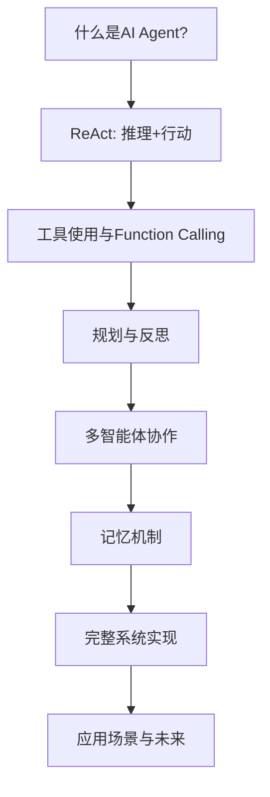

# 第四十六章 AI Agent与智能体系统

> *"智能体不仅是工具的使用者，更是目标的追求者。"*

## 本章学习路线图



**学习目标**：
- 理解AI Agent的核心概念与架构
- 掌握ReAct模式的原理与实现
- 学会设计工具使用和Function Calling系统
- 理解规划、反思与自我改进机制
- 掌握多智能体协作框架
- 能够构建完整的Agent系统

---

## 46.1 什么是AI Agent?

### 46.1.1 从LLM到Agent：范式的跃迁

想象你是一位旅行者站在陌生的城市街头。传统的LLM就像是一本详尽的旅游指南——它知识渊博，能告诉你所有景点的信息，但如果你问"我现在该怎么去最近的地铁站"，它只能基于训练数据给出通用建议，无法查看实时地图、无法叫出租车、也无法帮你购买车票。

**AI Agent（智能体）**则是一位**全能的私人助理**——它不仅知道答案，还能**主动采取行动**：打开地图应用规划路线、叫车、购买车票，甚至在你走错路时重新规划。

**核心区别**：

| 维度 | 传统LLM应用 | AI Agent |
|------|------------|----------|
| **交互模式** | 单次请求-响应 | 多轮自主循环 |
| **任务复杂度** | 简单查询、文本生成 | 复杂多步骤任务 |
| **工具使用** | 无或预定义 | 动态选择和调用 |
| **规划能力** | 无 | 任务分解和规划 |
| **记忆** | 会话级别 | 持久化长期记忆 |
| **自主性** | 低（需要人工引导） | 高（自主决策执行） |
| **错误处理** | 直接失败 | 尝试修复和重试 |

### 46.1.2 Agent的四大核心组件

用**驾驶员**的比喻来理解AI Agent：

```
┌─────────────────────────────────────────────────────────┐
│                    AI Agent 架构                        │
├─────────────────────────────────────────────────────────┤
│  🧠 大脑 (LLM)                                          │
│     └── 推理、决策、生成自然语言                          │
│                                                         │
│  👁️ 感知 (Perception)                                   │
│     └── 接收环境信息、用户输入、工具返回值                │
│                                                         │
│  ✋ 行动 (Action)                                       │
│     └── 调用工具、执行代码、与环境交互                   │
│                                                         │
│  📝 记忆 (Memory)                                       │
│     └── 短期记忆（上下文）、长期记忆（知识库）           │
└─────────────────────────────────────────────────────────┘
```

**费曼比喻**：Agent就像一个**会思考的智能机器人管家**：
- **大脑**：理解主人的指令（"今晚我想吃意大利菜"）
- **感知**：查看冰箱里有什么食材、查看天气、查看餐厅评价
- **行动**：购买食材、预订餐厅、设置导航
- **记忆**：记得你上次说那家餐厅太吵、记得你对海鲜过敏

### 46.1.3 Agent的工作循环

```python
class AIAgent:
    """
    AI Agent的基本工作循环
    费曼比喻：像一个不断"思考-行动-观察"的探险家
    """
    
    def __init__(self, llm, tools, memory):
        self.llm = llm          # 大脑：语言模型
        self.tools = tools      # 工具箱
        self.memory = memory    # 笔记本
    
    def run(self, task: str, max_iterations: int = 10) -> str:
        """
        Agent主循环
        
        工作流程：
        1. 感知：理解当前任务和环境
        2. 思考：LLM推理下一步行动
        3. 行动：调用工具或输出结果
        4. 观察：获取行动反馈
        5. 重复直到任务完成
        """
        self.memory.add(f"任务: {task}")
        
        for i in range(max_iterations):
            # 构建上下文
            context = self.memory.get_context()
            
            # 思考：LLM决定下一步
            thought = self.llm.think(context, self.tools)
            
            if thought.is_complete:
                return thought.final_answer
            
            # 行动：执行工具调用
            observation = self.execute_action(thought.action)
            
            # 记录到记忆
            self.memory.add(thought, observation)
        
        return "达到最大迭代次数，任务未完成"
    
    def execute_action(self, action) -> str:
        """执行具体的工具调用"""
        tool = self.tools[action.tool_name]
        return tool(**action.parameters)
```

### 46.1.4 Agent的演进历程

**第一代：单一Agent (2022-2023)**
- 简单的工具调用
- 基于提示工程的决策
- 代表：ChatGPT Plugins

**第二代：ReAct Agent (2023)**
- 思考-行动循环
- 工具链调用
- 代表：LangChain Agents

**第三代：规划型Agent (2023-2024)**
- 任务分解和规划
- 自我反思和修正
- 代表：AutoGPT, BabyAGI

**第四代：多Agent协作 (2024-2025)**
- Agent间通信和协作
- 角色专业化
- 分布式执行
- 代表：CrewAI, AutoGen, MetaGPT

**第五代：自我进化Agent (2025+)**
- 持续学习
- 知识积累
- 能力自我扩展

---

## 46.2 ReAct：推理与行动的协同

### 46.2.1 为什么需要ReAct?

**纯推理**（如Chain-of-Thought）的问题：
- 只能基于内部知识，无法获取外部信息
- 容易产生幻觉
- 无法执行实际操作

**纯行动**（如简单工具调用）的问题：
- 缺乏系统性推理
- 容易在复杂任务中迷失方向
- 无法解释决策过程

**ReAct（Reasoning + Acting）**将两者结合，形成**思考-行动-观察**的循环。

**费曼比喻**：ReAct就像一个**侦探破案**：
- **思考**："根据现有线索，凶手可能去过仓库"
- **行动**：去仓库调查
- **观察**：发现一个脚印
- **思考**："这个脚印和嫌疑人的鞋匹配，我要对比更多证据"
- **行动**：采集脚印样本
- ...循环直到破案

### 46.2.2 ReAct的数学框架

**ReAct轨迹**可以表示为一个交替序列：

$$\tau = [(t_1, a_1, o_1), (t_2, a_2, o_2), ..., (t_n, a_n, o_n), t_{n+1}]$$

其中：
- $t_i$：第$i$步的**思考**（thought）
- $a_i$：第$i$步的**行动**（action）
- $o_i$：第$i$步的**观察**（observation）
- $t_{n+1}$：最终答案

**LLM的条件概率**：

$$P(t_i, a_i | t_{<i}, a_{<i}, o_{<i}, \text{task})$$

**完整轨迹概率**：

$$P(\tau | \text{task}) = \prod_{i=1}^{n} P(t_i, a_i | h_{<i}) \cdot P(o_i | a_i) \cdot P(t_{n+1} | h_{\leq n})$$

其中$h_{<i}$表示历史轨迹。

### 46.2.3 ReAct提示模板

```
任务：{task}

你可以使用以下工具：
{tools_description}

按以下格式输出：
思考：我对当前情况的分析
行动：工具名称[参数]
观察：工具返回的结果
...（重复思考-行动-观察直到完成任务）
思考：我已经得到最终答案
最终答案：问题的答案

开始：
思考：
```

### 46.2.4 ReAct完整实现

```python
import re
from typing import List, Dict, Callable, Tuple, Optional
from dataclasses import dataclass

@dataclass
class Tool:
    """工具定义"""
    name: str
    description: str
    func: Callable
    
    def __call__(self, *args, **kwargs):
        return self.func(*args, **kwargs)

@dataclass
class ReActStep:
    """ReAct单步记录"""
    thought: str
    action: Optional[str]
    action_input: Optional[str]
    observation: Optional[str]

class ReActAgent:
    """
    ReAct Agent完整实现
    
    费曼比喻：像一个边思考边行动的探险家
    """
    
    def __init__(self, llm, tools: List[Tool], max_iterations: int = 10):
        self.llm = llm
        self.tools = {tool.name: tool for tool in tools}
        self.max_iterations = max_iterations
        
    def _build_prompt(self, task: str, history: List[ReActStep]) -> str:
        """构建ReAct提示"""
        tools_desc = "\n".join([
            f"- {name}: {tool.description}"
            for name, tool in self.tools.items()
        ])
        
        prompt = f"""你需要完成以下任务，通过交替进行"思考"和"行动"来解决问题。

任务：{task}

可用工具：
{tools_desc}

重要提示：
1. "思考"用于分析当前情况并决定下一步行动
2. "行动"必须是以下格式：工具名称[参数]
3. 如果需要使用多个参数，使用逗号分隔
4. 当获得足够信息时，输出"最终答案：你的答案"

"""
        
        # 添加历史记录
        for step in history:
            prompt += f"思考：{step.thought}\n"
            if step.action:
                prompt += f"行动：{step.action}[{step.action_input}]\n"
                prompt += f"观察：{step.observation}\n"
        
        prompt += "思考："
        return prompt
    
    def _parse_llm_output(self, output: str) -> Tuple[str, Optional[str], Optional[str]]:
        """解析LLM输出，提取思考和行动"""
        # 提取思考
        thought_match = re.search(r'思考[:：]\s*(.+?)(?=\n|$)', output, re.DOTALL)
        thought = thought_match.group(1).strip() if thought_match else output.strip()
        
        # 提取行动
        action_match = re.search(r'行动[:：]\s*(\w+)\[(.*?)\]', output)
        if action_match:
            action_name = action_match.group(1)
            action_input = action_match.group(2)
            return thought, action_name, action_input
        
        # 检查是否是最终答案
        final_match = re.search(r'最终答案[:：]\s*(.+)', output, re.DOTALL)
        if final_match:
            return thought, "FINAL", final_match.group(1).strip()
        
        return thought, None, None
    
    def run(self, task: str) -> str:
        """
        执行ReAct循环
        
        返回：最终答案
        """
        history: List[ReActStep] = []
        
        for i in range(self.max_iterations):
            # 构建提示
            prompt = self._build_prompt(task, history)
            
            # LLM生成思考和行动
            llm_output = self.llm.generate(prompt)
            
            # 解析输出
            thought, action, action_input = self._parse_llm_output(llm_output)
            
            # 检查是否完成
            if action == "FINAL":
                return action_input
            
            # 执行工具
            observation = None
            if action and action in self.tools:
                try:
                    tool = self.tools[action]
                    observation = tool(action_input)
                except Exception as e:
                    observation = f"错误：{str(e)}"
            elif action:
                observation = f"错误：未知工具 '{action}'"
            
            # 记录步骤
            history.append(ReActStep(
                thought=thought,
                action=action,
                action_input=action_input,
                observation=observation
            ))
            
            print(f"步骤 {i+1}:")
            print(f"  思考：{thought[:100]}...")
            if action:
                print(f"  行动：{action}[{action_input}]")
                print(f"  观察：{observation[:100]}...")
            print()
        
        return "达到最大迭代次数，任务未完成"


# ============ 使用示例 ============

class SimpleLLM:
    """模拟LLM用于演示"""
    
    def __init__(self):
        self.responses = []
        
    def generate(self, prompt: str) -> str:
        """
        实际应用中，这里调用真实的LLM API
        这里使用简单的规则模拟
        """
        # 模拟LLM推理过程
        if "问题" in prompt and "爱因斯坦" in prompt:
            if "搜索" in prompt:
                return "思考：我需要搜索爱因斯坦的出生日期\n行动：搜索引擎[爱因斯坦 出生日期]"
            elif "1879年3月14日" in prompt:
                return "思考：我已经找到了答案\n最终答案：爱因斯坦出生于1879年3月14日"
        
        return "思考：让我继续分析问题\n行动：搜索引擎[相关信息]"


# 定义工具
def search_engine(query: str) -> str:
    """模拟搜索引擎"""
    knowledge_base = {
        "爱因斯坦 出生日期": "阿尔伯特·爱因斯坦出生于1879年3月14日",
        "相对论": "相对论是爱因斯坦提出的物理学理论，包括狭义相对论和广义相对论",
        "光电效应": "爱因斯坦因解释光电效应获得1921年诺贝尔物理学奖"
    }
    return knowledge_base.get(query, f"搜索结果：{query}的相关信息")

def calculator(expression: str) -> str:
    """计算器工具"""
    try:
        # 安全计算
        allowed_chars = set('0123456789+-*/(). ')
        if all(c in allowed_chars for c in expression):
            result = eval(expression)
            return str(result)
        return "错误：非法字符"
    except Exception as e:
        return f"计算错误：{str(e)}"


# 创建Agent
tools = [
    Tool(name="搜索引擎", description="搜索网络信息", func=search_engine),
    Tool(name="计算器", description="执行数学计算", func=calculator)
]

agent = ReActAgent(llm=SimpleLLM(), tools=tools)

# 运行示例
# result = agent.run("爱因斯坦是什么时候出生的？")
# print(f"最终答案：{result}")
```

### 46.2.5 ReAct的优势与局限

**优势**：
1. **可解释性**：每一步都有明确的思考过程
2. **灵活性**：可根据观察动态调整策略
3. **鲁棒性**：错误可以被后续步骤纠正
4. **通用性**：适用于多种任务类型

**局限**：
1. **Token消耗大**：需要多轮LLM调用
2. **累积错误**：早期错误可能传播
3. **推理深度有限**：复杂多步推理仍有挑战
4. **工具依赖**：需要预先定义好工具

---

## 46.3 工具使用与Function Calling

### 46.3.1 为什么需要工具?

**LLM的局限性**：
- 知识截止：无法获取最新信息
- 计算能力弱：复杂数学计算容易出错
- 无法感知：无法获取实时环境信息
- 无法行动：不能直接执行操作

**费曼比喻**：工具就像是**给盲人一根拐杖**——LLM虽然"看不见"外部世界，但通过工具可以"触摸"到真实的信息。

### 46.3.2 ToolFormer：让LLM自学使用工具

**核心思想**：通过自监督学习，让LLM学会在适当的时候调用API。

**数学原理**：

给定文本$x = (x_1, x_2, ..., x_n)$，标准语言建模目标是：

$$\mathcal{L}_{LM} = -\sum_{i=1}^{n} \log P(x_i | x_{<i})$$

ToolFormer引入了**工具调用标记**，将API调用视为特殊的token序列：

$$\text{API调用} = \langle \text{API} \rangle \cdot \text{name}(\text{args}) \cdot \langle /\text{API} \rangle$$

**损失函数**：

$$\mathcal{L}_{Tool} = -\sum_{i \in I_{API}} \log P(x_i | x_{<i}) - \sum_{i \in I_{text}} \log P(x_i | x_{<i}, \text{API结果})$$

其中$I_{API}$是API调用位置的索引，$I_{text}$是正常文本位置。

### 46.3.3 Function Calling架构

```
用户提问
    ↓
┌─────────────────────────────────┐
│  LLM分析：是否需要调用工具？      │
│  - 如果是 → 生成工具调用         │
│  - 如果否 → 直接回答             │
└─────────────────────────────────┘
    ↓
如果需要调用工具：
    ↓
生成Function Call（JSON格式）
    ↓
执行工具/API
    ↓
获取结果
    ↓
将结果返回给LLM
    ↓
LLM生成最终回答
```

### 46.3.4 Function Calling完整实现

```python
import json
from typing import Any, Dict, List, Callable
from dataclasses import dataclass, asdict
from enum import Enum

class FunctionCallStatus(Enum):
    """函数调用状态"""
    PENDING = "pending"
    SUCCESS = "success"
    ERROR = "error"
    NOT_NEEDED = "not_needed"

@dataclass
class FunctionDefinition:
    """函数定义（OpenAI格式）"""
    name: str
    description: str
    parameters: Dict[str, Any]
    
    def to_dict(self) -> Dict:
        return {
            "name": self.name,
            "description": self.description,
            "parameters": self.parameters
        }

@dataclass
class FunctionCall:
    """函数调用请求"""
    name: str
    arguments: Dict[str, Any]
    
    @classmethod
    def from_json(cls, json_str: str) -> "FunctionCall":
        data = json.loads(json_str)
        return cls(name=data["name"], arguments=data.get("arguments", {}))

@dataclass
class FunctionResult:
    """函数调用结果"""
    call_id: str
    name: str
    arguments: Dict[str, Any]
    result: Any
    status: FunctionCallStatus
    error_message: str = ""


class FunctionCallingSystem:
    """
    Function Calling系统完整实现
    
    费曼比喻：像是一个智能的"电话转接员"
    - 理解用户需求
    - 决定是否需要转接（调用工具）
    - 找到正确的部门（选择合适的工具）
    - 传达信息（传递参数）
    - 返回结果（给用户完整回答）
    """
    
    def __init__(self, llm):
        self.llm = llm
        self.functions: Dict[str, Callable] = {}
        self.function_defs: Dict[str, FunctionDefinition] = {}
        self.call_history: List[FunctionResult] = []
        
    def register_function(self, func: Callable, definition: FunctionDefinition):
        """注册工具函数"""
        self.functions[definition.name] = func
        self.function_defs[definition.name] = definition
        
    def get_available_functions(self) -> List[Dict]:
        """获取所有可用函数定义"""
        return [defn.to_dict() for defn in self.function_defs.values()]
    
    def detect_function_calls(self, user_input: str) -> List[FunctionCall]:
        """
        检测用户输入中是否需要调用函数
        
        实际应用中，这里应该调用LLM的function calling API
        """
        prompt = f"""分析以下用户输入，判断是否需要调用工具函数。

可用工具：
{json.dumps(self.get_available_functions(), indent=2, ensure_ascii=False)}

用户输入：{user_input}

如果需要调用工具，请输出JSON格式：
{{
    "tool_calls": [
        {{
            "name": "工具名称",
            "arguments": {{"参数名": "参数值"}}
        }}
    ]
}}

如果不需要调用工具，输出：{{"tool_calls": []}}

只输出JSON，不要其他内容："""
        
        # 模拟LLM检测（实际调用API）
        response = self.llm.generate(prompt)
        
        try:
            data = json.loads(response)
            calls = []
            for call_data in data.get("tool_calls", []):
                calls.append(FunctionCall(
                    name=call_data["name"],
                    arguments=call_data.get("arguments", {})
                ))
            return calls
        except json.JSONDecodeError:
            return []
    
    def execute_function(self, call: FunctionCall, call_id: str) -> FunctionResult:
        """执行单个函数调用"""
        if call.name not in self.functions:
            return FunctionResult(
                call_id=call_id,
                name=call.name,
                arguments=call.arguments,
                result=None,
                status=FunctionCallStatus.ERROR,
                error_message=f"函数 '{call.name}' 未注册"
            )
        
        try:
            func = self.functions[call.name]
            result = func(**call.arguments)
            
            function_result = FunctionResult(
                call_id=call_id,
                name=call.name,
                arguments=call.arguments,
                result=result,
                status=FunctionCallStatus.SUCCESS
            )
            
            self.call_history.append(function_result)
            return function_result
            
        except Exception as e:
            return FunctionResult(
                call_id=call_id,
                name=call.name,
                arguments=call.arguments,
                result=None,
                status=FunctionCallStatus.ERROR,
                error_message=str(e)
            )
    
    def generate_final_response(self, user_input: str, 
                                function_results: List[FunctionResult]) -> str:
        """基于函数调用结果生成最终回答"""
        
        # 构建上下文
        context = f"用户问题：{user_input}\n\n"
        
        if function_results:
            context += "工具调用结果：\n"
            for result in function_results:
                if result.status == FunctionCallStatus.SUCCESS:
                    context += f"- {result.name}: {result.result}\n"
                else:
                    context += f"- {result.name}: 错误 - {result.error_message}\n"
        
        prompt = f"""基于以下信息，回答用户的问题。

{context}

请给出完整、准确的回答。如果工具调用失败，请说明情况并提供基于现有知识的回答。"""
        
        return self.llm.generate(prompt)
    
    def process(self, user_input: str) -> str:
        """
        完整的Function Calling处理流程
        
        步骤：
        1. 检测是否需要调用函数
        2. 执行所有需要的函数调用
        3. 基于结果生成最终回答
        """
        # 步骤1：检测函数调用
        function_calls = self.detect_function_calls(user_input)
        
        if not function_calls:
            # 不需要调用函数，直接回答
            return self.llm.generate(user_input)
        
        # 步骤2：执行函数调用
        function_results = []
        for i, call in enumerate(function_calls):
            call_id = f"call_{len(self.call_history) + i}"
            result = self.execute_function(call, call_id)
            function_results.append(result)
        
        # 步骤3：生成最终回答
        final_response = self.generate_final_response(user_input, function_results)
        
        return final_response


# ============ 工具函数示例 ============

def get_weather(location: str, unit: str = "celsius") -> Dict:
    """获取天气信息（模拟）"""
    # 模拟天气数据
    weather_data = {
        "北京": {"temperature": 25, "condition": "晴天", "humidity": 45},
        "上海": {"temperature": 28, "condition": "多云", "humidity": 70},
        "纽约": {"temperature": 18, "condition": "小雨", "humidity": 80}
    }
    
    data = weather_data.get(location, {"temperature": 20, "condition": "未知", "humidity": 50})
    
    if unit == "fahrenheit":
        data["temperature"] = data["temperature"] * 9/5 + 32
    
    return data

def search_database(query: str, limit: int = 5) -> List[Dict]:
    """搜索数据库（模拟）"""
    # 模拟知识库
    knowledge_base = [
        {"id": 1, "title": "机器学习基础", "content": "机器学习是AI的核心技术..."},
        {"id": 2, "title": "深度学习入门", "content": "深度学习使用神经网络..."},
        {"id": 3, "title": "强化学习原理", "content": "强化学习通过与环境交互学习..."}
    ]
    
    results = [item for item in knowledge_base if query.lower() in item["title"].lower()]
    return results[:limit]

def calculate_mortgage(principal: float, annual_rate: float, years: int) -> Dict:
    """计算房贷月供"""
    monthly_rate = annual_rate / 100 / 12
    num_payments = years * 12
    
    if monthly_rate == 0:
        monthly_payment = principal / num_payments
    else:
        monthly_payment = principal * (monthly_rate * (1 + monthly_rate)**num_payments) / \
                         ((1 + monthly_rate)**num_payments - 1)
    
    total_payment = monthly_payment * num_payments
    total_interest = total_payment - principal
    
    return {
        "monthly_payment": round(monthly_payment, 2),
        "total_payment": round(total_payment, 2),
        "total_interest": round(total_interest, 2),
        "num_payments": num_payments
    }


# ============ 使用示例 ============

# 创建系统
fc_system = FunctionCallingSystem(llm=SimpleLLM())

# 注册工具
fc_system.register_function(
    get_weather,
    FunctionDefinition(
        name="get_weather",
        description="获取指定城市的天气信息",
        parameters={
            "type": "object",
            "properties": {
                "location": {
                    "type": "string",
                    "description": "城市名称，如'北京'、'上海'"
                },
                "unit": {
                    "type": "string",
                    "enum": ["celsius", "fahrenheit"],
                    "description": "温度单位"
                }
            },
            "required": ["location"]
        }
    )
)

fc_system.register_function(
    search_database,
    FunctionDefinition(
        name="search_database",
        description="搜索知识库获取相关信息",
        parameters={
            "type": "object",
            "properties": {
                "query": {
                    "type": "string",
                    "description": "搜索关键词"
                },
                "limit": {
                    "type": "integer",
                    "description": "返回结果数量限制"
                }
            },
            "required": ["query"]
        }
    )
)

fc_system.register_function(
    calculate_mortgage,
    FunctionDefinition(
        name="calculate_mortgage",
        description="计算房贷月供",
        parameters={
            "type": "object",
            "properties": {
                "principal": {
                    "type": "number",
                    "description": "贷款本金（元）"
                },
                "annual_rate": {
                    "type": "number",
                    "description": "年利率（%）"
                },
                "years": {
                    "type": "integer",
                    "description": "贷款年限"
                }
            },
            "required": ["principal", "annual_rate", "years"]
        }
    )
)

# 处理用户请求
# response = fc_system.process("北京的天气怎么样？")
# print(response)
```

### 46.3.5 工具选择策略

当Agent面对多个可用工具时，需要智能地选择最合适的工具。常见策略包括：

**1. 基于描述的相似度**：

$$\text{score}(t, q) = \text{cosine\_similarity}(\text{embedding}(t_{desc}), \text{embedding}(q))$$

选择得分最高的工具。

**2. 层次化工具组织**：

```
工具分类
├── 信息检索
│   ├── 搜索引擎
│   ├── 数据库查询
│   └── 文档检索
├── 计算
│   ├── 计算器
│   ├── 数学求解器
│   └── 数据分析
└── 执行
    ├── 代码执行
    ├── API调用
    └── 文件操作
```

**3. 多工具组合**：复杂任务可能需要顺序调用多个工具。

---

